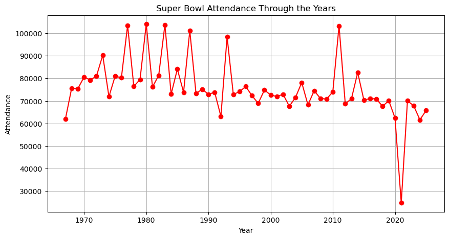
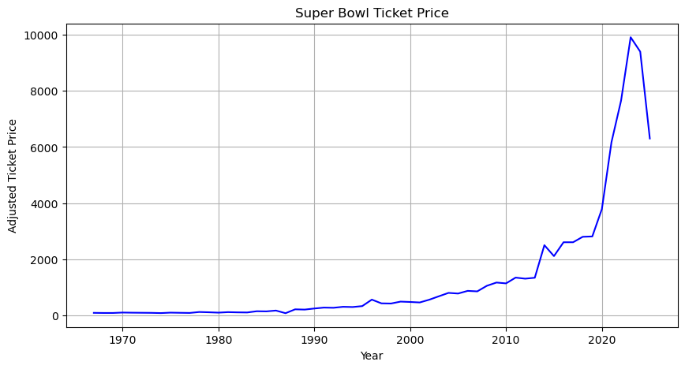
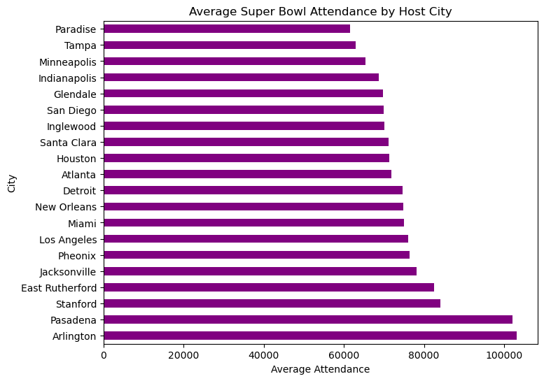
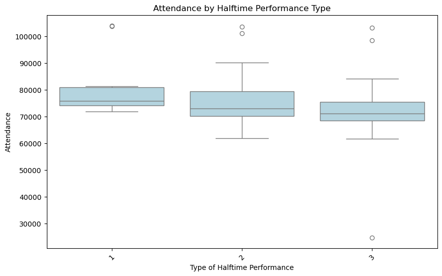
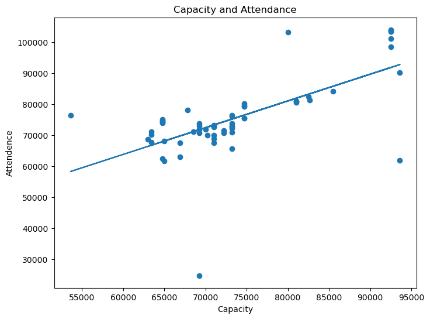
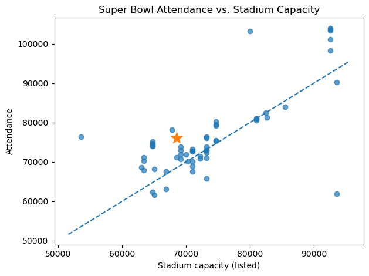
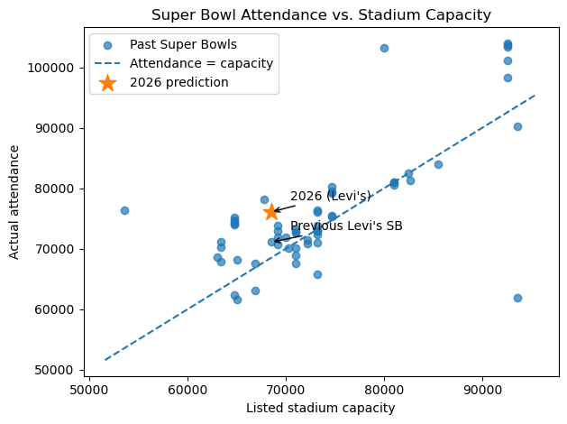
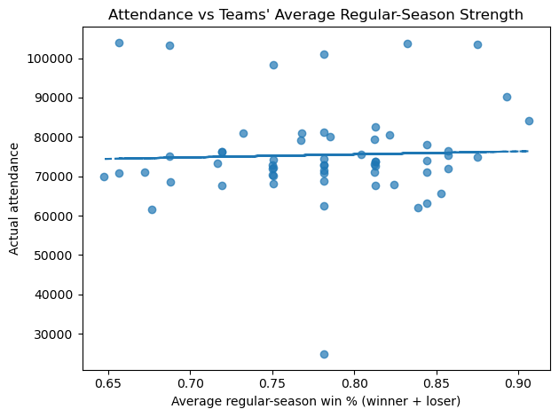
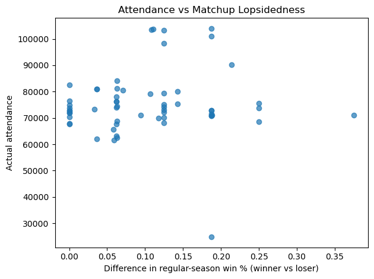

```python
# Created DataFrame
```


```python
from selenium import webdriver
import pandas as pd
import time
import random
```


```python
driver = webdriver.Chrome()
driver.get('https://nflplayoffpass.com/super-bowl-winners/')

data = []

for i in range(1,60):
    winners = driver.find_element('xpath', f'//*[@id="post-3005"]/div[1]/div/figure[3]/table/tbody/tr[{i}]/td[3]').text
    opposition = driver.find_element('xpath', f'//*[@id="post-3005"]/div[1]/div/figure[3]/table/tbody/tr[{i}]/td[4]').text
    year = driver.find_element('xpath', f'//*[@id="post-3005"]/div[1]/div/figure[3]/table/tbody/tr[{i}]/td[2]').text
    
    data.append([year, winners, opposition])
```


```python
df = pd.DataFrame(data, columns = ["Year", "Team 1", "Team 2"])
```


```python
df
```


<div>
<style scoped>
    .dataframe tbody tr th:only-of-type {
        vertical-align: middle;
    }

    .dataframe tbody tr th {
        vertical-align: top;
    }

    .dataframe thead th {
        text-align: right;
    }
</style>
<table border="1" class="dataframe">
  <thead>
    <tr style="text-align: right;">
      <th></th>
      <th>Year</th>
      <th>Team 1</th>
      <th>Team 2</th>
    </tr>
  </thead>
  <tbody>
    <tr>
      <th>0</th>
      <td>2025</td>
      <td>Philadelphia Eagles</td>
      <td>Kansas City Chiefs</td>
    </tr>
    <tr>
      <th>1</th>
      <td>2024</td>
      <td>Kansas City Chiefs</td>
      <td>San Francisco 49ers</td>
    </tr>
    <tr>
      <th>2</th>
      <td>2023</td>
      <td>Kansas City Chiefs</td>
      <td>Philadelphia Eagles</td>
    </tr>
    <tr>
      <th>3</th>
      <td>2022</td>
      <td>Los Angeles Rams</td>
      <td>Cincinnati Bengals</td>
    </tr>
    <tr>
      <th>4</th>
      <td>2021</td>
      <td>Tampa Bay Buccaneers</td>
      <td>Kansas City Chiefs</td>
    </tr>
    <tr>
      <th>5</th>
      <td>2020</td>
      <td>Kansas City Chiefs</td>
      <td>San Francisco 49ers</td>
    </tr>
    <tr>
      <th>6</th>
      <td>2019</td>
      <td>New England Patriots</td>
      <td>Los Angeles Rams</td>
    </tr>
    <tr>
      <th>7</th>
      <td>2018</td>
      <td>Philadelphia Eagles</td>
      <td>New England Patriots</td>
    </tr>
    <tr>
      <th>8</th>
      <td>2017</td>
      <td>New England Patriots</td>
      <td>Atlanta Falcons</td>
    </tr>
    <tr>
      <th>9</th>
      <td>2016</td>
      <td>Denver Broncos</td>
      <td>Carolina Panthers</td>
    </tr>
    <tr>
      <th>10</th>
      <td>2015</td>
      <td>New England Patriots</td>
      <td>Seattle Seahawks</td>
    </tr>
    <tr>
      <th>11</th>
      <td>2014</td>
      <td>Seattle Seahawks</td>
      <td>Denver Broncos</td>
    </tr>
    <tr>
      <th>12</th>
      <td>2013</td>
      <td>Baltimore Ravens</td>
      <td>San Francisco 49ers</td>
    </tr>
    <tr>
      <th>13</th>
      <td>2012</td>
      <td>New York Giants</td>
      <td>New England Patriots</td>
    </tr>
    <tr>
      <th>14</th>
      <td>2011</td>
      <td>Green Bay Packers</td>
      <td>Pittsburgh Steelers</td>
    </tr>
    <tr>
      <th>15</th>
      <td>2010</td>
      <td>New Orleans Saints</td>
      <td>Indianapolis Colts</td>
    </tr>
    <tr>
      <th>16</th>
      <td>2009</td>
      <td>Pittsburgh Steelers</td>
      <td>Arizona Cardinals</td>
    </tr>
    <tr>
      <th>17</th>
      <td>2008</td>
      <td>New York Giants</td>
      <td>New England Patriots</td>
    </tr>
    <tr>
      <th>18</th>
      <td>2007</td>
      <td>Indianapolis Colts</td>
      <td>Chicago Bears</td>
    </tr>
    <tr>
      <th>19</th>
      <td>2006</td>
      <td>Pittsburgh Steelers</td>
      <td>Seattle Seahawks</td>
    </tr>
    <tr>
      <th>20</th>
      <td>2005</td>
      <td>New England Patriots</td>
      <td>Philadelphia Eagles</td>
    </tr>
    <tr>
      <th>21</th>
      <td>2004</td>
      <td>New England Patriots</td>
      <td>Carolina Panthers</td>
    </tr>
    <tr>
      <th>22</th>
      <td>2003</td>
      <td>Tampa Bay Buccaneers</td>
      <td>Oakland Raiders</td>
    </tr>
    <tr>
      <th>23</th>
      <td>2002</td>
      <td>New England Patriots</td>
      <td>St. Louis Rams</td>
    </tr>
    <tr>
      <th>24</th>
      <td>2001</td>
      <td>Baltimore Ravens</td>
      <td>New York Giants</td>
    </tr>
    <tr>
      <th>25</th>
      <td>2000</td>
      <td>St. Louis Rams</td>
      <td>Tennessee Titans</td>
    </tr>
    <tr>
      <th>26</th>
      <td>1999</td>
      <td>Denver Broncos</td>
      <td>Atlanta Falcons</td>
    </tr>
    <tr>
      <th>27</th>
      <td>1998</td>
      <td>Denver Broncos</td>
      <td>Green Bay Packers</td>
    </tr>
    <tr>
      <th>28</th>
      <td>1997</td>
      <td>Green Bay Packers</td>
      <td>New England Patriots</td>
    </tr>
    <tr>
      <th>29</th>
      <td>1996</td>
      <td>Dallas Cowboys</td>
      <td>Pittsburgh Steelers</td>
    </tr>
    <tr>
      <th>30</th>
      <td>1995</td>
      <td>San Francisco 49ers</td>
      <td>San Diego Chargers</td>
    </tr>
    <tr>
      <th>31</th>
      <td>1994</td>
      <td>Dallas Cowboys</td>
      <td>Buffalo Bills</td>
    </tr>
    <tr>
      <th>32</th>
      <td>1993</td>
      <td>Dallas Cowboys</td>
      <td>Buffalo Bills</td>
    </tr>
    <tr>
      <th>33</th>
      <td>1992</td>
      <td>Washington Redskins</td>
      <td>Buffalo Bills</td>
    </tr>
    <tr>
      <th>34</th>
      <td>1991</td>
      <td>New York Giants</td>
      <td>Buffalo Bills</td>
    </tr>
    <tr>
      <th>35</th>
      <td>1990</td>
      <td>San Francisco 49ers</td>
      <td>Denver Broncos</td>
    </tr>
    <tr>
      <th>36</th>
      <td>1989</td>
      <td>San Francisco 49ers</td>
      <td>Cincinnati Bengals</td>
    </tr>
    <tr>
      <th>37</th>
      <td>1988</td>
      <td>Washington Redskins</td>
      <td>Denver Broncos</td>
    </tr>
    <tr>
      <th>38</th>
      <td>1987</td>
      <td>New York Giants</td>
      <td>Denver Broncos</td>
    </tr>
    <tr>
      <th>39</th>
      <td>1986</td>
      <td>Chicago Bears</td>
      <td>New England Patriots</td>
    </tr>
    <tr>
      <th>40</th>
      <td>1985</td>
      <td>San Francisco 49ers</td>
      <td>Miami Dolphins</td>
    </tr>
    <tr>
      <th>41</th>
      <td>1984</td>
      <td>Los Angeles Raiders</td>
      <td>Washington Redskins</td>
    </tr>
    <tr>
      <th>42</th>
      <td>1983</td>
      <td>Washington Redskins</td>
      <td>Miami Dolphins</td>
    </tr>
    <tr>
      <th>43</th>
      <td>1982</td>
      <td>San Francisco 49ers</td>
      <td>Cincinnati Bengals</td>
    </tr>
    <tr>
      <th>44</th>
      <td>1981</td>
      <td>Oakland Raiders</td>
      <td>Philadelphia Eagles</td>
    </tr>
    <tr>
      <th>45</th>
      <td>1980</td>
      <td>Pittsburgh Steelers</td>
      <td>Los Angeles Rams</td>
    </tr>
    <tr>
      <th>46</th>
      <td>1979</td>
      <td>Pittsburgh Steelers</td>
      <td>Dallas Cowboys</td>
    </tr>
    <tr>
      <th>47</th>
      <td>1978</td>
      <td>Dallas Cowboys</td>
      <td>Denver Broncos</td>
    </tr>
    <tr>
      <th>48</th>
      <td>1977</td>
      <td>Oakland Raiders</td>
      <td>Minnesota Vikings</td>
    </tr>
    <tr>
      <th>49</th>
      <td>1976</td>
      <td>Pittsburgh Steelers</td>
      <td>Dallas Cowboys</td>
    </tr>
    <tr>
      <th>50</th>
      <td>1975</td>
      <td>Pittsburgh Steelers</td>
      <td>Minnesota Vikings</td>
    </tr>
    <tr>
      <th>51</th>
      <td>1974</td>
      <td>Miami Dolphins</td>
      <td>Minnesota Vikings</td>
    </tr>
    <tr>
      <th>52</th>
      <td>1973</td>
      <td>Miami Dolphins</td>
      <td>Washington Redskins</td>
    </tr>
    <tr>
      <th>53</th>
      <td>1972</td>
      <td>Dallas Cowboys</td>
      <td>Miami Dolphins</td>
    </tr>
    <tr>
      <th>54</th>
      <td>1971</td>
      <td>Baltimore Colts</td>
      <td>Dallas Cowboys</td>
    </tr>
    <tr>
      <th>55</th>
      <td>1970</td>
      <td>Kansas City Chiefs</td>
      <td>Minnesota Vikings</td>
    </tr>
    <tr>
      <th>56</th>
      <td>1969</td>
      <td>New York Jets</td>
      <td>Baltimore Colts</td>
    </tr>
    <tr>
      <th>57</th>
      <td>1968</td>
      <td>Green Bay Packers</td>
      <td>Oakland Raiders</td>
    </tr>
    <tr>
      <th>58</th>
      <td>1967</td>
      <td>Green Bay Packers</td>
      <td>Kansas City Chiefs</td>
    </tr>
  </tbody>
</table>
</div>


```python
ticket_price = [6304,9400,9915,7654,6173,3789,2812,2799,2605,2605,2111,2500,1339,1306,1344,
                1138,1168,1052,853,871,776,799,679,557,458,475,488,420,426,559,328,295,303,
                268,275,242,204,213,75,169,140,145,101,105,113,95,108,118,84,89,95,79,87,90,
                93,98,83,83,87]
```


```python
df["Ticket Price"] = ticket_price
df
```


<div>
<style scoped>
    .dataframe tbody tr th:only-of-type {
        vertical-align: middle;
    }

    .dataframe tbody tr th {
        vertical-align: top;
    }

    .dataframe thead th {
        text-align: right;
    }
</style>
<table border="1" class="dataframe">
  <thead>
    <tr style="text-align: right;">
      <th></th>
      <th>Year</th>
      <th>Team 1</th>
      <th>Team 2</th>
      <th>Ticket Price</th>
    </tr>
  </thead>
  <tbody>
    <tr>
      <th>0</th>
      <td>2025</td>
      <td>Philadelphia Eagles</td>
      <td>Kansas City Chiefs</td>
      <td>6304</td>
    </tr>
    <tr>
      <th>1</th>
      <td>2024</td>
      <td>Kansas City Chiefs</td>
      <td>San Francisco 49ers</td>
      <td>9400</td>
    </tr>
    <tr>
      <th>2</th>
      <td>2023</td>
      <td>Kansas City Chiefs</td>
      <td>Philadelphia Eagles</td>
      <td>9915</td>
    </tr>
    <tr>
      <th>3</th>
      <td>2022</td>
      <td>Los Angeles Rams</td>
      <td>Cincinnati Bengals</td>
      <td>7654</td>
    </tr>
    <tr>
      <th>4</th>
      <td>2021</td>
      <td>Tampa Bay Buccaneers</td>
      <td>Kansas City Chiefs</td>
      <td>6173</td>
    </tr>
    <tr>
      <th>5</th>
      <td>2020</td>
      <td>Kansas City Chiefs</td>
      <td>San Francisco 49ers</td>
      <td>3789</td>
    </tr>
    <tr>
      <th>6</th>
      <td>2019</td>
      <td>New England Patriots</td>
      <td>Los Angeles Rams</td>
      <td>2812</td>
    </tr>
    <tr>
      <th>7</th>
      <td>2018</td>
      <td>Philadelphia Eagles</td>
      <td>New England Patriots</td>
      <td>2799</td>
    </tr>
    <tr>
      <th>8</th>
      <td>2017</td>
      <td>New England Patriots</td>
      <td>Atlanta Falcons</td>
      <td>2605</td>
    </tr>
    <tr>
      <th>9</th>
      <td>2016</td>
      <td>Denver Broncos</td>
      <td>Carolina Panthers</td>
      <td>2605</td>
    </tr>
    <tr>
      <th>10</th>
      <td>2015</td>
      <td>New England Patriots</td>
      <td>Seattle Seahawks</td>
      <td>2111</td>
    </tr>
    <tr>
      <th>11</th>
      <td>2014</td>
      <td>Seattle Seahawks</td>
      <td>Denver Broncos</td>
      <td>2500</td>
    </tr>
    <tr>
      <th>12</th>
      <td>2013</td>
      <td>Baltimore Ravens</td>
      <td>San Francisco 49ers</td>
      <td>1339</td>
    </tr>
    <tr>
      <th>13</th>
      <td>2012</td>
      <td>New York Giants</td>
      <td>New England Patriots</td>
      <td>1306</td>
    </tr>
    <tr>
      <th>14</th>
      <td>2011</td>
      <td>Green Bay Packers</td>
      <td>Pittsburgh Steelers</td>
      <td>1344</td>
    </tr>
    <tr>
      <th>15</th>
      <td>2010</td>
      <td>New Orleans Saints</td>
      <td>Indianapolis Colts</td>
      <td>1138</td>
    </tr>
    <tr>
      <th>16</th>
      <td>2009</td>
      <td>Pittsburgh Steelers</td>
      <td>Arizona Cardinals</td>
      <td>1168</td>
    </tr>
    <tr>
      <th>17</th>
      <td>2008</td>
      <td>New York Giants</td>
      <td>New England Patriots</td>
      <td>1052</td>
    </tr>
    <tr>
      <th>18</th>
      <td>2007</td>
      <td>Indianapolis Colts</td>
      <td>Chicago Bears</td>
      <td>853</td>
    </tr>
    <tr>
      <th>19</th>
      <td>2006</td>
      <td>Pittsburgh Steelers</td>
      <td>Seattle Seahawks</td>
      <td>871</td>
    </tr>
    <tr>
      <th>20</th>
      <td>2005</td>
      <td>New England Patriots</td>
      <td>Philadelphia Eagles</td>
      <td>776</td>
    </tr>
    <tr>
      <th>21</th>
      <td>2004</td>
      <td>New England Patriots</td>
      <td>Carolina Panthers</td>
      <td>799</td>
    </tr>
    <tr>
      <th>22</th>
      <td>2003</td>
      <td>Tampa Bay Buccaneers</td>
      <td>Oakland Raiders</td>
      <td>679</td>
    </tr>
    <tr>
      <th>23</th>
      <td>2002</td>
      <td>New England Patriots</td>
      <td>St. Louis Rams</td>
      <td>557</td>
    </tr>
    <tr>
      <th>24</th>
      <td>2001</td>
      <td>Baltimore Ravens</td>
      <td>New York Giants</td>
      <td>458</td>
    </tr>
    <tr>
      <th>25</th>
      <td>2000</td>
      <td>St. Louis Rams</td>
      <td>Tennessee Titans</td>
      <td>475</td>
    </tr>
    <tr>
      <th>26</th>
      <td>1999</td>
      <td>Denver Broncos</td>
      <td>Atlanta Falcons</td>
      <td>488</td>
    </tr>
    <tr>
      <th>27</th>
      <td>1998</td>
      <td>Denver Broncos</td>
      <td>Green Bay Packers</td>
      <td>420</td>
    </tr>
    <tr>
      <th>28</th>
      <td>1997</td>
      <td>Green Bay Packers</td>
      <td>New England Patriots</td>
      <td>426</td>
    </tr>
    <tr>
      <th>29</th>
      <td>1996</td>
      <td>Dallas Cowboys</td>
      <td>Pittsburgh Steelers</td>
      <td>559</td>
    </tr>
    <tr>
      <th>30</th>
      <td>1995</td>
      <td>San Francisco 49ers</td>
      <td>San Diego Chargers</td>
      <td>328</td>
    </tr>
    <tr>
      <th>31</th>
      <td>1994</td>
      <td>Dallas Cowboys</td>
      <td>Buffalo Bills</td>
      <td>295</td>
    </tr>
    <tr>
      <th>32</th>
      <td>1993</td>
      <td>Dallas Cowboys</td>
      <td>Buffalo Bills</td>
      <td>303</td>
    </tr>
    <tr>
      <th>33</th>
      <td>1992</td>
      <td>Washington Redskins</td>
      <td>Buffalo Bills</td>
      <td>268</td>
    </tr>
    <tr>
      <th>34</th>
      <td>1991</td>
      <td>New York Giants</td>
      <td>Buffalo Bills</td>
      <td>275</td>
    </tr>
    <tr>
      <th>35</th>
      <td>1990</td>
      <td>San Francisco 49ers</td>
      <td>Denver Broncos</td>
      <td>242</td>
    </tr>
    <tr>
      <th>36</th>
      <td>1989</td>
      <td>San Francisco 49ers</td>
      <td>Cincinnati Bengals</td>
      <td>204</td>
    </tr>
    <tr>
      <th>37</th>
      <td>1988</td>
      <td>Washington Redskins</td>
      <td>Denver Broncos</td>
      <td>213</td>
    </tr>
    <tr>
      <th>38</th>
      <td>1987</td>
      <td>New York Giants</td>
      <td>Denver Broncos</td>
      <td>75</td>
    </tr>
    <tr>
      <th>39</th>
      <td>1986</td>
      <td>Chicago Bears</td>
      <td>New England Patriots</td>
      <td>169</td>
    </tr>
    <tr>
      <th>40</th>
      <td>1985</td>
      <td>San Francisco 49ers</td>
      <td>Miami Dolphins</td>
      <td>140</td>
    </tr>
    <tr>
      <th>41</th>
      <td>1984</td>
      <td>Los Angeles Raiders</td>
      <td>Washington Redskins</td>
      <td>145</td>
    </tr>
    <tr>
      <th>42</th>
      <td>1983</td>
      <td>Washington Redskins</td>
      <td>Miami Dolphins</td>
      <td>101</td>
    </tr>
    <tr>
      <th>43</th>
      <td>1982</td>
      <td>San Francisco 49ers</td>
      <td>Cincinnati Bengals</td>
      <td>105</td>
    </tr>
    <tr>
      <th>44</th>
      <td>1981</td>
      <td>Oakland Raiders</td>
      <td>Philadelphia Eagles</td>
      <td>113</td>
    </tr>
    <tr>
      <th>45</th>
      <td>1980</td>
      <td>Pittsburgh Steelers</td>
      <td>Los Angeles Rams</td>
      <td>95</td>
    </tr>
    <tr>
      <th>46</th>
      <td>1979</td>
      <td>Pittsburgh Steelers</td>
      <td>Dallas Cowboys</td>
      <td>108</td>
    </tr>
    <tr>
      <th>47</th>
      <td>1978</td>
      <td>Dallas Cowboys</td>
      <td>Denver Broncos</td>
      <td>118</td>
    </tr>
    <tr>
      <th>48</th>
      <td>1977</td>
      <td>Oakland Raiders</td>
      <td>Minnesota Vikings</td>
      <td>84</td>
    </tr>
    <tr>
      <th>49</th>
      <td>1976</td>
      <td>Pittsburgh Steelers</td>
      <td>Dallas Cowboys</td>
      <td>89</td>
    </tr>
    <tr>
      <th>50</th>
      <td>1975</td>
      <td>Pittsburgh Steelers</td>
      <td>Minnesota Vikings</td>
      <td>95</td>
    </tr>
    <tr>
      <th>51</th>
      <td>1974</td>
      <td>Miami Dolphins</td>
      <td>Minnesota Vikings</td>
      <td>79</td>
    </tr>
    <tr>
      <th>52</th>
      <td>1973</td>
      <td>Miami Dolphins</td>
      <td>Washington Redskins</td>
      <td>87</td>
    </tr>
    <tr>
      <th>53</th>
      <td>1972</td>
      <td>Dallas Cowboys</td>
      <td>Miami Dolphins</td>
      <td>90</td>
    </tr>
    <tr>
      <th>54</th>
      <td>1971</td>
      <td>Baltimore Colts</td>
      <td>Dallas Cowboys</td>
      <td>93</td>
    </tr>
    <tr>
      <th>55</th>
      <td>1970</td>
      <td>Kansas City Chiefs</td>
      <td>Minnesota Vikings</td>
      <td>98</td>
    </tr>
    <tr>
      <th>56</th>
      <td>1969</td>
      <td>New York Jets</td>
      <td>Baltimore Colts</td>
      <td>83</td>
    </tr>
    <tr>
      <th>57</th>
      <td>1968</td>
      <td>Green Bay Packers</td>
      <td>Oakland Raiders</td>
      <td>83</td>
    </tr>
    <tr>
      <th>58</th>
      <td>1967</td>
      <td>Green Bay Packers</td>
      <td>Kansas City Chiefs</td>
      <td>87</td>
    </tr>
  </tbody>
</table>
</div>


```python
df['Year'] = df['Year'].astype(int)
```


```python
df2 = pd.read_csv('Data_400_data.csv')
df2 = df2.iloc[:, :-2]
df2 = df2.sort_values(by='Year', ascending=False)
df2['Year'] = df2['Year'].astype(int)
```


```python
df2.head()
```


<div>
<style scoped>
    .dataframe tbody tr th:only-of-type {
        vertical-align: middle;
    }

    .dataframe tbody tr th {
        vertical-align: top;
    }

    .dataframe thead th {
        text-align: right;
    }
</style>
<table border="1" class="dataframe">
  <thead>
    <tr style="text-align: right;">
      <th></th>
      <th>Year</th>
      <th>Super_Bowl</th>
      <th>Stadium</th>
      <th>Indoor</th>
      <th>City</th>
      <th>State</th>
    </tr>
  </thead>
  <tbody>
    <tr>
      <th>58</th>
      <td>2025</td>
      <td>LIX</td>
      <td>Caesars Superdome</td>
      <td>1</td>
      <td>New Orleans</td>
      <td>Louisiana</td>
    </tr>
    <tr>
      <th>57</th>
      <td>2024</td>
      <td>LVIII</td>
      <td>Allegiant Stadium</td>
      <td>1</td>
      <td>Paradise</td>
      <td>Nevada</td>
    </tr>
    <tr>
      <th>56</th>
      <td>2023</td>
      <td>LVII</td>
      <td>State Farm Stadium</td>
      <td>1</td>
      <td>Glendale</td>
      <td>Arizona</td>
    </tr>
    <tr>
      <th>55</th>
      <td>2022</td>
      <td>LVI</td>
      <td>SoFi Stadium</td>
      <td>1</td>
      <td>Inglewood</td>
      <td>California</td>
    </tr>
    <tr>
      <th>54</th>
      <td>2021</td>
      <td>LV</td>
      <td>Raymond James Stadium</td>
      <td>0</td>
      <td>Tampa</td>
      <td>Florida</td>
    </tr>
  </tbody>
</table>
</div>


```python
df.dtypes
```


    Year             int32
    Team 1          object
    Team 2          object
    Ticket Price     int64
    dtype: object


```python
df2.dtypes
```


    Year           int32
    Super_Bowl    object
    Stadium       object
    Indoor         int64
    City          object
    State         object
    dtype: object


```python
combined_df = pd.merge(df, df2, on='Year', how='inner')
```


```python
combined_df.head(10)
```


<div>
<style scoped>
    .dataframe tbody tr th:only-of-type {
        vertical-align: middle;
    }

    .dataframe tbody tr th {
        vertical-align: top;
    }

    .dataframe thead th {
        text-align: right;
    }
</style>
<table border="1" class="dataframe">
  <thead>
    <tr style="text-align: right;">
      <th></th>
      <th>Year</th>
      <th>Team 1</th>
      <th>Team 2</th>
      <th>Ticket Price</th>
      <th>Super_Bowl</th>
      <th>Stadium</th>
      <th>Indoor</th>
      <th>City</th>
      <th>State</th>
    </tr>
  </thead>
  <tbody>
    <tr>
      <th>0</th>
      <td>2025</td>
      <td>Philadelphia Eagles</td>
      <td>Kansas City Chiefs</td>
      <td>6304</td>
      <td>LIX</td>
      <td>Caesars Superdome</td>
      <td>1</td>
      <td>New Orleans</td>
      <td>Louisiana</td>
    </tr>
    <tr>
      <th>1</th>
      <td>2024</td>
      <td>Kansas City Chiefs</td>
      <td>San Francisco 49ers</td>
      <td>9400</td>
      <td>LVIII</td>
      <td>Allegiant Stadium</td>
      <td>1</td>
      <td>Paradise</td>
      <td>Nevada</td>
    </tr>
    <tr>
      <th>2</th>
      <td>2023</td>
      <td>Kansas City Chiefs</td>
      <td>Philadelphia Eagles</td>
      <td>9915</td>
      <td>LVII</td>
      <td>State Farm Stadium</td>
      <td>1</td>
      <td>Glendale</td>
      <td>Arizona</td>
    </tr>
    <tr>
      <th>3</th>
      <td>2022</td>
      <td>Los Angeles Rams</td>
      <td>Cincinnati Bengals</td>
      <td>7654</td>
      <td>LVI</td>
      <td>SoFi Stadium</td>
      <td>1</td>
      <td>Inglewood</td>
      <td>California</td>
    </tr>
    <tr>
      <th>4</th>
      <td>2021</td>
      <td>Tampa Bay Buccaneers</td>
      <td>Kansas City Chiefs</td>
      <td>6173</td>
      <td>LV</td>
      <td>Raymond James Stadium</td>
      <td>0</td>
      <td>Tampa</td>
      <td>Florida</td>
    </tr>
    <tr>
      <th>5</th>
      <td>2020</td>
      <td>Kansas City Chiefs</td>
      <td>San Francisco 49ers</td>
      <td>3789</td>
      <td>LIV</td>
      <td>Hard Rock Stadium</td>
      <td>0</td>
      <td>Miami</td>
      <td>Florida</td>
    </tr>
    <tr>
      <th>6</th>
      <td>2019</td>
      <td>New England Patriots</td>
      <td>Los Angeles Rams</td>
      <td>2812</td>
      <td>LIII</td>
      <td>Mercedes-Benz Stadium</td>
      <td>1</td>
      <td>Atlanta</td>
      <td>Georgia</td>
    </tr>
    <tr>
      <th>7</th>
      <td>2018</td>
      <td>Philadelphia Eagles</td>
      <td>New England Patriots</td>
      <td>2799</td>
      <td>LII</td>
      <td>U.S. Bank Stadium</td>
      <td>1</td>
      <td>Minneapolis</td>
      <td>Minnesota</td>
    </tr>
    <tr>
      <th>8</th>
      <td>2017</td>
      <td>New England Patriots</td>
      <td>Atlanta Falcons</td>
      <td>2605</td>
      <td>LI</td>
      <td>NRG Stadium</td>
      <td>1</td>
      <td>Houston</td>
      <td>Texas</td>
    </tr>
    <tr>
      <th>9</th>
      <td>2016</td>
      <td>Denver Broncos</td>
      <td>Carolina Panthers</td>
      <td>2605</td>
      <td>L</td>
      <td>Levi's Stadium</td>
      <td>0</td>
      <td>Santa Clara</td>
      <td>California</td>
    </tr>
  </tbody>
</table>
</div>


```python
df3 = pd.read_csv("SuperBowl Halftime Performances.csv")
df3 = df3.iloc[:, [0, 3]]
df3 = df3.sort_values(by='Year', ascending=False)
```


```python
df3
```


<div>
<style scoped>
    .dataframe tbody tr th:only-of-type {
        vertical-align: middle;
    }

    .dataframe tbody tr th {
        vertical-align: top;
    }

    .dataframe thead th {
        text-align: right;
    }
</style>
<table border="1" class="dataframe">
  <thead>
    <tr style="text-align: right;">
      <th></th>
      <th>Year</th>
      <th>Type of Halftime Performance</th>
    </tr>
  </thead>
  <tbody>
    <tr>
      <th>58</th>
      <td>2025</td>
      <td>3</td>
    </tr>
    <tr>
      <th>57</th>
      <td>2024</td>
      <td>3</td>
    </tr>
    <tr>
      <th>56</th>
      <td>2023</td>
      <td>3</td>
    </tr>
    <tr>
      <th>55</th>
      <td>2022</td>
      <td>2</td>
    </tr>
    <tr>
      <th>54</th>
      <td>2021</td>
      <td>3</td>
    </tr>
    <tr>
      <th>53</th>
      <td>2020</td>
      <td>2</td>
    </tr>
    <tr>
      <th>52</th>
      <td>2019</td>
      <td>2</td>
    </tr>
    <tr>
      <th>51</th>
      <td>2018</td>
      <td>3</td>
    </tr>
    <tr>
      <th>50</th>
      <td>2017</td>
      <td>3</td>
    </tr>
    <tr>
      <th>49</th>
      <td>2016</td>
      <td>3</td>
    </tr>
    <tr>
      <th>48</th>
      <td>2015</td>
      <td>3</td>
    </tr>
    <tr>
      <th>47</th>
      <td>2014</td>
      <td>3</td>
    </tr>
    <tr>
      <th>46</th>
      <td>2013</td>
      <td>3</td>
    </tr>
    <tr>
      <th>45</th>
      <td>2012</td>
      <td>3</td>
    </tr>
    <tr>
      <th>44</th>
      <td>2011</td>
      <td>3</td>
    </tr>
    <tr>
      <th>43</th>
      <td>2010</td>
      <td>3</td>
    </tr>
    <tr>
      <th>42</th>
      <td>2009</td>
      <td>3</td>
    </tr>
    <tr>
      <th>41</th>
      <td>2008</td>
      <td>3</td>
    </tr>
    <tr>
      <th>40</th>
      <td>2007</td>
      <td>3</td>
    </tr>
    <tr>
      <th>39</th>
      <td>2006</td>
      <td>3</td>
    </tr>
    <tr>
      <th>38</th>
      <td>2005</td>
      <td>3</td>
    </tr>
    <tr>
      <th>37</th>
      <td>2004</td>
      <td>2</td>
    </tr>
    <tr>
      <th>36</th>
      <td>2003</td>
      <td>2</td>
    </tr>
    <tr>
      <th>35</th>
      <td>2002</td>
      <td>3</td>
    </tr>
    <tr>
      <th>34</th>
      <td>2001</td>
      <td>2</td>
    </tr>
    <tr>
      <th>33</th>
      <td>2000</td>
      <td>2</td>
    </tr>
    <tr>
      <th>32</th>
      <td>1999</td>
      <td>2</td>
    </tr>
    <tr>
      <th>31</th>
      <td>1998</td>
      <td>2</td>
    </tr>
    <tr>
      <th>30</th>
      <td>1997</td>
      <td>2</td>
    </tr>
    <tr>
      <th>29</th>
      <td>1996</td>
      <td>3</td>
    </tr>
    <tr>
      <th>28</th>
      <td>1995</td>
      <td>2</td>
    </tr>
    <tr>
      <th>27</th>
      <td>1994</td>
      <td>2</td>
    </tr>
    <tr>
      <th>26</th>
      <td>1993</td>
      <td>3</td>
    </tr>
    <tr>
      <th>25</th>
      <td>1992</td>
      <td>2</td>
    </tr>
    <tr>
      <th>24</th>
      <td>1991</td>
      <td>3</td>
    </tr>
    <tr>
      <th>23</th>
      <td>1990</td>
      <td>2</td>
    </tr>
    <tr>
      <th>22</th>
      <td>1989</td>
      <td>3</td>
    </tr>
    <tr>
      <th>21</th>
      <td>1988</td>
      <td>2</td>
    </tr>
    <tr>
      <th>20</th>
      <td>1987</td>
      <td>2</td>
    </tr>
    <tr>
      <th>19</th>
      <td>1986</td>
      <td>1</td>
    </tr>
    <tr>
      <th>18</th>
      <td>1985</td>
      <td>3</td>
    </tr>
    <tr>
      <th>17</th>
      <td>1984</td>
      <td>1</td>
    </tr>
    <tr>
      <th>16</th>
      <td>1983</td>
      <td>1</td>
    </tr>
    <tr>
      <th>15</th>
      <td>1982</td>
      <td>1</td>
    </tr>
    <tr>
      <th>14</th>
      <td>1981</td>
      <td>1</td>
    </tr>
    <tr>
      <th>13</th>
      <td>1980</td>
      <td>1</td>
    </tr>
    <tr>
      <th>12</th>
      <td>1979</td>
      <td>2</td>
    </tr>
    <tr>
      <th>11</th>
      <td>1978</td>
      <td>2</td>
    </tr>
    <tr>
      <th>10</th>
      <td>1977</td>
      <td>2</td>
    </tr>
    <tr>
      <th>9</th>
      <td>1976</td>
      <td>1</td>
    </tr>
    <tr>
      <th>8</th>
      <td>1975</td>
      <td>2</td>
    </tr>
    <tr>
      <th>7</th>
      <td>1974</td>
      <td>1</td>
    </tr>
    <tr>
      <th>6</th>
      <td>1973</td>
      <td>2</td>
    </tr>
    <tr>
      <th>5</th>
      <td>1972</td>
      <td>2</td>
    </tr>
    <tr>
      <th>4</th>
      <td>1971</td>
      <td>2</td>
    </tr>
    <tr>
      <th>3</th>
      <td>1970</td>
      <td>2</td>
    </tr>
    <tr>
      <th>2</th>
      <td>1969</td>
      <td>1</td>
    </tr>
    <tr>
      <th>1</th>
      <td>1968</td>
      <td>1</td>
    </tr>
    <tr>
      <th>0</th>
      <td>1967</td>
      <td>2</td>
    </tr>
  </tbody>
</table>
</div>


```python
combined_df = pd.merge(combined_df, df3, on='Year', how='inner')
```


```python
combined_df
```


<div>
<style scoped>
    .dataframe tbody tr th:only-of-type {
        vertical-align: middle;
    }

    .dataframe tbody tr th {
        vertical-align: top;
    }

    .dataframe thead th {
        text-align: right;
    }
</style>
<table border="1" class="dataframe">
  <thead>
    <tr style="text-align: right;">
      <th></th>
      <th>Year</th>
      <th>Team 1</th>
      <th>Team 2</th>
      <th>Ticket Price</th>
      <th>Super_Bowl</th>
      <th>Stadium</th>
      <th>Indoor</th>
      <th>City</th>
      <th>State</th>
      <th>Type of Halftime Performance</th>
    </tr>
  </thead>
  <tbody>
    <tr>
      <th>0</th>
      <td>2025</td>
      <td>Philadelphia Eagles</td>
      <td>Kansas City Chiefs</td>
      <td>6304</td>
      <td>LIX</td>
      <td>Caesars Superdome</td>
      <td>1</td>
      <td>New Orleans</td>
      <td>Louisiana</td>
      <td>3</td>
    </tr>
    <tr>
      <th>1</th>
      <td>2024</td>
      <td>Kansas City Chiefs</td>
      <td>San Francisco 49ers</td>
      <td>9400</td>
      <td>LVIII</td>
      <td>Allegiant Stadium</td>
      <td>1</td>
      <td>Paradise</td>
      <td>Nevada</td>
      <td>3</td>
    </tr>
    <tr>
      <th>2</th>
      <td>2023</td>
      <td>Kansas City Chiefs</td>
      <td>Philadelphia Eagles</td>
      <td>9915</td>
      <td>LVII</td>
      <td>State Farm Stadium</td>
      <td>1</td>
      <td>Glendale</td>
      <td>Arizona</td>
      <td>3</td>
    </tr>
    <tr>
      <th>3</th>
      <td>2022</td>
      <td>Los Angeles Rams</td>
      <td>Cincinnati Bengals</td>
      <td>7654</td>
      <td>LVI</td>
      <td>SoFi Stadium</td>
      <td>1</td>
      <td>Inglewood</td>
      <td>California</td>
      <td>2</td>
    </tr>
    <tr>
      <th>4</th>
      <td>2021</td>
      <td>Tampa Bay Buccaneers</td>
      <td>Kansas City Chiefs</td>
      <td>6173</td>
      <td>LV</td>
      <td>Raymond James Stadium</td>
      <td>0</td>
      <td>Tampa</td>
      <td>Florida</td>
      <td>3</td>
    </tr>
    <tr>
      <th>5</th>
      <td>2020</td>
      <td>Kansas City Chiefs</td>
      <td>San Francisco 49ers</td>
      <td>3789</td>
      <td>LIV</td>
      <td>Hard Rock Stadium</td>
      <td>0</td>
      <td>Miami</td>
      <td>Florida</td>
      <td>2</td>
    </tr>
    <tr>
      <th>6</th>
      <td>2019</td>
      <td>New England Patriots</td>
      <td>Los Angeles Rams</td>
      <td>2812</td>
      <td>LIII</td>
      <td>Mercedes-Benz Stadium</td>
      <td>1</td>
      <td>Atlanta</td>
      <td>Georgia</td>
      <td>2</td>
    </tr>
    <tr>
      <th>7</th>
      <td>2018</td>
      <td>Philadelphia Eagles</td>
      <td>New England Patriots</td>
      <td>2799</td>
      <td>LII</td>
      <td>U.S. Bank Stadium</td>
      <td>1</td>
      <td>Minneapolis</td>
      <td>Minnesota</td>
      <td>3</td>
    </tr>
    <tr>
      <th>8</th>
      <td>2017</td>
      <td>New England Patriots</td>
      <td>Atlanta Falcons</td>
      <td>2605</td>
      <td>LI</td>
      <td>NRG Stadium</td>
      <td>1</td>
      <td>Houston</td>
      <td>Texas</td>
      <td>3</td>
    </tr>
    <tr>
      <th>9</th>
      <td>2016</td>
      <td>Denver Broncos</td>
      <td>Carolina Panthers</td>
      <td>2605</td>
      <td>L</td>
      <td>Levi's Stadium</td>
      <td>0</td>
      <td>Santa Clara</td>
      <td>California</td>
      <td>3</td>
    </tr>
    <tr>
      <th>10</th>
      <td>2015</td>
      <td>New England Patriots</td>
      <td>Seattle Seahawks</td>
      <td>2111</td>
      <td>XLIX</td>
      <td>State Farm Stadium</td>
      <td>1</td>
      <td>Glendale</td>
      <td>Arizona</td>
      <td>3</td>
    </tr>
    <tr>
      <th>11</th>
      <td>2014</td>
      <td>Seattle Seahawks</td>
      <td>Denver Broncos</td>
      <td>2500</td>
      <td>XLVIII</td>
      <td>MetLife Stadium</td>
      <td>0</td>
      <td>East Rutherford</td>
      <td>New Jersey</td>
      <td>3</td>
    </tr>
    <tr>
      <th>12</th>
      <td>2013</td>
      <td>Baltimore Ravens</td>
      <td>San Francisco 49ers</td>
      <td>1339</td>
      <td>XLVII</td>
      <td>Caesars Superdome</td>
      <td>1</td>
      <td>New Orleans</td>
      <td>Louisiana</td>
      <td>3</td>
    </tr>
    <tr>
      <th>13</th>
      <td>2012</td>
      <td>New York Giants</td>
      <td>New England Patriots</td>
      <td>1306</td>
      <td>XLVI</td>
      <td>Lucas Oil Stadium</td>
      <td>1</td>
      <td>Indianapolis</td>
      <td>Indiana</td>
      <td>3</td>
    </tr>
    <tr>
      <th>14</th>
      <td>2011</td>
      <td>Green Bay Packers</td>
      <td>Pittsburgh Steelers</td>
      <td>1344</td>
      <td>XLV</td>
      <td>AT&amp;T Stadium</td>
      <td>1</td>
      <td>Arlington</td>
      <td>Texas</td>
      <td>3</td>
    </tr>
    <tr>
      <th>15</th>
      <td>2010</td>
      <td>New Orleans Saints</td>
      <td>Indianapolis Colts</td>
      <td>1138</td>
      <td>XLIV</td>
      <td>Hard Rock Stadium</td>
      <td>0</td>
      <td>Miami</td>
      <td>Florida</td>
      <td>3</td>
    </tr>
    <tr>
      <th>16</th>
      <td>2009</td>
      <td>Pittsburgh Steelers</td>
      <td>Arizona Cardinals</td>
      <td>1168</td>
      <td>XLIII</td>
      <td>Raymond James Stadium</td>
      <td>0</td>
      <td>Tampa</td>
      <td>Florida</td>
      <td>3</td>
    </tr>
    <tr>
      <th>17</th>
      <td>2008</td>
      <td>New York Giants</td>
      <td>New England Patriots</td>
      <td>1052</td>
      <td>XLII</td>
      <td>State Farm Stadium</td>
      <td>1</td>
      <td>Glendale</td>
      <td>Arizona</td>
      <td>3</td>
    </tr>
    <tr>
      <th>18</th>
      <td>2007</td>
      <td>Indianapolis Colts</td>
      <td>Chicago Bears</td>
      <td>853</td>
      <td>XLI</td>
      <td>Hard Rock Stadium</td>
      <td>0</td>
      <td>Miami</td>
      <td>Florida</td>
      <td>3</td>
    </tr>
    <tr>
      <th>19</th>
      <td>2006</td>
      <td>Pittsburgh Steelers</td>
      <td>Seattle Seahawks</td>
      <td>871</td>
      <td>XL</td>
      <td>Ford Field</td>
      <td>1</td>
      <td>Detroit</td>
      <td>Michigan</td>
      <td>3</td>
    </tr>
    <tr>
      <th>20</th>
      <td>2005</td>
      <td>New England Patriots</td>
      <td>Philadelphia Eagles</td>
      <td>776</td>
      <td>XXXIX</td>
      <td>Alltel Stadium</td>
      <td>0</td>
      <td>Jacksonville</td>
      <td>Florida</td>
      <td>3</td>
    </tr>
    <tr>
      <th>21</th>
      <td>2004</td>
      <td>New England Patriots</td>
      <td>Carolina Panthers</td>
      <td>799</td>
      <td>XXXVIII</td>
      <td>NRG Stadium</td>
      <td>1</td>
      <td>Houston</td>
      <td>Texas</td>
      <td>2</td>
    </tr>
    <tr>
      <th>22</th>
      <td>2003</td>
      <td>Tampa Bay Buccaneers</td>
      <td>Oakland Raiders</td>
      <td>679</td>
      <td>XXXVII</td>
      <td>Qualcomm Stadium</td>
      <td>0</td>
      <td>San Diego</td>
      <td>California</td>
      <td>2</td>
    </tr>
    <tr>
      <th>23</th>
      <td>2002</td>
      <td>New England Patriots</td>
      <td>St. Louis Rams</td>
      <td>557</td>
      <td>XXXVI</td>
      <td>Caesars Superdome</td>
      <td>1</td>
      <td>New Orleans</td>
      <td>Louisiana</td>
      <td>3</td>
    </tr>
    <tr>
      <th>24</th>
      <td>2001</td>
      <td>Baltimore Ravens</td>
      <td>New York Giants</td>
      <td>458</td>
      <td>XXXV</td>
      <td>Raymond James Stadium</td>
      <td>0</td>
      <td>Tampa</td>
      <td>Florida</td>
      <td>2</td>
    </tr>
    <tr>
      <th>25</th>
      <td>2000</td>
      <td>St. Louis Rams</td>
      <td>Tennessee Titans</td>
      <td>475</td>
      <td>XXXIV</td>
      <td>Georgia Dome</td>
      <td>1</td>
      <td>Atlanta</td>
      <td>Georgia</td>
      <td>2</td>
    </tr>
    <tr>
      <th>26</th>
      <td>1999</td>
      <td>Denver Broncos</td>
      <td>Atlanta Falcons</td>
      <td>488</td>
      <td>XXXIII</td>
      <td>Hard Rock Stadium</td>
      <td>0</td>
      <td>Miami</td>
      <td>Florida</td>
      <td>2</td>
    </tr>
    <tr>
      <th>27</th>
      <td>1998</td>
      <td>Denver Broncos</td>
      <td>Green Bay Packers</td>
      <td>420</td>
      <td>XXXII</td>
      <td>Qualcomm Stadium</td>
      <td>0</td>
      <td>San Diego</td>
      <td>California</td>
      <td>2</td>
    </tr>
    <tr>
      <th>28</th>
      <td>1997</td>
      <td>Green Bay Packers</td>
      <td>New England Patriots</td>
      <td>426</td>
      <td>XXXI</td>
      <td>Caesars Superdome</td>
      <td>1</td>
      <td>New Orleans</td>
      <td>Louisiana</td>
      <td>2</td>
    </tr>
    <tr>
      <th>29</th>
      <td>1996</td>
      <td>Dallas Cowboys</td>
      <td>Pittsburgh Steelers</td>
      <td>559</td>
      <td>XXX</td>
      <td>Sun Devil Stadium</td>
      <td>0</td>
      <td>Pheonix</td>
      <td>Arizona</td>
      <td>3</td>
    </tr>
    <tr>
      <th>30</th>
      <td>1995</td>
      <td>San Francisco 49ers</td>
      <td>San Diego Chargers</td>
      <td>328</td>
      <td>XXIX</td>
      <td>Hard Rock Stadium</td>
      <td>0</td>
      <td>Miami</td>
      <td>Florida</td>
      <td>2</td>
    </tr>
    <tr>
      <th>31</th>
      <td>1994</td>
      <td>Dallas Cowboys</td>
      <td>Buffalo Bills</td>
      <td>295</td>
      <td>XVIII</td>
      <td>Georgia Dome</td>
      <td>1</td>
      <td>Atlanta</td>
      <td>Georgia</td>
      <td>2</td>
    </tr>
    <tr>
      <th>32</th>
      <td>1993</td>
      <td>Dallas Cowboys</td>
      <td>Buffalo Bills</td>
      <td>303</td>
      <td>XXVII</td>
      <td>Rose Bowl</td>
      <td>0</td>
      <td>Pasadena</td>
      <td>California</td>
      <td>3</td>
    </tr>
    <tr>
      <th>33</th>
      <td>1992</td>
      <td>Washington Redskins</td>
      <td>Buffalo Bills</td>
      <td>268</td>
      <td>XXVI</td>
      <td>Hubert H. Humphrey Metrodome</td>
      <td>1</td>
      <td>Minneapolis</td>
      <td>Minnesota</td>
      <td>2</td>
    </tr>
    <tr>
      <th>34</th>
      <td>1991</td>
      <td>New York Giants</td>
      <td>Buffalo Bills</td>
      <td>275</td>
      <td>XXV</td>
      <td>Tampa Stadium</td>
      <td>0</td>
      <td>Tampa</td>
      <td>Florida</td>
      <td>3</td>
    </tr>
    <tr>
      <th>35</th>
      <td>1990</td>
      <td>San Francisco 49ers</td>
      <td>Denver Broncos</td>
      <td>242</td>
      <td>XXIV</td>
      <td>Caesars Superdome</td>
      <td>1</td>
      <td>New Orleans</td>
      <td>Louisiana</td>
      <td>2</td>
    </tr>
    <tr>
      <th>36</th>
      <td>1989</td>
      <td>San Francisco 49ers</td>
      <td>Cincinnati Bengals</td>
      <td>204</td>
      <td>XXIII</td>
      <td>Hard Rock Stadium</td>
      <td>0</td>
      <td>Miami</td>
      <td>Florida</td>
      <td>3</td>
    </tr>
    <tr>
      <th>37</th>
      <td>1988</td>
      <td>Washington Redskins</td>
      <td>Denver Broncos</td>
      <td>213</td>
      <td>XXII</td>
      <td>Qualcomm Stadium</td>
      <td>0</td>
      <td>San Diego</td>
      <td>California</td>
      <td>2</td>
    </tr>
    <tr>
      <th>38</th>
      <td>1987</td>
      <td>New York Giants</td>
      <td>Denver Broncos</td>
      <td>75</td>
      <td>XXI</td>
      <td>Rose Bowl</td>
      <td>0</td>
      <td>Pasadena</td>
      <td>California</td>
      <td>2</td>
    </tr>
    <tr>
      <th>39</th>
      <td>1986</td>
      <td>Chicago Bears</td>
      <td>New England Patriots</td>
      <td>169</td>
      <td>XX</td>
      <td>Caesars Superdome</td>
      <td>1</td>
      <td>New Orleans</td>
      <td>Louisiana</td>
      <td>1</td>
    </tr>
    <tr>
      <th>40</th>
      <td>1985</td>
      <td>San Francisco 49ers</td>
      <td>Miami Dolphins</td>
      <td>140</td>
      <td>XIX</td>
      <td>Stanford Stadium</td>
      <td>0</td>
      <td>Stanford</td>
      <td>California</td>
      <td>3</td>
    </tr>
    <tr>
      <th>41</th>
      <td>1984</td>
      <td>Los Angeles Raiders</td>
      <td>Washington Redskins</td>
      <td>145</td>
      <td>XVIII</td>
      <td>Tampa Stadium</td>
      <td>0</td>
      <td>Tampa</td>
      <td>Florida</td>
      <td>1</td>
    </tr>
    <tr>
      <th>42</th>
      <td>1983</td>
      <td>Washington Redskins</td>
      <td>Miami Dolphins</td>
      <td>101</td>
      <td>XVII</td>
      <td>Rose Bowl</td>
      <td>0</td>
      <td>Pasadena</td>
      <td>California</td>
      <td>1</td>
    </tr>
    <tr>
      <th>43</th>
      <td>1982</td>
      <td>San Francisco 49ers</td>
      <td>Cincinnati Bengals</td>
      <td>105</td>
      <td>XVI</td>
      <td>Pontiac Silverdome</td>
      <td>1</td>
      <td>Detroit</td>
      <td>Michigan</td>
      <td>1</td>
    </tr>
    <tr>
      <th>44</th>
      <td>1981</td>
      <td>Oakland Raiders</td>
      <td>Philadelphia Eagles</td>
      <td>113</td>
      <td>XV</td>
      <td>Caesars Superdome</td>
      <td>1</td>
      <td>New Orleans</td>
      <td>Louisiana</td>
      <td>1</td>
    </tr>
    <tr>
      <th>45</th>
      <td>1980</td>
      <td>Pittsburgh Steelers</td>
      <td>Los Angeles Rams</td>
      <td>95</td>
      <td>XIV</td>
      <td>Rose Bowl</td>
      <td>0</td>
      <td>Pasadena</td>
      <td>California</td>
      <td>1</td>
    </tr>
    <tr>
      <th>46</th>
      <td>1979</td>
      <td>Pittsburgh Steelers</td>
      <td>Dallas Cowboys</td>
      <td>108</td>
      <td>XIII</td>
      <td>Orange Bowl</td>
      <td>0</td>
      <td>Miami</td>
      <td>Florida</td>
      <td>2</td>
    </tr>
    <tr>
      <th>47</th>
      <td>1978</td>
      <td>Dallas Cowboys</td>
      <td>Denver Broncos</td>
      <td>118</td>
      <td>XII</td>
      <td>Caesars Superdome</td>
      <td>1</td>
      <td>New Orleans</td>
      <td>Louisiana</td>
      <td>2</td>
    </tr>
    <tr>
      <th>48</th>
      <td>1977</td>
      <td>Oakland Raiders</td>
      <td>Minnesota Vikings</td>
      <td>84</td>
      <td>XI</td>
      <td>Rose Bowl</td>
      <td>0</td>
      <td>Pasadena</td>
      <td>California</td>
      <td>2</td>
    </tr>
    <tr>
      <th>49</th>
      <td>1976</td>
      <td>Pittsburgh Steelers</td>
      <td>Dallas Cowboys</td>
      <td>89</td>
      <td>X</td>
      <td>Orange Bowl</td>
      <td>0</td>
      <td>Miami</td>
      <td>Florida</td>
      <td>1</td>
    </tr>
    <tr>
      <th>50</th>
      <td>1975</td>
      <td>Pittsburgh Steelers</td>
      <td>Minnesota Vikings</td>
      <td>95</td>
      <td>IX</td>
      <td>Tulane Stadium</td>
      <td>0</td>
      <td>New Orleans</td>
      <td>Louisiana</td>
      <td>2</td>
    </tr>
    <tr>
      <th>51</th>
      <td>1974</td>
      <td>Miami Dolphins</td>
      <td>Minnesota Vikings</td>
      <td>79</td>
      <td>VIII</td>
      <td>Rice Stadium</td>
      <td>0</td>
      <td>Houston</td>
      <td>Texas</td>
      <td>1</td>
    </tr>
    <tr>
      <th>52</th>
      <td>1973</td>
      <td>Miami Dolphins</td>
      <td>Washington Redskins</td>
      <td>87</td>
      <td>VII</td>
      <td>Los Angeles Memorial Coliseum</td>
      <td>0</td>
      <td>Los Angeles</td>
      <td>California</td>
      <td>2</td>
    </tr>
    <tr>
      <th>53</th>
      <td>1972</td>
      <td>Dallas Cowboys</td>
      <td>Miami Dolphins</td>
      <td>90</td>
      <td>VI</td>
      <td>Tulane Stadium</td>
      <td>0</td>
      <td>New Orleans</td>
      <td>Louisiana</td>
      <td>2</td>
    </tr>
    <tr>
      <th>54</th>
      <td>1971</td>
      <td>Baltimore Colts</td>
      <td>Dallas Cowboys</td>
      <td>93</td>
      <td>V</td>
      <td>Orange Bowl</td>
      <td>0</td>
      <td>Miami</td>
      <td>Florida</td>
      <td>2</td>
    </tr>
    <tr>
      <th>55</th>
      <td>1970</td>
      <td>Kansas City Chiefs</td>
      <td>Minnesota Vikings</td>
      <td>98</td>
      <td>IV</td>
      <td>Tulane Stadium</td>
      <td>0</td>
      <td>New Orleans</td>
      <td>Louisiana</td>
      <td>2</td>
    </tr>
    <tr>
      <th>56</th>
      <td>1969</td>
      <td>New York Jets</td>
      <td>Baltimore Colts</td>
      <td>83</td>
      <td>III</td>
      <td>Orange Bowl</td>
      <td>0</td>
      <td>Miami</td>
      <td>Florida</td>
      <td>1</td>
    </tr>
    <tr>
      <th>57</th>
      <td>1968</td>
      <td>Green Bay Packers</td>
      <td>Oakland Raiders</td>
      <td>83</td>
      <td>II</td>
      <td>Orange Bowl</td>
      <td>0</td>
      <td>Miami</td>
      <td>Florida</td>
      <td>1</td>
    </tr>
    <tr>
      <th>58</th>
      <td>1967</td>
      <td>Green Bay Packers</td>
      <td>Kansas City Chiefs</td>
      <td>87</td>
      <td>I</td>
      <td>Los Angeles Memorial Coliseum</td>
      <td>0</td>
      <td>Los Angeles</td>
      <td>California</td>
      <td>2</td>
    </tr>
  </tbody>
</table>
</div>


```python
df4 = pd.read_csv("SuperBowl Attendance.csv")
df4 = df4.sort_values(by='Year', ascending=False)
```


```python
combined_df = pd.merge(combined_df, df4, on= "Year", how= 'inner')
```


```python
combined_df
```


<div>
<style scoped>
    .dataframe tbody tr th:only-of-type {
        vertical-align: middle;
    }

    .dataframe tbody tr th {
        vertical-align: top;
    }

    .dataframe thead th {
        text-align: right;
    }
</style>
<table border="1" class="dataframe">
  <thead>
    <tr style="text-align: right;">
      <th></th>
      <th>Year</th>
      <th>Team 1</th>
      <th>Team 2</th>
      <th>Ticket Price</th>
      <th>Super_Bowl</th>
      <th>Stadium</th>
      <th>Indoor</th>
      <th>City</th>
      <th>State</th>
      <th>Type of Halftime Performance</th>
      <th>Attendance</th>
    </tr>
  </thead>
  <tbody>
    <tr>
      <th>0</th>
      <td>2025</td>
      <td>Philadelphia Eagles</td>
      <td>Kansas City Chiefs</td>
      <td>6304</td>
      <td>LIX</td>
      <td>Caesars Superdome</td>
      <td>1</td>
      <td>New Orleans</td>
      <td>Louisiana</td>
      <td>3</td>
      <td>65719</td>
    </tr>
    <tr>
      <th>1</th>
      <td>2024</td>
      <td>Kansas City Chiefs</td>
      <td>San Francisco 49ers</td>
      <td>9400</td>
      <td>LVIII</td>
      <td>Allegiant Stadium</td>
      <td>1</td>
      <td>Paradise</td>
      <td>Nevada</td>
      <td>3</td>
      <td>61629</td>
    </tr>
    <tr>
      <th>2</th>
      <td>2023</td>
      <td>Kansas City Chiefs</td>
      <td>Philadelphia Eagles</td>
      <td>9915</td>
      <td>LVII</td>
      <td>State Farm Stadium</td>
      <td>1</td>
      <td>Glendale</td>
      <td>Arizona</td>
      <td>3</td>
      <td>67827</td>
    </tr>
    <tr>
      <th>3</th>
      <td>2022</td>
      <td>Los Angeles Rams</td>
      <td>Cincinnati Bengals</td>
      <td>7654</td>
      <td>LVI</td>
      <td>SoFi Stadium</td>
      <td>1</td>
      <td>Inglewood</td>
      <td>California</td>
      <td>2</td>
      <td>70048</td>
    </tr>
    <tr>
      <th>4</th>
      <td>2021</td>
      <td>Tampa Bay Buccaneers</td>
      <td>Kansas City Chiefs</td>
      <td>6173</td>
      <td>LV</td>
      <td>Raymond James Stadium</td>
      <td>0</td>
      <td>Tampa</td>
      <td>Florida</td>
      <td>3</td>
      <td>24835</td>
    </tr>
    <tr>
      <th>5</th>
      <td>2020</td>
      <td>Kansas City Chiefs</td>
      <td>San Francisco 49ers</td>
      <td>3789</td>
      <td>LIV</td>
      <td>Hard Rock Stadium</td>
      <td>0</td>
      <td>Miami</td>
      <td>Florida</td>
      <td>2</td>
      <td>62417</td>
    </tr>
    <tr>
      <th>6</th>
      <td>2019</td>
      <td>New England Patriots</td>
      <td>Los Angeles Rams</td>
      <td>2812</td>
      <td>LIII</td>
      <td>Mercedes-Benz Stadium</td>
      <td>1</td>
      <td>Atlanta</td>
      <td>Georgia</td>
      <td>2</td>
      <td>70081</td>
    </tr>
    <tr>
      <th>7</th>
      <td>2018</td>
      <td>Philadelphia Eagles</td>
      <td>New England Patriots</td>
      <td>2799</td>
      <td>LII</td>
      <td>U.S. Bank Stadium</td>
      <td>1</td>
      <td>Minneapolis</td>
      <td>Minnesota</td>
      <td>3</td>
      <td>67612</td>
    </tr>
    <tr>
      <th>8</th>
      <td>2017</td>
      <td>New England Patriots</td>
      <td>Atlanta Falcons</td>
      <td>2605</td>
      <td>LI</td>
      <td>NRG Stadium</td>
      <td>1</td>
      <td>Houston</td>
      <td>Texas</td>
      <td>3</td>
      <td>70807</td>
    </tr>
    <tr>
      <th>9</th>
      <td>2016</td>
      <td>Denver Broncos</td>
      <td>Carolina Panthers</td>
      <td>2605</td>
      <td>L</td>
      <td>Levi's Stadium</td>
      <td>0</td>
      <td>Santa Clara</td>
      <td>California</td>
      <td>3</td>
      <td>71088</td>
    </tr>
    <tr>
      <th>10</th>
      <td>2015</td>
      <td>New England Patriots</td>
      <td>Seattle Seahawks</td>
      <td>2111</td>
      <td>XLIX</td>
      <td>State Farm Stadium</td>
      <td>1</td>
      <td>Glendale</td>
      <td>Arizona</td>
      <td>3</td>
      <td>70288</td>
    </tr>
    <tr>
      <th>11</th>
      <td>2014</td>
      <td>Seattle Seahawks</td>
      <td>Denver Broncos</td>
      <td>2500</td>
      <td>XLVIII</td>
      <td>MetLife Stadium</td>
      <td>0</td>
      <td>East Rutherford</td>
      <td>New Jersey</td>
      <td>3</td>
      <td>82529</td>
    </tr>
    <tr>
      <th>12</th>
      <td>2013</td>
      <td>Baltimore Ravens</td>
      <td>San Francisco 49ers</td>
      <td>1339</td>
      <td>XLVII</td>
      <td>Caesars Superdome</td>
      <td>1</td>
      <td>New Orleans</td>
      <td>Louisiana</td>
      <td>3</td>
      <td>71024</td>
    </tr>
    <tr>
      <th>13</th>
      <td>2012</td>
      <td>New York Giants</td>
      <td>New England Patriots</td>
      <td>1306</td>
      <td>XLVI</td>
      <td>Lucas Oil Stadium</td>
      <td>1</td>
      <td>Indianapolis</td>
      <td>Indiana</td>
      <td>3</td>
      <td>68658</td>
    </tr>
    <tr>
      <th>14</th>
      <td>2011</td>
      <td>Green Bay Packers</td>
      <td>Pittsburgh Steelers</td>
      <td>1344</td>
      <td>XLV</td>
      <td>AT&amp;T Stadium</td>
      <td>1</td>
      <td>Arlington</td>
      <td>Texas</td>
      <td>3</td>
      <td>103219</td>
    </tr>
    <tr>
      <th>15</th>
      <td>2010</td>
      <td>New Orleans Saints</td>
      <td>Indianapolis Colts</td>
      <td>1138</td>
      <td>XLIV</td>
      <td>Hard Rock Stadium</td>
      <td>0</td>
      <td>Miami</td>
      <td>Florida</td>
      <td>3</td>
      <td>74059</td>
    </tr>
    <tr>
      <th>16</th>
      <td>2009</td>
      <td>Pittsburgh Steelers</td>
      <td>Arizona Cardinals</td>
      <td>1168</td>
      <td>XLIII</td>
      <td>Raymond James Stadium</td>
      <td>0</td>
      <td>Tampa</td>
      <td>Florida</td>
      <td>3</td>
      <td>70774</td>
    </tr>
    <tr>
      <th>17</th>
      <td>2008</td>
      <td>New York Giants</td>
      <td>New England Patriots</td>
      <td>1052</td>
      <td>XLII</td>
      <td>State Farm Stadium</td>
      <td>1</td>
      <td>Glendale</td>
      <td>Arizona</td>
      <td>3</td>
      <td>71101</td>
    </tr>
    <tr>
      <th>18</th>
      <td>2007</td>
      <td>Indianapolis Colts</td>
      <td>Chicago Bears</td>
      <td>853</td>
      <td>XLI</td>
      <td>Hard Rock Stadium</td>
      <td>0</td>
      <td>Miami</td>
      <td>Florida</td>
      <td>3</td>
      <td>74512</td>
    </tr>
    <tr>
      <th>19</th>
      <td>2006</td>
      <td>Pittsburgh Steelers</td>
      <td>Seattle Seahawks</td>
      <td>871</td>
      <td>XL</td>
      <td>Ford Field</td>
      <td>1</td>
      <td>Detroit</td>
      <td>Michigan</td>
      <td>3</td>
      <td>68206</td>
    </tr>
    <tr>
      <th>20</th>
      <td>2005</td>
      <td>New England Patriots</td>
      <td>Philadelphia Eagles</td>
      <td>776</td>
      <td>XXXIX</td>
      <td>Alltel Stadium</td>
      <td>0</td>
      <td>Jacksonville</td>
      <td>Florida</td>
      <td>3</td>
      <td>78125</td>
    </tr>
    <tr>
      <th>21</th>
      <td>2004</td>
      <td>New England Patriots</td>
      <td>Carolina Panthers</td>
      <td>799</td>
      <td>XXXVIII</td>
      <td>NRG Stadium</td>
      <td>1</td>
      <td>Houston</td>
      <td>Texas</td>
      <td>2</td>
      <td>71525</td>
    </tr>
    <tr>
      <th>22</th>
      <td>2003</td>
      <td>Tampa Bay Buccaneers</td>
      <td>Oakland Raiders</td>
      <td>679</td>
      <td>XXXVII</td>
      <td>Qualcomm Stadium</td>
      <td>0</td>
      <td>San Diego</td>
      <td>California</td>
      <td>2</td>
      <td>67603</td>
    </tr>
    <tr>
      <th>23</th>
      <td>2002</td>
      <td>New England Patriots</td>
      <td>St. Louis Rams</td>
      <td>557</td>
      <td>XXXVI</td>
      <td>Caesars Superdome</td>
      <td>1</td>
      <td>New Orleans</td>
      <td>Louisiana</td>
      <td>3</td>
      <td>72922</td>
    </tr>
    <tr>
      <th>24</th>
      <td>2001</td>
      <td>Baltimore Ravens</td>
      <td>New York Giants</td>
      <td>458</td>
      <td>XXXV</td>
      <td>Raymond James Stadium</td>
      <td>0</td>
      <td>Tampa</td>
      <td>Florida</td>
      <td>2</td>
      <td>71921</td>
    </tr>
    <tr>
      <th>25</th>
      <td>2000</td>
      <td>St. Louis Rams</td>
      <td>Tennessee Titans</td>
      <td>475</td>
      <td>XXXIV</td>
      <td>Georgia Dome</td>
      <td>1</td>
      <td>Atlanta</td>
      <td>Georgia</td>
      <td>2</td>
      <td>72625</td>
    </tr>
    <tr>
      <th>26</th>
      <td>1999</td>
      <td>Denver Broncos</td>
      <td>Atlanta Falcons</td>
      <td>488</td>
      <td>XXXIII</td>
      <td>Hard Rock Stadium</td>
      <td>0</td>
      <td>Miami</td>
      <td>Florida</td>
      <td>2</td>
      <td>74803</td>
    </tr>
    <tr>
      <th>27</th>
      <td>1998</td>
      <td>Denver Broncos</td>
      <td>Green Bay Packers</td>
      <td>420</td>
      <td>XXXII</td>
      <td>Qualcomm Stadium</td>
      <td>0</td>
      <td>San Diego</td>
      <td>California</td>
      <td>2</td>
      <td>68912</td>
    </tr>
    <tr>
      <th>28</th>
      <td>1997</td>
      <td>Green Bay Packers</td>
      <td>New England Patriots</td>
      <td>426</td>
      <td>XXXI</td>
      <td>Caesars Superdome</td>
      <td>1</td>
      <td>New Orleans</td>
      <td>Louisiana</td>
      <td>2</td>
      <td>72301</td>
    </tr>
    <tr>
      <th>29</th>
      <td>1996</td>
      <td>Dallas Cowboys</td>
      <td>Pittsburgh Steelers</td>
      <td>559</td>
      <td>XXX</td>
      <td>Sun Devil Stadium</td>
      <td>0</td>
      <td>Pheonix</td>
      <td>Arizona</td>
      <td>3</td>
      <td>76347</td>
    </tr>
    <tr>
      <th>30</th>
      <td>1995</td>
      <td>San Francisco 49ers</td>
      <td>San Diego Chargers</td>
      <td>328</td>
      <td>XXIX</td>
      <td>Hard Rock Stadium</td>
      <td>0</td>
      <td>Miami</td>
      <td>Florida</td>
      <td>2</td>
      <td>74107</td>
    </tr>
    <tr>
      <th>31</th>
      <td>1994</td>
      <td>Dallas Cowboys</td>
      <td>Buffalo Bills</td>
      <td>295</td>
      <td>XVIII</td>
      <td>Georgia Dome</td>
      <td>1</td>
      <td>Atlanta</td>
      <td>Georgia</td>
      <td>2</td>
      <td>72817</td>
    </tr>
    <tr>
      <th>32</th>
      <td>1993</td>
      <td>Dallas Cowboys</td>
      <td>Buffalo Bills</td>
      <td>303</td>
      <td>XXVII</td>
      <td>Rose Bowl</td>
      <td>0</td>
      <td>Pasadena</td>
      <td>California</td>
      <td>3</td>
      <td>98374</td>
    </tr>
    <tr>
      <th>33</th>
      <td>1992</td>
      <td>Washington Redskins</td>
      <td>Buffalo Bills</td>
      <td>268</td>
      <td>XXVI</td>
      <td>Hubert H. Humphrey Metrodome</td>
      <td>1</td>
      <td>Minneapolis</td>
      <td>Minnesota</td>
      <td>2</td>
      <td>63130</td>
    </tr>
    <tr>
      <th>34</th>
      <td>1991</td>
      <td>New York Giants</td>
      <td>Buffalo Bills</td>
      <td>275</td>
      <td>XXV</td>
      <td>Tampa Stadium</td>
      <td>0</td>
      <td>Tampa</td>
      <td>Florida</td>
      <td>3</td>
      <td>73813</td>
    </tr>
    <tr>
      <th>35</th>
      <td>1990</td>
      <td>San Francisco 49ers</td>
      <td>Denver Broncos</td>
      <td>242</td>
      <td>XXIV</td>
      <td>Caesars Superdome</td>
      <td>1</td>
      <td>New Orleans</td>
      <td>Louisiana</td>
      <td>2</td>
      <td>72919</td>
    </tr>
    <tr>
      <th>36</th>
      <td>1989</td>
      <td>San Francisco 49ers</td>
      <td>Cincinnati Bengals</td>
      <td>204</td>
      <td>XXIII</td>
      <td>Hard Rock Stadium</td>
      <td>0</td>
      <td>Miami</td>
      <td>Florida</td>
      <td>3</td>
      <td>75129</td>
    </tr>
    <tr>
      <th>37</th>
      <td>1988</td>
      <td>Washington Redskins</td>
      <td>Denver Broncos</td>
      <td>213</td>
      <td>XXII</td>
      <td>Qualcomm Stadium</td>
      <td>0</td>
      <td>San Diego</td>
      <td>California</td>
      <td>2</td>
      <td>73302</td>
    </tr>
    <tr>
      <th>38</th>
      <td>1987</td>
      <td>New York Giants</td>
      <td>Denver Broncos</td>
      <td>75</td>
      <td>XXI</td>
      <td>Rose Bowl</td>
      <td>0</td>
      <td>Pasadena</td>
      <td>California</td>
      <td>2</td>
      <td>101063</td>
    </tr>
    <tr>
      <th>39</th>
      <td>1986</td>
      <td>Chicago Bears</td>
      <td>New England Patriots</td>
      <td>169</td>
      <td>XX</td>
      <td>Caesars Superdome</td>
      <td>1</td>
      <td>New Orleans</td>
      <td>Louisiana</td>
      <td>1</td>
      <td>73818</td>
    </tr>
    <tr>
      <th>40</th>
      <td>1985</td>
      <td>San Francisco 49ers</td>
      <td>Miami Dolphins</td>
      <td>140</td>
      <td>XIX</td>
      <td>Stanford Stadium</td>
      <td>0</td>
      <td>Stanford</td>
      <td>California</td>
      <td>3</td>
      <td>84059</td>
    </tr>
    <tr>
      <th>41</th>
      <td>1984</td>
      <td>Los Angeles Raiders</td>
      <td>Washington Redskins</td>
      <td>145</td>
      <td>XVIII</td>
      <td>Tampa Stadium</td>
      <td>0</td>
      <td>Tampa</td>
      <td>Florida</td>
      <td>1</td>
      <td>72980</td>
    </tr>
    <tr>
      <th>42</th>
      <td>1983</td>
      <td>Washington Redskins</td>
      <td>Miami Dolphins</td>
      <td>101</td>
      <td>XVII</td>
      <td>Rose Bowl</td>
      <td>0</td>
      <td>Pasadena</td>
      <td>California</td>
      <td>1</td>
      <td>103667</td>
    </tr>
    <tr>
      <th>43</th>
      <td>1982</td>
      <td>San Francisco 49ers</td>
      <td>Cincinnati Bengals</td>
      <td>105</td>
      <td>XVI</td>
      <td>Pontiac Silverdome</td>
      <td>1</td>
      <td>Detroit</td>
      <td>Michigan</td>
      <td>1</td>
      <td>81270</td>
    </tr>
    <tr>
      <th>44</th>
      <td>1981</td>
      <td>Oakland Raiders</td>
      <td>Philadelphia Eagles</td>
      <td>113</td>
      <td>XV</td>
      <td>Caesars Superdome</td>
      <td>1</td>
      <td>New Orleans</td>
      <td>Louisiana</td>
      <td>1</td>
      <td>76135</td>
    </tr>
    <tr>
      <th>45</th>
      <td>1980</td>
      <td>Pittsburgh Steelers</td>
      <td>Los Angeles Rams</td>
      <td>95</td>
      <td>XIV</td>
      <td>Rose Bowl</td>
      <td>0</td>
      <td>Pasadena</td>
      <td>California</td>
      <td>1</td>
      <td>103985</td>
    </tr>
    <tr>
      <th>46</th>
      <td>1979</td>
      <td>Pittsburgh Steelers</td>
      <td>Dallas Cowboys</td>
      <td>108</td>
      <td>XIII</td>
      <td>Orange Bowl</td>
      <td>0</td>
      <td>Miami</td>
      <td>Florida</td>
      <td>2</td>
      <td>79484</td>
    </tr>
    <tr>
      <th>47</th>
      <td>1978</td>
      <td>Dallas Cowboys</td>
      <td>Denver Broncos</td>
      <td>118</td>
      <td>XII</td>
      <td>Caesars Superdome</td>
      <td>1</td>
      <td>New Orleans</td>
      <td>Louisiana</td>
      <td>2</td>
      <td>76400</td>
    </tr>
    <tr>
      <th>48</th>
      <td>1977</td>
      <td>Oakland Raiders</td>
      <td>Minnesota Vikings</td>
      <td>84</td>
      <td>XI</td>
      <td>Rose Bowl</td>
      <td>0</td>
      <td>Pasadena</td>
      <td>California</td>
      <td>2</td>
      <td>103438</td>
    </tr>
    <tr>
      <th>49</th>
      <td>1976</td>
      <td>Pittsburgh Steelers</td>
      <td>Dallas Cowboys</td>
      <td>89</td>
      <td>X</td>
      <td>Orange Bowl</td>
      <td>0</td>
      <td>Miami</td>
      <td>Florida</td>
      <td>1</td>
      <td>80187</td>
    </tr>
    <tr>
      <th>50</th>
      <td>1975</td>
      <td>Pittsburgh Steelers</td>
      <td>Minnesota Vikings</td>
      <td>95</td>
      <td>IX</td>
      <td>Tulane Stadium</td>
      <td>0</td>
      <td>New Orleans</td>
      <td>Louisiana</td>
      <td>2</td>
      <td>80997</td>
    </tr>
    <tr>
      <th>51</th>
      <td>1974</td>
      <td>Miami Dolphins</td>
      <td>Minnesota Vikings</td>
      <td>79</td>
      <td>VIII</td>
      <td>Rice Stadium</td>
      <td>0</td>
      <td>Houston</td>
      <td>Texas</td>
      <td>1</td>
      <td>71882</td>
    </tr>
    <tr>
      <th>52</th>
      <td>1973</td>
      <td>Miami Dolphins</td>
      <td>Washington Redskins</td>
      <td>87</td>
      <td>VII</td>
      <td>Los Angeles Memorial Coliseum</td>
      <td>0</td>
      <td>Los Angeles</td>
      <td>California</td>
      <td>2</td>
      <td>90182</td>
    </tr>
    <tr>
      <th>53</th>
      <td>1972</td>
      <td>Dallas Cowboys</td>
      <td>Miami Dolphins</td>
      <td>90</td>
      <td>VI</td>
      <td>Tulane Stadium</td>
      <td>0</td>
      <td>New Orleans</td>
      <td>Louisiana</td>
      <td>2</td>
      <td>81023</td>
    </tr>
    <tr>
      <th>54</th>
      <td>1971</td>
      <td>Baltimore Colts</td>
      <td>Dallas Cowboys</td>
      <td>93</td>
      <td>V</td>
      <td>Orange Bowl</td>
      <td>0</td>
      <td>Miami</td>
      <td>Florida</td>
      <td>2</td>
      <td>79204</td>
    </tr>
    <tr>
      <th>55</th>
      <td>1970</td>
      <td>Kansas City Chiefs</td>
      <td>Minnesota Vikings</td>
      <td>98</td>
      <td>IV</td>
      <td>Tulane Stadium</td>
      <td>0</td>
      <td>New Orleans</td>
      <td>Louisiana</td>
      <td>2</td>
      <td>80562</td>
    </tr>
    <tr>
      <th>56</th>
      <td>1969</td>
      <td>New York Jets</td>
      <td>Baltimore Colts</td>
      <td>83</td>
      <td>III</td>
      <td>Orange Bowl</td>
      <td>0</td>
      <td>Miami</td>
      <td>Florida</td>
      <td>1</td>
      <td>75389</td>
    </tr>
    <tr>
      <th>57</th>
      <td>1968</td>
      <td>Green Bay Packers</td>
      <td>Oakland Raiders</td>
      <td>83</td>
      <td>II</td>
      <td>Orange Bowl</td>
      <td>0</td>
      <td>Miami</td>
      <td>Florida</td>
      <td>1</td>
      <td>75546</td>
    </tr>
    <tr>
      <th>58</th>
      <td>1967</td>
      <td>Green Bay Packers</td>
      <td>Kansas City Chiefs</td>
      <td>87</td>
      <td>I</td>
      <td>Los Angeles Memorial Coliseum</td>
      <td>0</td>
      <td>Los Angeles</td>
      <td>California</td>
      <td>2</td>
      <td>61946</td>
    </tr>
  </tbody>
</table>
</div>


```python
df5 = pd.read_csv("Data 400 RS Win % + Year.csv")
df5 = df5.sort_values('Year', ascending=False).reset_index(drop=True)
```


```python
df5
```


<div>
<style scoped>
    .dataframe tbody tr th:only-of-type {
        vertical-align: middle;
    }

    .dataframe tbody tr th {
        vertical-align: top;
    }

    .dataframe thead th {
        text-align: right;
    }
</style>
<table border="1" class="dataframe">
  <thead>
    <tr style="text-align: right;">
      <th></th>
      <th>Winner RS Win %</th>
      <th>Loser RS Win %</th>
      <th>Year</th>
    </tr>
  </thead>
  <tbody>
    <tr>
      <th>0</th>
      <td>0.824</td>
      <td>0.882</td>
      <td>2025</td>
    </tr>
    <tr>
      <th>1</th>
      <td>0.647</td>
      <td>0.706</td>
      <td>2024</td>
    </tr>
    <tr>
      <th>2</th>
      <td>0.824</td>
      <td>0.824</td>
      <td>2023</td>
    </tr>
    <tr>
      <th>3</th>
      <td>0.706</td>
      <td>0.588</td>
      <td>2022</td>
    </tr>
    <tr>
      <th>4</th>
      <td>0.688</td>
      <td>0.875</td>
      <td>2021</td>
    </tr>
    <tr>
      <th>5</th>
      <td>0.750</td>
      <td>0.813</td>
      <td>2020</td>
    </tr>
    <tr>
      <th>6</th>
      <td>0.688</td>
      <td>0.813</td>
      <td>2019</td>
    </tr>
    <tr>
      <th>7</th>
      <td>0.813</td>
      <td>0.813</td>
      <td>2018</td>
    </tr>
    <tr>
      <th>8</th>
      <td>0.875</td>
      <td>0.688</td>
      <td>2017</td>
    </tr>
    <tr>
      <th>9</th>
      <td>0.750</td>
      <td>0.938</td>
      <td>2016</td>
    </tr>
    <tr>
      <th>10</th>
      <td>0.750</td>
      <td>0.750</td>
      <td>2015</td>
    </tr>
    <tr>
      <th>11</th>
      <td>0.813</td>
      <td>0.813</td>
      <td>2014</td>
    </tr>
    <tr>
      <th>12</th>
      <td>0.625</td>
      <td>0.719</td>
      <td>2013</td>
    </tr>
    <tr>
      <th>13</th>
      <td>0.563</td>
      <td>0.813</td>
      <td>2012</td>
    </tr>
    <tr>
      <th>14</th>
      <td>0.625</td>
      <td>0.750</td>
      <td>2011</td>
    </tr>
    <tr>
      <th>15</th>
      <td>0.813</td>
      <td>0.875</td>
      <td>2010</td>
    </tr>
    <tr>
      <th>16</th>
      <td>0.750</td>
      <td>0.563</td>
      <td>2009</td>
    </tr>
    <tr>
      <th>17</th>
      <td>0.625</td>
      <td>1.000</td>
      <td>2008</td>
    </tr>
    <tr>
      <th>18</th>
      <td>0.750</td>
      <td>0.813</td>
      <td>2007</td>
    </tr>
    <tr>
      <th>19</th>
      <td>0.688</td>
      <td>0.813</td>
      <td>2006</td>
    </tr>
    <tr>
      <th>20</th>
      <td>0.875</td>
      <td>0.813</td>
      <td>2005</td>
    </tr>
    <tr>
      <th>21</th>
      <td>0.875</td>
      <td>0.688</td>
      <td>2004</td>
    </tr>
    <tr>
      <th>22</th>
      <td>0.750</td>
      <td>0.688</td>
      <td>2003</td>
    </tr>
    <tr>
      <th>23</th>
      <td>0.688</td>
      <td>0.875</td>
      <td>2002</td>
    </tr>
    <tr>
      <th>24</th>
      <td>0.750</td>
      <td>0.750</td>
      <td>2001</td>
    </tr>
    <tr>
      <th>25</th>
      <td>0.813</td>
      <td>0.813</td>
      <td>2000</td>
    </tr>
    <tr>
      <th>26</th>
      <td>0.875</td>
      <td>0.875</td>
      <td>1999</td>
    </tr>
    <tr>
      <th>27</th>
      <td>0.750</td>
      <td>0.813</td>
      <td>1998</td>
    </tr>
    <tr>
      <th>28</th>
      <td>0.813</td>
      <td>0.688</td>
      <td>1997</td>
    </tr>
    <tr>
      <th>29</th>
      <td>0.750</td>
      <td>0.688</td>
      <td>1996</td>
    </tr>
    <tr>
      <th>30</th>
      <td>0.813</td>
      <td>0.688</td>
      <td>1995</td>
    </tr>
    <tr>
      <th>31</th>
      <td>0.750</td>
      <td>0.750</td>
      <td>1994</td>
    </tr>
    <tr>
      <th>32</th>
      <td>0.813</td>
      <td>0.688</td>
      <td>1993</td>
    </tr>
    <tr>
      <th>33</th>
      <td>0.875</td>
      <td>0.813</td>
      <td>1992</td>
    </tr>
    <tr>
      <th>34</th>
      <td>0.813</td>
      <td>0.813</td>
      <td>1991</td>
    </tr>
    <tr>
      <th>35</th>
      <td>0.875</td>
      <td>0.688</td>
      <td>1990</td>
    </tr>
    <tr>
      <th>36</th>
      <td>0.625</td>
      <td>0.750</td>
      <td>1989</td>
    </tr>
    <tr>
      <th>37</th>
      <td>0.733</td>
      <td>0.700</td>
      <td>1988</td>
    </tr>
    <tr>
      <th>38</th>
      <td>0.875</td>
      <td>0.688</td>
      <td>1987</td>
    </tr>
    <tr>
      <th>39</th>
      <td>0.938</td>
      <td>0.688</td>
      <td>1986</td>
    </tr>
    <tr>
      <th>40</th>
      <td>0.938</td>
      <td>0.875</td>
      <td>1985</td>
    </tr>
    <tr>
      <th>41</th>
      <td>0.750</td>
      <td>0.875</td>
      <td>1984</td>
    </tr>
    <tr>
      <th>42</th>
      <td>0.888</td>
      <td>0.777</td>
      <td>1983</td>
    </tr>
    <tr>
      <th>43</th>
      <td>0.813</td>
      <td>0.750</td>
      <td>1982</td>
    </tr>
    <tr>
      <th>44</th>
      <td>0.688</td>
      <td>0.750</td>
      <td>1981</td>
    </tr>
    <tr>
      <th>45</th>
      <td>0.750</td>
      <td>0.563</td>
      <td>1980</td>
    </tr>
    <tr>
      <th>46</th>
      <td>0.875</td>
      <td>0.750</td>
      <td>1979</td>
    </tr>
    <tr>
      <th>47</th>
      <td>0.857</td>
      <td>0.857</td>
      <td>1978</td>
    </tr>
    <tr>
      <th>48</th>
      <td>0.929</td>
      <td>0.821</td>
      <td>1977</td>
    </tr>
    <tr>
      <th>49</th>
      <td>0.857</td>
      <td>0.714</td>
      <td>1976</td>
    </tr>
    <tr>
      <th>50</th>
      <td>0.750</td>
      <td>0.714</td>
      <td>1975</td>
    </tr>
    <tr>
      <th>51</th>
      <td>0.857</td>
      <td>0.857</td>
      <td>1974</td>
    </tr>
    <tr>
      <th>52</th>
      <td>1.000</td>
      <td>0.786</td>
      <td>1973</td>
    </tr>
    <tr>
      <th>53</th>
      <td>0.786</td>
      <td>0.750</td>
      <td>1972</td>
    </tr>
    <tr>
      <th>54</th>
      <td>0.821</td>
      <td>0.714</td>
      <td>1971</td>
    </tr>
    <tr>
      <th>55</th>
      <td>0.786</td>
      <td>0.857</td>
      <td>1970</td>
    </tr>
    <tr>
      <th>56</th>
      <td>0.786</td>
      <td>0.929</td>
      <td>1969</td>
    </tr>
    <tr>
      <th>57</th>
      <td>0.679</td>
      <td>0.929</td>
      <td>1968</td>
    </tr>
    <tr>
      <th>58</th>
      <td>0.857</td>
      <td>0.821</td>
      <td>1967</td>
    </tr>
  </tbody>
</table>
</div>


```python
combined_df = pd.merge(combined_df, df5, on= "Year", how= 'inner')
```


```python
combined_df
```


<div>
<style scoped>
    .dataframe tbody tr th:only-of-type {
        vertical-align: middle;
    }

    .dataframe tbody tr th {
        vertical-align: top;
    }

    .dataframe thead th {
        text-align: right;
    }
</style>
<table border="1" class="dataframe">
  <thead>
    <tr style="text-align: right;">
      <th></th>
      <th>Year</th>
      <th>Team 1</th>
      <th>Team 2</th>
      <th>Ticket Price</th>
      <th>Super_Bowl</th>
      <th>Stadium</th>
      <th>Indoor</th>
      <th>City</th>
      <th>State</th>
      <th>Type of Halftime Performance</th>
      <th>Attendance</th>
      <th>Winner RS Win %</th>
      <th>Loser RS Win %</th>
    </tr>
  </thead>
  <tbody>
    <tr>
      <th>0</th>
      <td>2025</td>
      <td>Philadelphia Eagles</td>
      <td>Kansas City Chiefs</td>
      <td>6304</td>
      <td>LIX</td>
      <td>Caesars Superdome</td>
      <td>1</td>
      <td>New Orleans</td>
      <td>Louisiana</td>
      <td>3</td>
      <td>65719</td>
      <td>0.824</td>
      <td>0.882</td>
    </tr>
    <tr>
      <th>1</th>
      <td>2024</td>
      <td>Kansas City Chiefs</td>
      <td>San Francisco 49ers</td>
      <td>9400</td>
      <td>LVIII</td>
      <td>Allegiant Stadium</td>
      <td>1</td>
      <td>Paradise</td>
      <td>Nevada</td>
      <td>3</td>
      <td>61629</td>
      <td>0.647</td>
      <td>0.706</td>
    </tr>
    <tr>
      <th>2</th>
      <td>2023</td>
      <td>Kansas City Chiefs</td>
      <td>Philadelphia Eagles</td>
      <td>9915</td>
      <td>LVII</td>
      <td>State Farm Stadium</td>
      <td>1</td>
      <td>Glendale</td>
      <td>Arizona</td>
      <td>3</td>
      <td>67827</td>
      <td>0.824</td>
      <td>0.824</td>
    </tr>
    <tr>
      <th>3</th>
      <td>2022</td>
      <td>Los Angeles Rams</td>
      <td>Cincinnati Bengals</td>
      <td>7654</td>
      <td>LVI</td>
      <td>SoFi Stadium</td>
      <td>1</td>
      <td>Inglewood</td>
      <td>California</td>
      <td>2</td>
      <td>70048</td>
      <td>0.706</td>
      <td>0.588</td>
    </tr>
    <tr>
      <th>4</th>
      <td>2021</td>
      <td>Tampa Bay Buccaneers</td>
      <td>Kansas City Chiefs</td>
      <td>6173</td>
      <td>LV</td>
      <td>Raymond James Stadium</td>
      <td>0</td>
      <td>Tampa</td>
      <td>Florida</td>
      <td>3</td>
      <td>24835</td>
      <td>0.688</td>
      <td>0.875</td>
    </tr>
    <tr>
      <th>5</th>
      <td>2020</td>
      <td>Kansas City Chiefs</td>
      <td>San Francisco 49ers</td>
      <td>3789</td>
      <td>LIV</td>
      <td>Hard Rock Stadium</td>
      <td>0</td>
      <td>Miami</td>
      <td>Florida</td>
      <td>2</td>
      <td>62417</td>
      <td>0.750</td>
      <td>0.813</td>
    </tr>
    <tr>
      <th>6</th>
      <td>2019</td>
      <td>New England Patriots</td>
      <td>Los Angeles Rams</td>
      <td>2812</td>
      <td>LIII</td>
      <td>Mercedes-Benz Stadium</td>
      <td>1</td>
      <td>Atlanta</td>
      <td>Georgia</td>
      <td>2</td>
      <td>70081</td>
      <td>0.688</td>
      <td>0.813</td>
    </tr>
    <tr>
      <th>7</th>
      <td>2018</td>
      <td>Philadelphia Eagles</td>
      <td>New England Patriots</td>
      <td>2799</td>
      <td>LII</td>
      <td>U.S. Bank Stadium</td>
      <td>1</td>
      <td>Minneapolis</td>
      <td>Minnesota</td>
      <td>3</td>
      <td>67612</td>
      <td>0.813</td>
      <td>0.813</td>
    </tr>
    <tr>
      <th>8</th>
      <td>2017</td>
      <td>New England Patriots</td>
      <td>Atlanta Falcons</td>
      <td>2605</td>
      <td>LI</td>
      <td>NRG Stadium</td>
      <td>1</td>
      <td>Houston</td>
      <td>Texas</td>
      <td>3</td>
      <td>70807</td>
      <td>0.875</td>
      <td>0.688</td>
    </tr>
    <tr>
      <th>9</th>
      <td>2016</td>
      <td>Denver Broncos</td>
      <td>Carolina Panthers</td>
      <td>2605</td>
      <td>L</td>
      <td>Levi's Stadium</td>
      <td>0</td>
      <td>Santa Clara</td>
      <td>California</td>
      <td>3</td>
      <td>71088</td>
      <td>0.750</td>
      <td>0.938</td>
    </tr>
    <tr>
      <th>10</th>
      <td>2015</td>
      <td>New England Patriots</td>
      <td>Seattle Seahawks</td>
      <td>2111</td>
      <td>XLIX</td>
      <td>State Farm Stadium</td>
      <td>1</td>
      <td>Glendale</td>
      <td>Arizona</td>
      <td>3</td>
      <td>70288</td>
      <td>0.750</td>
      <td>0.750</td>
    </tr>
    <tr>
      <th>11</th>
      <td>2014</td>
      <td>Seattle Seahawks</td>
      <td>Denver Broncos</td>
      <td>2500</td>
      <td>XLVIII</td>
      <td>MetLife Stadium</td>
      <td>0</td>
      <td>East Rutherford</td>
      <td>New Jersey</td>
      <td>3</td>
      <td>82529</td>
      <td>0.813</td>
      <td>0.813</td>
    </tr>
    <tr>
      <th>12</th>
      <td>2013</td>
      <td>Baltimore Ravens</td>
      <td>San Francisco 49ers</td>
      <td>1339</td>
      <td>XLVII</td>
      <td>Caesars Superdome</td>
      <td>1</td>
      <td>New Orleans</td>
      <td>Louisiana</td>
      <td>3</td>
      <td>71024</td>
      <td>0.625</td>
      <td>0.719</td>
    </tr>
    <tr>
      <th>13</th>
      <td>2012</td>
      <td>New York Giants</td>
      <td>New England Patriots</td>
      <td>1306</td>
      <td>XLVI</td>
      <td>Lucas Oil Stadium</td>
      <td>1</td>
      <td>Indianapolis</td>
      <td>Indiana</td>
      <td>3</td>
      <td>68658</td>
      <td>0.563</td>
      <td>0.813</td>
    </tr>
    <tr>
      <th>14</th>
      <td>2011</td>
      <td>Green Bay Packers</td>
      <td>Pittsburgh Steelers</td>
      <td>1344</td>
      <td>XLV</td>
      <td>AT&amp;T Stadium</td>
      <td>1</td>
      <td>Arlington</td>
      <td>Texas</td>
      <td>3</td>
      <td>103219</td>
      <td>0.625</td>
      <td>0.750</td>
    </tr>
    <tr>
      <th>15</th>
      <td>2010</td>
      <td>New Orleans Saints</td>
      <td>Indianapolis Colts</td>
      <td>1138</td>
      <td>XLIV</td>
      <td>Hard Rock Stadium</td>
      <td>0</td>
      <td>Miami</td>
      <td>Florida</td>
      <td>3</td>
      <td>74059</td>
      <td>0.813</td>
      <td>0.875</td>
    </tr>
    <tr>
      <th>16</th>
      <td>2009</td>
      <td>Pittsburgh Steelers</td>
      <td>Arizona Cardinals</td>
      <td>1168</td>
      <td>XLIII</td>
      <td>Raymond James Stadium</td>
      <td>0</td>
      <td>Tampa</td>
      <td>Florida</td>
      <td>3</td>
      <td>70774</td>
      <td>0.750</td>
      <td>0.563</td>
    </tr>
    <tr>
      <th>17</th>
      <td>2008</td>
      <td>New York Giants</td>
      <td>New England Patriots</td>
      <td>1052</td>
      <td>XLII</td>
      <td>State Farm Stadium</td>
      <td>1</td>
      <td>Glendale</td>
      <td>Arizona</td>
      <td>3</td>
      <td>71101</td>
      <td>0.625</td>
      <td>1.000</td>
    </tr>
    <tr>
      <th>18</th>
      <td>2007</td>
      <td>Indianapolis Colts</td>
      <td>Chicago Bears</td>
      <td>853</td>
      <td>XLI</td>
      <td>Hard Rock Stadium</td>
      <td>0</td>
      <td>Miami</td>
      <td>Florida</td>
      <td>3</td>
      <td>74512</td>
      <td>0.750</td>
      <td>0.813</td>
    </tr>
    <tr>
      <th>19</th>
      <td>2006</td>
      <td>Pittsburgh Steelers</td>
      <td>Seattle Seahawks</td>
      <td>871</td>
      <td>XL</td>
      <td>Ford Field</td>
      <td>1</td>
      <td>Detroit</td>
      <td>Michigan</td>
      <td>3</td>
      <td>68206</td>
      <td>0.688</td>
      <td>0.813</td>
    </tr>
    <tr>
      <th>20</th>
      <td>2005</td>
      <td>New England Patriots</td>
      <td>Philadelphia Eagles</td>
      <td>776</td>
      <td>XXXIX</td>
      <td>Alltel Stadium</td>
      <td>0</td>
      <td>Jacksonville</td>
      <td>Florida</td>
      <td>3</td>
      <td>78125</td>
      <td>0.875</td>
      <td>0.813</td>
    </tr>
    <tr>
      <th>21</th>
      <td>2004</td>
      <td>New England Patriots</td>
      <td>Carolina Panthers</td>
      <td>799</td>
      <td>XXXVIII</td>
      <td>NRG Stadium</td>
      <td>1</td>
      <td>Houston</td>
      <td>Texas</td>
      <td>2</td>
      <td>71525</td>
      <td>0.875</td>
      <td>0.688</td>
    </tr>
    <tr>
      <th>22</th>
      <td>2003</td>
      <td>Tampa Bay Buccaneers</td>
      <td>Oakland Raiders</td>
      <td>679</td>
      <td>XXXVII</td>
      <td>Qualcomm Stadium</td>
      <td>0</td>
      <td>San Diego</td>
      <td>California</td>
      <td>2</td>
      <td>67603</td>
      <td>0.750</td>
      <td>0.688</td>
    </tr>
    <tr>
      <th>23</th>
      <td>2002</td>
      <td>New England Patriots</td>
      <td>St. Louis Rams</td>
      <td>557</td>
      <td>XXXVI</td>
      <td>Caesars Superdome</td>
      <td>1</td>
      <td>New Orleans</td>
      <td>Louisiana</td>
      <td>3</td>
      <td>72922</td>
      <td>0.688</td>
      <td>0.875</td>
    </tr>
    <tr>
      <th>24</th>
      <td>2001</td>
      <td>Baltimore Ravens</td>
      <td>New York Giants</td>
      <td>458</td>
      <td>XXXV</td>
      <td>Raymond James Stadium</td>
      <td>0</td>
      <td>Tampa</td>
      <td>Florida</td>
      <td>2</td>
      <td>71921</td>
      <td>0.750</td>
      <td>0.750</td>
    </tr>
    <tr>
      <th>25</th>
      <td>2000</td>
      <td>St. Louis Rams</td>
      <td>Tennessee Titans</td>
      <td>475</td>
      <td>XXXIV</td>
      <td>Georgia Dome</td>
      <td>1</td>
      <td>Atlanta</td>
      <td>Georgia</td>
      <td>2</td>
      <td>72625</td>
      <td>0.813</td>
      <td>0.813</td>
    </tr>
    <tr>
      <th>26</th>
      <td>1999</td>
      <td>Denver Broncos</td>
      <td>Atlanta Falcons</td>
      <td>488</td>
      <td>XXXIII</td>
      <td>Hard Rock Stadium</td>
      <td>0</td>
      <td>Miami</td>
      <td>Florida</td>
      <td>2</td>
      <td>74803</td>
      <td>0.875</td>
      <td>0.875</td>
    </tr>
    <tr>
      <th>27</th>
      <td>1998</td>
      <td>Denver Broncos</td>
      <td>Green Bay Packers</td>
      <td>420</td>
      <td>XXXII</td>
      <td>Qualcomm Stadium</td>
      <td>0</td>
      <td>San Diego</td>
      <td>California</td>
      <td>2</td>
      <td>68912</td>
      <td>0.750</td>
      <td>0.813</td>
    </tr>
    <tr>
      <th>28</th>
      <td>1997</td>
      <td>Green Bay Packers</td>
      <td>New England Patriots</td>
      <td>426</td>
      <td>XXXI</td>
      <td>Caesars Superdome</td>
      <td>1</td>
      <td>New Orleans</td>
      <td>Louisiana</td>
      <td>2</td>
      <td>72301</td>
      <td>0.813</td>
      <td>0.688</td>
    </tr>
    <tr>
      <th>29</th>
      <td>1996</td>
      <td>Dallas Cowboys</td>
      <td>Pittsburgh Steelers</td>
      <td>559</td>
      <td>XXX</td>
      <td>Sun Devil Stadium</td>
      <td>0</td>
      <td>Pheonix</td>
      <td>Arizona</td>
      <td>3</td>
      <td>76347</td>
      <td>0.750</td>
      <td>0.688</td>
    </tr>
    <tr>
      <th>30</th>
      <td>1995</td>
      <td>San Francisco 49ers</td>
      <td>San Diego Chargers</td>
      <td>328</td>
      <td>XXIX</td>
      <td>Hard Rock Stadium</td>
      <td>0</td>
      <td>Miami</td>
      <td>Florida</td>
      <td>2</td>
      <td>74107</td>
      <td>0.813</td>
      <td>0.688</td>
    </tr>
    <tr>
      <th>31</th>
      <td>1994</td>
      <td>Dallas Cowboys</td>
      <td>Buffalo Bills</td>
      <td>295</td>
      <td>XVIII</td>
      <td>Georgia Dome</td>
      <td>1</td>
      <td>Atlanta</td>
      <td>Georgia</td>
      <td>2</td>
      <td>72817</td>
      <td>0.750</td>
      <td>0.750</td>
    </tr>
    <tr>
      <th>32</th>
      <td>1993</td>
      <td>Dallas Cowboys</td>
      <td>Buffalo Bills</td>
      <td>303</td>
      <td>XXVII</td>
      <td>Rose Bowl</td>
      <td>0</td>
      <td>Pasadena</td>
      <td>California</td>
      <td>3</td>
      <td>98374</td>
      <td>0.813</td>
      <td>0.688</td>
    </tr>
    <tr>
      <th>33</th>
      <td>1992</td>
      <td>Washington Redskins</td>
      <td>Buffalo Bills</td>
      <td>268</td>
      <td>XXVI</td>
      <td>Hubert H. Humphrey Metrodome</td>
      <td>1</td>
      <td>Minneapolis</td>
      <td>Minnesota</td>
      <td>2</td>
      <td>63130</td>
      <td>0.875</td>
      <td>0.813</td>
    </tr>
    <tr>
      <th>34</th>
      <td>1991</td>
      <td>New York Giants</td>
      <td>Buffalo Bills</td>
      <td>275</td>
      <td>XXV</td>
      <td>Tampa Stadium</td>
      <td>0</td>
      <td>Tampa</td>
      <td>Florida</td>
      <td>3</td>
      <td>73813</td>
      <td>0.813</td>
      <td>0.813</td>
    </tr>
    <tr>
      <th>35</th>
      <td>1990</td>
      <td>San Francisco 49ers</td>
      <td>Denver Broncos</td>
      <td>242</td>
      <td>XXIV</td>
      <td>Caesars Superdome</td>
      <td>1</td>
      <td>New Orleans</td>
      <td>Louisiana</td>
      <td>2</td>
      <td>72919</td>
      <td>0.875</td>
      <td>0.688</td>
    </tr>
    <tr>
      <th>36</th>
      <td>1989</td>
      <td>San Francisco 49ers</td>
      <td>Cincinnati Bengals</td>
      <td>204</td>
      <td>XXIII</td>
      <td>Hard Rock Stadium</td>
      <td>0</td>
      <td>Miami</td>
      <td>Florida</td>
      <td>3</td>
      <td>75129</td>
      <td>0.625</td>
      <td>0.750</td>
    </tr>
    <tr>
      <th>37</th>
      <td>1988</td>
      <td>Washington Redskins</td>
      <td>Denver Broncos</td>
      <td>213</td>
      <td>XXII</td>
      <td>Qualcomm Stadium</td>
      <td>0</td>
      <td>San Diego</td>
      <td>California</td>
      <td>2</td>
      <td>73302</td>
      <td>0.733</td>
      <td>0.700</td>
    </tr>
    <tr>
      <th>38</th>
      <td>1987</td>
      <td>New York Giants</td>
      <td>Denver Broncos</td>
      <td>75</td>
      <td>XXI</td>
      <td>Rose Bowl</td>
      <td>0</td>
      <td>Pasadena</td>
      <td>California</td>
      <td>2</td>
      <td>101063</td>
      <td>0.875</td>
      <td>0.688</td>
    </tr>
    <tr>
      <th>39</th>
      <td>1986</td>
      <td>Chicago Bears</td>
      <td>New England Patriots</td>
      <td>169</td>
      <td>XX</td>
      <td>Caesars Superdome</td>
      <td>1</td>
      <td>New Orleans</td>
      <td>Louisiana</td>
      <td>1</td>
      <td>73818</td>
      <td>0.938</td>
      <td>0.688</td>
    </tr>
    <tr>
      <th>40</th>
      <td>1985</td>
      <td>San Francisco 49ers</td>
      <td>Miami Dolphins</td>
      <td>140</td>
      <td>XIX</td>
      <td>Stanford Stadium</td>
      <td>0</td>
      <td>Stanford</td>
      <td>California</td>
      <td>3</td>
      <td>84059</td>
      <td>0.938</td>
      <td>0.875</td>
    </tr>
    <tr>
      <th>41</th>
      <td>1984</td>
      <td>Los Angeles Raiders</td>
      <td>Washington Redskins</td>
      <td>145</td>
      <td>XVIII</td>
      <td>Tampa Stadium</td>
      <td>0</td>
      <td>Tampa</td>
      <td>Florida</td>
      <td>1</td>
      <td>72980</td>
      <td>0.750</td>
      <td>0.875</td>
    </tr>
    <tr>
      <th>42</th>
      <td>1983</td>
      <td>Washington Redskins</td>
      <td>Miami Dolphins</td>
      <td>101</td>
      <td>XVII</td>
      <td>Rose Bowl</td>
      <td>0</td>
      <td>Pasadena</td>
      <td>California</td>
      <td>1</td>
      <td>103667</td>
      <td>0.888</td>
      <td>0.777</td>
    </tr>
    <tr>
      <th>43</th>
      <td>1982</td>
      <td>San Francisco 49ers</td>
      <td>Cincinnati Bengals</td>
      <td>105</td>
      <td>XVI</td>
      <td>Pontiac Silverdome</td>
      <td>1</td>
      <td>Detroit</td>
      <td>Michigan</td>
      <td>1</td>
      <td>81270</td>
      <td>0.813</td>
      <td>0.750</td>
    </tr>
    <tr>
      <th>44</th>
      <td>1981</td>
      <td>Oakland Raiders</td>
      <td>Philadelphia Eagles</td>
      <td>113</td>
      <td>XV</td>
      <td>Caesars Superdome</td>
      <td>1</td>
      <td>New Orleans</td>
      <td>Louisiana</td>
      <td>1</td>
      <td>76135</td>
      <td>0.688</td>
      <td>0.750</td>
    </tr>
    <tr>
      <th>45</th>
      <td>1980</td>
      <td>Pittsburgh Steelers</td>
      <td>Los Angeles Rams</td>
      <td>95</td>
      <td>XIV</td>
      <td>Rose Bowl</td>
      <td>0</td>
      <td>Pasadena</td>
      <td>California</td>
      <td>1</td>
      <td>103985</td>
      <td>0.750</td>
      <td>0.563</td>
    </tr>
    <tr>
      <th>46</th>
      <td>1979</td>
      <td>Pittsburgh Steelers</td>
      <td>Dallas Cowboys</td>
      <td>108</td>
      <td>XIII</td>
      <td>Orange Bowl</td>
      <td>0</td>
      <td>Miami</td>
      <td>Florida</td>
      <td>2</td>
      <td>79484</td>
      <td>0.875</td>
      <td>0.750</td>
    </tr>
    <tr>
      <th>47</th>
      <td>1978</td>
      <td>Dallas Cowboys</td>
      <td>Denver Broncos</td>
      <td>118</td>
      <td>XII</td>
      <td>Caesars Superdome</td>
      <td>1</td>
      <td>New Orleans</td>
      <td>Louisiana</td>
      <td>2</td>
      <td>76400</td>
      <td>0.857</td>
      <td>0.857</td>
    </tr>
    <tr>
      <th>48</th>
      <td>1977</td>
      <td>Oakland Raiders</td>
      <td>Minnesota Vikings</td>
      <td>84</td>
      <td>XI</td>
      <td>Rose Bowl</td>
      <td>0</td>
      <td>Pasadena</td>
      <td>California</td>
      <td>2</td>
      <td>103438</td>
      <td>0.929</td>
      <td>0.821</td>
    </tr>
    <tr>
      <th>49</th>
      <td>1976</td>
      <td>Pittsburgh Steelers</td>
      <td>Dallas Cowboys</td>
      <td>89</td>
      <td>X</td>
      <td>Orange Bowl</td>
      <td>0</td>
      <td>Miami</td>
      <td>Florida</td>
      <td>1</td>
      <td>80187</td>
      <td>0.857</td>
      <td>0.714</td>
    </tr>
    <tr>
      <th>50</th>
      <td>1975</td>
      <td>Pittsburgh Steelers</td>
      <td>Minnesota Vikings</td>
      <td>95</td>
      <td>IX</td>
      <td>Tulane Stadium</td>
      <td>0</td>
      <td>New Orleans</td>
      <td>Louisiana</td>
      <td>2</td>
      <td>80997</td>
      <td>0.750</td>
      <td>0.714</td>
    </tr>
    <tr>
      <th>51</th>
      <td>1974</td>
      <td>Miami Dolphins</td>
      <td>Minnesota Vikings</td>
      <td>79</td>
      <td>VIII</td>
      <td>Rice Stadium</td>
      <td>0</td>
      <td>Houston</td>
      <td>Texas</td>
      <td>1</td>
      <td>71882</td>
      <td>0.857</td>
      <td>0.857</td>
    </tr>
    <tr>
      <th>52</th>
      <td>1973</td>
      <td>Miami Dolphins</td>
      <td>Washington Redskins</td>
      <td>87</td>
      <td>VII</td>
      <td>Los Angeles Memorial Coliseum</td>
      <td>0</td>
      <td>Los Angeles</td>
      <td>California</td>
      <td>2</td>
      <td>90182</td>
      <td>1.000</td>
      <td>0.786</td>
    </tr>
    <tr>
      <th>53</th>
      <td>1972</td>
      <td>Dallas Cowboys</td>
      <td>Miami Dolphins</td>
      <td>90</td>
      <td>VI</td>
      <td>Tulane Stadium</td>
      <td>0</td>
      <td>New Orleans</td>
      <td>Louisiana</td>
      <td>2</td>
      <td>81023</td>
      <td>0.786</td>
      <td>0.750</td>
    </tr>
    <tr>
      <th>54</th>
      <td>1971</td>
      <td>Baltimore Colts</td>
      <td>Dallas Cowboys</td>
      <td>93</td>
      <td>V</td>
      <td>Orange Bowl</td>
      <td>0</td>
      <td>Miami</td>
      <td>Florida</td>
      <td>2</td>
      <td>79204</td>
      <td>0.821</td>
      <td>0.714</td>
    </tr>
    <tr>
      <th>55</th>
      <td>1970</td>
      <td>Kansas City Chiefs</td>
      <td>Minnesota Vikings</td>
      <td>98</td>
      <td>IV</td>
      <td>Tulane Stadium</td>
      <td>0</td>
      <td>New Orleans</td>
      <td>Louisiana</td>
      <td>2</td>
      <td>80562</td>
      <td>0.786</td>
      <td>0.857</td>
    </tr>
    <tr>
      <th>56</th>
      <td>1969</td>
      <td>New York Jets</td>
      <td>Baltimore Colts</td>
      <td>83</td>
      <td>III</td>
      <td>Orange Bowl</td>
      <td>0</td>
      <td>Miami</td>
      <td>Florida</td>
      <td>1</td>
      <td>75389</td>
      <td>0.786</td>
      <td>0.929</td>
    </tr>
    <tr>
      <th>57</th>
      <td>1968</td>
      <td>Green Bay Packers</td>
      <td>Oakland Raiders</td>
      <td>83</td>
      <td>II</td>
      <td>Orange Bowl</td>
      <td>0</td>
      <td>Miami</td>
      <td>Florida</td>
      <td>1</td>
      <td>75546</td>
      <td>0.679</td>
      <td>0.929</td>
    </tr>
    <tr>
      <th>58</th>
      <td>1967</td>
      <td>Green Bay Packers</td>
      <td>Kansas City Chiefs</td>
      <td>87</td>
      <td>I</td>
      <td>Los Angeles Memorial Coliseum</td>
      <td>0</td>
      <td>Los Angeles</td>
      <td>California</td>
      <td>2</td>
      <td>61946</td>
      <td>0.857</td>
      <td>0.821</td>
    </tr>
  </tbody>
</table>
</div>


```python
df6 = pd.read_csv("Stadium Capacity.csv")
```


```python
df6_2 = df6.drop("Stadium", axis=1)
```


```python
df6_2.head()
```


<div>
<style scoped>
    .dataframe tbody tr th:only-of-type {
        vertical-align: middle;
    }

    .dataframe tbody tr th {
        vertical-align: top;
    }

    .dataframe thead th {
        text-align: right;
    }
</style>
<table border="1" class="dataframe">
  <thead>
    <tr style="text-align: right;">
      <th></th>
      <th>Year</th>
      <th>Capacity</th>
    </tr>
  </thead>
  <tbody>
    <tr>
      <th>0</th>
      <td>2025</td>
      <td>73208</td>
    </tr>
    <tr>
      <th>1</th>
      <td>2024</td>
      <td>65000</td>
    </tr>
    <tr>
      <th>2</th>
      <td>2023</td>
      <td>63400</td>
    </tr>
    <tr>
      <th>3</th>
      <td>2022</td>
      <td>70240</td>
    </tr>
    <tr>
      <th>4</th>
      <td>2021</td>
      <td>69218</td>
    </tr>
  </tbody>
</table>
</div>


```python
combined_df
```


<div>
<style scoped>
    .dataframe tbody tr th:only-of-type {
        vertical-align: middle;
    }

    .dataframe tbody tr th {
        vertical-align: top;
    }

    .dataframe thead th {
        text-align: right;
    }
</style>
<table border="1" class="dataframe">
  <thead>
    <tr style="text-align: right;">
      <th></th>
      <th>Year</th>
      <th>Team 1</th>
      <th>Team 2</th>
      <th>Ticket Price</th>
      <th>Super_Bowl</th>
      <th>Stadium</th>
      <th>Indoor</th>
      <th>City</th>
      <th>State</th>
      <th>Type of Halftime Performance</th>
      <th>Attendance</th>
      <th>Winner RS Win %</th>
      <th>Loser RS Win %</th>
    </tr>
  </thead>
  <tbody>
    <tr>
      <th>0</th>
      <td>2025</td>
      <td>Philadelphia Eagles</td>
      <td>Kansas City Chiefs</td>
      <td>6304</td>
      <td>LIX</td>
      <td>Caesars Superdome</td>
      <td>1</td>
      <td>New Orleans</td>
      <td>Louisiana</td>
      <td>3</td>
      <td>65719</td>
      <td>0.824</td>
      <td>0.882</td>
    </tr>
    <tr>
      <th>1</th>
      <td>2024</td>
      <td>Kansas City Chiefs</td>
      <td>San Francisco 49ers</td>
      <td>9400</td>
      <td>LVIII</td>
      <td>Allegiant Stadium</td>
      <td>1</td>
      <td>Paradise</td>
      <td>Nevada</td>
      <td>3</td>
      <td>61629</td>
      <td>0.647</td>
      <td>0.706</td>
    </tr>
    <tr>
      <th>2</th>
      <td>2023</td>
      <td>Kansas City Chiefs</td>
      <td>Philadelphia Eagles</td>
      <td>9915</td>
      <td>LVII</td>
      <td>State Farm Stadium</td>
      <td>1</td>
      <td>Glendale</td>
      <td>Arizona</td>
      <td>3</td>
      <td>67827</td>
      <td>0.824</td>
      <td>0.824</td>
    </tr>
    <tr>
      <th>3</th>
      <td>2022</td>
      <td>Los Angeles Rams</td>
      <td>Cincinnati Bengals</td>
      <td>7654</td>
      <td>LVI</td>
      <td>SoFi Stadium</td>
      <td>1</td>
      <td>Inglewood</td>
      <td>California</td>
      <td>2</td>
      <td>70048</td>
      <td>0.706</td>
      <td>0.588</td>
    </tr>
    <tr>
      <th>4</th>
      <td>2021</td>
      <td>Tampa Bay Buccaneers</td>
      <td>Kansas City Chiefs</td>
      <td>6173</td>
      <td>LV</td>
      <td>Raymond James Stadium</td>
      <td>0</td>
      <td>Tampa</td>
      <td>Florida</td>
      <td>3</td>
      <td>24835</td>
      <td>0.688</td>
      <td>0.875</td>
    </tr>
    <tr>
      <th>5</th>
      <td>2020</td>
      <td>Kansas City Chiefs</td>
      <td>San Francisco 49ers</td>
      <td>3789</td>
      <td>LIV</td>
      <td>Hard Rock Stadium</td>
      <td>0</td>
      <td>Miami</td>
      <td>Florida</td>
      <td>2</td>
      <td>62417</td>
      <td>0.750</td>
      <td>0.813</td>
    </tr>
    <tr>
      <th>6</th>
      <td>2019</td>
      <td>New England Patriots</td>
      <td>Los Angeles Rams</td>
      <td>2812</td>
      <td>LIII</td>
      <td>Mercedes-Benz Stadium</td>
      <td>1</td>
      <td>Atlanta</td>
      <td>Georgia</td>
      <td>2</td>
      <td>70081</td>
      <td>0.688</td>
      <td>0.813</td>
    </tr>
    <tr>
      <th>7</th>
      <td>2018</td>
      <td>Philadelphia Eagles</td>
      <td>New England Patriots</td>
      <td>2799</td>
      <td>LII</td>
      <td>U.S. Bank Stadium</td>
      <td>1</td>
      <td>Minneapolis</td>
      <td>Minnesota</td>
      <td>3</td>
      <td>67612</td>
      <td>0.813</td>
      <td>0.813</td>
    </tr>
    <tr>
      <th>8</th>
      <td>2017</td>
      <td>New England Patriots</td>
      <td>Atlanta Falcons</td>
      <td>2605</td>
      <td>LI</td>
      <td>NRG Stadium</td>
      <td>1</td>
      <td>Houston</td>
      <td>Texas</td>
      <td>3</td>
      <td>70807</td>
      <td>0.875</td>
      <td>0.688</td>
    </tr>
    <tr>
      <th>9</th>
      <td>2016</td>
      <td>Denver Broncos</td>
      <td>Carolina Panthers</td>
      <td>2605</td>
      <td>L</td>
      <td>Levi's Stadium</td>
      <td>0</td>
      <td>Santa Clara</td>
      <td>California</td>
      <td>3</td>
      <td>71088</td>
      <td>0.750</td>
      <td>0.938</td>
    </tr>
    <tr>
      <th>10</th>
      <td>2015</td>
      <td>New England Patriots</td>
      <td>Seattle Seahawks</td>
      <td>2111</td>
      <td>XLIX</td>
      <td>State Farm Stadium</td>
      <td>1</td>
      <td>Glendale</td>
      <td>Arizona</td>
      <td>3</td>
      <td>70288</td>
      <td>0.750</td>
      <td>0.750</td>
    </tr>
    <tr>
      <th>11</th>
      <td>2014</td>
      <td>Seattle Seahawks</td>
      <td>Denver Broncos</td>
      <td>2500</td>
      <td>XLVIII</td>
      <td>MetLife Stadium</td>
      <td>0</td>
      <td>East Rutherford</td>
      <td>New Jersey</td>
      <td>3</td>
      <td>82529</td>
      <td>0.813</td>
      <td>0.813</td>
    </tr>
    <tr>
      <th>12</th>
      <td>2013</td>
      <td>Baltimore Ravens</td>
      <td>San Francisco 49ers</td>
      <td>1339</td>
      <td>XLVII</td>
      <td>Caesars Superdome</td>
      <td>1</td>
      <td>New Orleans</td>
      <td>Louisiana</td>
      <td>3</td>
      <td>71024</td>
      <td>0.625</td>
      <td>0.719</td>
    </tr>
    <tr>
      <th>13</th>
      <td>2012</td>
      <td>New York Giants</td>
      <td>New England Patriots</td>
      <td>1306</td>
      <td>XLVI</td>
      <td>Lucas Oil Stadium</td>
      <td>1</td>
      <td>Indianapolis</td>
      <td>Indiana</td>
      <td>3</td>
      <td>68658</td>
      <td>0.563</td>
      <td>0.813</td>
    </tr>
    <tr>
      <th>14</th>
      <td>2011</td>
      <td>Green Bay Packers</td>
      <td>Pittsburgh Steelers</td>
      <td>1344</td>
      <td>XLV</td>
      <td>AT&amp;T Stadium</td>
      <td>1</td>
      <td>Arlington</td>
      <td>Texas</td>
      <td>3</td>
      <td>103219</td>
      <td>0.625</td>
      <td>0.750</td>
    </tr>
    <tr>
      <th>15</th>
      <td>2010</td>
      <td>New Orleans Saints</td>
      <td>Indianapolis Colts</td>
      <td>1138</td>
      <td>XLIV</td>
      <td>Hard Rock Stadium</td>
      <td>0</td>
      <td>Miami</td>
      <td>Florida</td>
      <td>3</td>
      <td>74059</td>
      <td>0.813</td>
      <td>0.875</td>
    </tr>
    <tr>
      <th>16</th>
      <td>2009</td>
      <td>Pittsburgh Steelers</td>
      <td>Arizona Cardinals</td>
      <td>1168</td>
      <td>XLIII</td>
      <td>Raymond James Stadium</td>
      <td>0</td>
      <td>Tampa</td>
      <td>Florida</td>
      <td>3</td>
      <td>70774</td>
      <td>0.750</td>
      <td>0.563</td>
    </tr>
    <tr>
      <th>17</th>
      <td>2008</td>
      <td>New York Giants</td>
      <td>New England Patriots</td>
      <td>1052</td>
      <td>XLII</td>
      <td>State Farm Stadium</td>
      <td>1</td>
      <td>Glendale</td>
      <td>Arizona</td>
      <td>3</td>
      <td>71101</td>
      <td>0.625</td>
      <td>1.000</td>
    </tr>
    <tr>
      <th>18</th>
      <td>2007</td>
      <td>Indianapolis Colts</td>
      <td>Chicago Bears</td>
      <td>853</td>
      <td>XLI</td>
      <td>Hard Rock Stadium</td>
      <td>0</td>
      <td>Miami</td>
      <td>Florida</td>
      <td>3</td>
      <td>74512</td>
      <td>0.750</td>
      <td>0.813</td>
    </tr>
    <tr>
      <th>19</th>
      <td>2006</td>
      <td>Pittsburgh Steelers</td>
      <td>Seattle Seahawks</td>
      <td>871</td>
      <td>XL</td>
      <td>Ford Field</td>
      <td>1</td>
      <td>Detroit</td>
      <td>Michigan</td>
      <td>3</td>
      <td>68206</td>
      <td>0.688</td>
      <td>0.813</td>
    </tr>
    <tr>
      <th>20</th>
      <td>2005</td>
      <td>New England Patriots</td>
      <td>Philadelphia Eagles</td>
      <td>776</td>
      <td>XXXIX</td>
      <td>Alltel Stadium</td>
      <td>0</td>
      <td>Jacksonville</td>
      <td>Florida</td>
      <td>3</td>
      <td>78125</td>
      <td>0.875</td>
      <td>0.813</td>
    </tr>
    <tr>
      <th>21</th>
      <td>2004</td>
      <td>New England Patriots</td>
      <td>Carolina Panthers</td>
      <td>799</td>
      <td>XXXVIII</td>
      <td>NRG Stadium</td>
      <td>1</td>
      <td>Houston</td>
      <td>Texas</td>
      <td>2</td>
      <td>71525</td>
      <td>0.875</td>
      <td>0.688</td>
    </tr>
    <tr>
      <th>22</th>
      <td>2003</td>
      <td>Tampa Bay Buccaneers</td>
      <td>Oakland Raiders</td>
      <td>679</td>
      <td>XXXVII</td>
      <td>Qualcomm Stadium</td>
      <td>0</td>
      <td>San Diego</td>
      <td>California</td>
      <td>2</td>
      <td>67603</td>
      <td>0.750</td>
      <td>0.688</td>
    </tr>
    <tr>
      <th>23</th>
      <td>2002</td>
      <td>New England Patriots</td>
      <td>St. Louis Rams</td>
      <td>557</td>
      <td>XXXVI</td>
      <td>Caesars Superdome</td>
      <td>1</td>
      <td>New Orleans</td>
      <td>Louisiana</td>
      <td>3</td>
      <td>72922</td>
      <td>0.688</td>
      <td>0.875</td>
    </tr>
    <tr>
      <th>24</th>
      <td>2001</td>
      <td>Baltimore Ravens</td>
      <td>New York Giants</td>
      <td>458</td>
      <td>XXXV</td>
      <td>Raymond James Stadium</td>
      <td>0</td>
      <td>Tampa</td>
      <td>Florida</td>
      <td>2</td>
      <td>71921</td>
      <td>0.750</td>
      <td>0.750</td>
    </tr>
    <tr>
      <th>25</th>
      <td>2000</td>
      <td>St. Louis Rams</td>
      <td>Tennessee Titans</td>
      <td>475</td>
      <td>XXXIV</td>
      <td>Georgia Dome</td>
      <td>1</td>
      <td>Atlanta</td>
      <td>Georgia</td>
      <td>2</td>
      <td>72625</td>
      <td>0.813</td>
      <td>0.813</td>
    </tr>
    <tr>
      <th>26</th>
      <td>1999</td>
      <td>Denver Broncos</td>
      <td>Atlanta Falcons</td>
      <td>488</td>
      <td>XXXIII</td>
      <td>Hard Rock Stadium</td>
      <td>0</td>
      <td>Miami</td>
      <td>Florida</td>
      <td>2</td>
      <td>74803</td>
      <td>0.875</td>
      <td>0.875</td>
    </tr>
    <tr>
      <th>27</th>
      <td>1998</td>
      <td>Denver Broncos</td>
      <td>Green Bay Packers</td>
      <td>420</td>
      <td>XXXII</td>
      <td>Qualcomm Stadium</td>
      <td>0</td>
      <td>San Diego</td>
      <td>California</td>
      <td>2</td>
      <td>68912</td>
      <td>0.750</td>
      <td>0.813</td>
    </tr>
    <tr>
      <th>28</th>
      <td>1997</td>
      <td>Green Bay Packers</td>
      <td>New England Patriots</td>
      <td>426</td>
      <td>XXXI</td>
      <td>Caesars Superdome</td>
      <td>1</td>
      <td>New Orleans</td>
      <td>Louisiana</td>
      <td>2</td>
      <td>72301</td>
      <td>0.813</td>
      <td>0.688</td>
    </tr>
    <tr>
      <th>29</th>
      <td>1996</td>
      <td>Dallas Cowboys</td>
      <td>Pittsburgh Steelers</td>
      <td>559</td>
      <td>XXX</td>
      <td>Sun Devil Stadium</td>
      <td>0</td>
      <td>Pheonix</td>
      <td>Arizona</td>
      <td>3</td>
      <td>76347</td>
      <td>0.750</td>
      <td>0.688</td>
    </tr>
    <tr>
      <th>30</th>
      <td>1995</td>
      <td>San Francisco 49ers</td>
      <td>San Diego Chargers</td>
      <td>328</td>
      <td>XXIX</td>
      <td>Hard Rock Stadium</td>
      <td>0</td>
      <td>Miami</td>
      <td>Florida</td>
      <td>2</td>
      <td>74107</td>
      <td>0.813</td>
      <td>0.688</td>
    </tr>
    <tr>
      <th>31</th>
      <td>1994</td>
      <td>Dallas Cowboys</td>
      <td>Buffalo Bills</td>
      <td>295</td>
      <td>XVIII</td>
      <td>Georgia Dome</td>
      <td>1</td>
      <td>Atlanta</td>
      <td>Georgia</td>
      <td>2</td>
      <td>72817</td>
      <td>0.750</td>
      <td>0.750</td>
    </tr>
    <tr>
      <th>32</th>
      <td>1993</td>
      <td>Dallas Cowboys</td>
      <td>Buffalo Bills</td>
      <td>303</td>
      <td>XXVII</td>
      <td>Rose Bowl</td>
      <td>0</td>
      <td>Pasadena</td>
      <td>California</td>
      <td>3</td>
      <td>98374</td>
      <td>0.813</td>
      <td>0.688</td>
    </tr>
    <tr>
      <th>33</th>
      <td>1992</td>
      <td>Washington Redskins</td>
      <td>Buffalo Bills</td>
      <td>268</td>
      <td>XXVI</td>
      <td>Hubert H. Humphrey Metrodome</td>
      <td>1</td>
      <td>Minneapolis</td>
      <td>Minnesota</td>
      <td>2</td>
      <td>63130</td>
      <td>0.875</td>
      <td>0.813</td>
    </tr>
    <tr>
      <th>34</th>
      <td>1991</td>
      <td>New York Giants</td>
      <td>Buffalo Bills</td>
      <td>275</td>
      <td>XXV</td>
      <td>Tampa Stadium</td>
      <td>0</td>
      <td>Tampa</td>
      <td>Florida</td>
      <td>3</td>
      <td>73813</td>
      <td>0.813</td>
      <td>0.813</td>
    </tr>
    <tr>
      <th>35</th>
      <td>1990</td>
      <td>San Francisco 49ers</td>
      <td>Denver Broncos</td>
      <td>242</td>
      <td>XXIV</td>
      <td>Caesars Superdome</td>
      <td>1</td>
      <td>New Orleans</td>
      <td>Louisiana</td>
      <td>2</td>
      <td>72919</td>
      <td>0.875</td>
      <td>0.688</td>
    </tr>
    <tr>
      <th>36</th>
      <td>1989</td>
      <td>San Francisco 49ers</td>
      <td>Cincinnati Bengals</td>
      <td>204</td>
      <td>XXIII</td>
      <td>Hard Rock Stadium</td>
      <td>0</td>
      <td>Miami</td>
      <td>Florida</td>
      <td>3</td>
      <td>75129</td>
      <td>0.625</td>
      <td>0.750</td>
    </tr>
    <tr>
      <th>37</th>
      <td>1988</td>
      <td>Washington Redskins</td>
      <td>Denver Broncos</td>
      <td>213</td>
      <td>XXII</td>
      <td>Qualcomm Stadium</td>
      <td>0</td>
      <td>San Diego</td>
      <td>California</td>
      <td>2</td>
      <td>73302</td>
      <td>0.733</td>
      <td>0.700</td>
    </tr>
    <tr>
      <th>38</th>
      <td>1987</td>
      <td>New York Giants</td>
      <td>Denver Broncos</td>
      <td>75</td>
      <td>XXI</td>
      <td>Rose Bowl</td>
      <td>0</td>
      <td>Pasadena</td>
      <td>California</td>
      <td>2</td>
      <td>101063</td>
      <td>0.875</td>
      <td>0.688</td>
    </tr>
    <tr>
      <th>39</th>
      <td>1986</td>
      <td>Chicago Bears</td>
      <td>New England Patriots</td>
      <td>169</td>
      <td>XX</td>
      <td>Caesars Superdome</td>
      <td>1</td>
      <td>New Orleans</td>
      <td>Louisiana</td>
      <td>1</td>
      <td>73818</td>
      <td>0.938</td>
      <td>0.688</td>
    </tr>
    <tr>
      <th>40</th>
      <td>1985</td>
      <td>San Francisco 49ers</td>
      <td>Miami Dolphins</td>
      <td>140</td>
      <td>XIX</td>
      <td>Stanford Stadium</td>
      <td>0</td>
      <td>Stanford</td>
      <td>California</td>
      <td>3</td>
      <td>84059</td>
      <td>0.938</td>
      <td>0.875</td>
    </tr>
    <tr>
      <th>41</th>
      <td>1984</td>
      <td>Los Angeles Raiders</td>
      <td>Washington Redskins</td>
      <td>145</td>
      <td>XVIII</td>
      <td>Tampa Stadium</td>
      <td>0</td>
      <td>Tampa</td>
      <td>Florida</td>
      <td>1</td>
      <td>72980</td>
      <td>0.750</td>
      <td>0.875</td>
    </tr>
    <tr>
      <th>42</th>
      <td>1983</td>
      <td>Washington Redskins</td>
      <td>Miami Dolphins</td>
      <td>101</td>
      <td>XVII</td>
      <td>Rose Bowl</td>
      <td>0</td>
      <td>Pasadena</td>
      <td>California</td>
      <td>1</td>
      <td>103667</td>
      <td>0.888</td>
      <td>0.777</td>
    </tr>
    <tr>
      <th>43</th>
      <td>1982</td>
      <td>San Francisco 49ers</td>
      <td>Cincinnati Bengals</td>
      <td>105</td>
      <td>XVI</td>
      <td>Pontiac Silverdome</td>
      <td>1</td>
      <td>Detroit</td>
      <td>Michigan</td>
      <td>1</td>
      <td>81270</td>
      <td>0.813</td>
      <td>0.750</td>
    </tr>
    <tr>
      <th>44</th>
      <td>1981</td>
      <td>Oakland Raiders</td>
      <td>Philadelphia Eagles</td>
      <td>113</td>
      <td>XV</td>
      <td>Caesars Superdome</td>
      <td>1</td>
      <td>New Orleans</td>
      <td>Louisiana</td>
      <td>1</td>
      <td>76135</td>
      <td>0.688</td>
      <td>0.750</td>
    </tr>
    <tr>
      <th>45</th>
      <td>1980</td>
      <td>Pittsburgh Steelers</td>
      <td>Los Angeles Rams</td>
      <td>95</td>
      <td>XIV</td>
      <td>Rose Bowl</td>
      <td>0</td>
      <td>Pasadena</td>
      <td>California</td>
      <td>1</td>
      <td>103985</td>
      <td>0.750</td>
      <td>0.563</td>
    </tr>
    <tr>
      <th>46</th>
      <td>1979</td>
      <td>Pittsburgh Steelers</td>
      <td>Dallas Cowboys</td>
      <td>108</td>
      <td>XIII</td>
      <td>Orange Bowl</td>
      <td>0</td>
      <td>Miami</td>
      <td>Florida</td>
      <td>2</td>
      <td>79484</td>
      <td>0.875</td>
      <td>0.750</td>
    </tr>
    <tr>
      <th>47</th>
      <td>1978</td>
      <td>Dallas Cowboys</td>
      <td>Denver Broncos</td>
      <td>118</td>
      <td>XII</td>
      <td>Caesars Superdome</td>
      <td>1</td>
      <td>New Orleans</td>
      <td>Louisiana</td>
      <td>2</td>
      <td>76400</td>
      <td>0.857</td>
      <td>0.857</td>
    </tr>
    <tr>
      <th>48</th>
      <td>1977</td>
      <td>Oakland Raiders</td>
      <td>Minnesota Vikings</td>
      <td>84</td>
      <td>XI</td>
      <td>Rose Bowl</td>
      <td>0</td>
      <td>Pasadena</td>
      <td>California</td>
      <td>2</td>
      <td>103438</td>
      <td>0.929</td>
      <td>0.821</td>
    </tr>
    <tr>
      <th>49</th>
      <td>1976</td>
      <td>Pittsburgh Steelers</td>
      <td>Dallas Cowboys</td>
      <td>89</td>
      <td>X</td>
      <td>Orange Bowl</td>
      <td>0</td>
      <td>Miami</td>
      <td>Florida</td>
      <td>1</td>
      <td>80187</td>
      <td>0.857</td>
      <td>0.714</td>
    </tr>
    <tr>
      <th>50</th>
      <td>1975</td>
      <td>Pittsburgh Steelers</td>
      <td>Minnesota Vikings</td>
      <td>95</td>
      <td>IX</td>
      <td>Tulane Stadium</td>
      <td>0</td>
      <td>New Orleans</td>
      <td>Louisiana</td>
      <td>2</td>
      <td>80997</td>
      <td>0.750</td>
      <td>0.714</td>
    </tr>
    <tr>
      <th>51</th>
      <td>1974</td>
      <td>Miami Dolphins</td>
      <td>Minnesota Vikings</td>
      <td>79</td>
      <td>VIII</td>
      <td>Rice Stadium</td>
      <td>0</td>
      <td>Houston</td>
      <td>Texas</td>
      <td>1</td>
      <td>71882</td>
      <td>0.857</td>
      <td>0.857</td>
    </tr>
    <tr>
      <th>52</th>
      <td>1973</td>
      <td>Miami Dolphins</td>
      <td>Washington Redskins</td>
      <td>87</td>
      <td>VII</td>
      <td>Los Angeles Memorial Coliseum</td>
      <td>0</td>
      <td>Los Angeles</td>
      <td>California</td>
      <td>2</td>
      <td>90182</td>
      <td>1.000</td>
      <td>0.786</td>
    </tr>
    <tr>
      <th>53</th>
      <td>1972</td>
      <td>Dallas Cowboys</td>
      <td>Miami Dolphins</td>
      <td>90</td>
      <td>VI</td>
      <td>Tulane Stadium</td>
      <td>0</td>
      <td>New Orleans</td>
      <td>Louisiana</td>
      <td>2</td>
      <td>81023</td>
      <td>0.786</td>
      <td>0.750</td>
    </tr>
    <tr>
      <th>54</th>
      <td>1971</td>
      <td>Baltimore Colts</td>
      <td>Dallas Cowboys</td>
      <td>93</td>
      <td>V</td>
      <td>Orange Bowl</td>
      <td>0</td>
      <td>Miami</td>
      <td>Florida</td>
      <td>2</td>
      <td>79204</td>
      <td>0.821</td>
      <td>0.714</td>
    </tr>
    <tr>
      <th>55</th>
      <td>1970</td>
      <td>Kansas City Chiefs</td>
      <td>Minnesota Vikings</td>
      <td>98</td>
      <td>IV</td>
      <td>Tulane Stadium</td>
      <td>0</td>
      <td>New Orleans</td>
      <td>Louisiana</td>
      <td>2</td>
      <td>80562</td>
      <td>0.786</td>
      <td>0.857</td>
    </tr>
    <tr>
      <th>56</th>
      <td>1969</td>
      <td>New York Jets</td>
      <td>Baltimore Colts</td>
      <td>83</td>
      <td>III</td>
      <td>Orange Bowl</td>
      <td>0</td>
      <td>Miami</td>
      <td>Florida</td>
      <td>1</td>
      <td>75389</td>
      <td>0.786</td>
      <td>0.929</td>
    </tr>
    <tr>
      <th>57</th>
      <td>1968</td>
      <td>Green Bay Packers</td>
      <td>Oakland Raiders</td>
      <td>83</td>
      <td>II</td>
      <td>Orange Bowl</td>
      <td>0</td>
      <td>Miami</td>
      <td>Florida</td>
      <td>1</td>
      <td>75546</td>
      <td>0.679</td>
      <td>0.929</td>
    </tr>
    <tr>
      <th>58</th>
      <td>1967</td>
      <td>Green Bay Packers</td>
      <td>Kansas City Chiefs</td>
      <td>87</td>
      <td>I</td>
      <td>Los Angeles Memorial Coliseum</td>
      <td>0</td>
      <td>Los Angeles</td>
      <td>California</td>
      <td>2</td>
      <td>61946</td>
      <td>0.857</td>
      <td>0.821</td>
    </tr>
  </tbody>
</table>
</div>


```python

```


```python
# Exploratory Data Analysis
```


```python
import seaborn as sns
import matplotlib.pyplot as plt
```


```python
# Super Bowl Attendance
plt.figure(figsize=(10,5))
plt.plot(combined_df['Year'], combined_df['Attendance'], marker='o', color = 'red')
plt.title('Super Bowl Attendance Through the Years')
plt.xlabel('Year')
plt.ylabel('Attendance')
plt.grid(True)
plt.show()
```


    

    


```python
#Super Bowl Ticket Price
plt.figure(figsize=(10,5))
plt.plot(combined_df['Year'], combined_df['Ticket Price'], color = 'blue')
plt.title('Super Bowl Ticket Price')
plt.xlabel('Year')
plt.ylabel('Adjusted Ticket Price')
plt.grid(True)
plt.show()
```


    

    


```python
city = combined_df.groupby('City')['Attendance'].mean().sort_values(ascending=False)
```


```python
# Host City Super Bowl Attendance
city.plot(kind='barh', figsize=(8,6), color = 'purple')
plt.title('Average Super Bowl Attendance by Host City')
plt.xlabel('Average Attendance')
plt.ylabel('City')
plt.show()
```


    

    


```python
# Halftime Performance Types
plt.figure(figsize=(10, 6))
sns.boxplot(data=combined_df, x="Type of Halftime Performance", y="Attendance", color = "lightblue")

plt.title("Attendance by Halftime Performance Type")
plt.xlabel("Type of Halftime Performance")
plt.ylabel("Attendance")
plt.xticks(rotation=45)
plt.show()
```


    

    


```python
# Capacity vs Attendance
import matplotlib.pyplot as plt
import pandas as pd

# Select variables
x = combined_df['Capacity']
y = combined_df['Attendance']

# Convert to numeric and remove missing values
data = pd.concat([x, y], axis=1).apply(pd.to_numeric, errors='coerce').dropna()
x = data['Capacity']
y = data['Attendance']

# Compute Pearson correlation
corr = x.corr(y)

# Plot
import numpy as np

m, b = np.polyfit(x, y, 1)
plt.figure(figsize=(8, 6))
plt.scatter(x, y)
plt.plot(x, m*x + b)
plt.xlabel('Capacity')
plt.ylabel('Attendence')
plt.title(f'Capacity and Attendance')
plt.show()


```


    

    


```python
df_model = combined_df.rename(columns={
    "Winner RS Win %": "Winner_RS_WinPct",
    "Loser RS Win %": "Loser_RS_WinPct",
    "Ticket Price": "TicketPrice",          # if you have this
    "Type of Halftime Performance": "Type_of_Halftime_Performance",
    "Indoor ": "Indoor"
})
```


```python
combined_df = df_model
```


```python
combined_df
```


<div>
<style scoped>
    .dataframe tbody tr th:only-of-type {
        vertical-align: middle;
    }

    .dataframe tbody tr th {
        vertical-align: top;
    }

    .dataframe thead th {
        text-align: right;
    }
</style>
<table border="1" class="dataframe">
  <thead>
    <tr style="text-align: right;">
      <th></th>
      <th>Year</th>
      <th>Team 1</th>
      <th>Team 2</th>
      <th>TicketPrice</th>
      <th>Super_Bowl</th>
      <th>Stadium</th>
      <th>Indoor</th>
      <th>City</th>
      <th>State</th>
      <th>Type_of_Halftime_Performance</th>
      <th>Attendance</th>
      <th>Winner_RS_WinPct</th>
      <th>Loser_RS_WinPct</th>
    </tr>
  </thead>
  <tbody>
    <tr>
      <th>0</th>
      <td>2025</td>
      <td>Philadelphia Eagles</td>
      <td>Kansas City Chiefs</td>
      <td>6304</td>
      <td>LIX</td>
      <td>Caesars Superdome</td>
      <td>1</td>
      <td>New Orleans</td>
      <td>Louisiana</td>
      <td>3</td>
      <td>65719</td>
      <td>0.824</td>
      <td>0.882</td>
    </tr>
    <tr>
      <th>1</th>
      <td>2024</td>
      <td>Kansas City Chiefs</td>
      <td>San Francisco 49ers</td>
      <td>9400</td>
      <td>LVIII</td>
      <td>Allegiant Stadium</td>
      <td>1</td>
      <td>Paradise</td>
      <td>Nevada</td>
      <td>3</td>
      <td>61629</td>
      <td>0.647</td>
      <td>0.706</td>
    </tr>
    <tr>
      <th>2</th>
      <td>2023</td>
      <td>Kansas City Chiefs</td>
      <td>Philadelphia Eagles</td>
      <td>9915</td>
      <td>LVII</td>
      <td>State Farm Stadium</td>
      <td>1</td>
      <td>Glendale</td>
      <td>Arizona</td>
      <td>3</td>
      <td>67827</td>
      <td>0.824</td>
      <td>0.824</td>
    </tr>
    <tr>
      <th>3</th>
      <td>2022</td>
      <td>Los Angeles Rams</td>
      <td>Cincinnati Bengals</td>
      <td>7654</td>
      <td>LVI</td>
      <td>SoFi Stadium</td>
      <td>1</td>
      <td>Inglewood</td>
      <td>California</td>
      <td>2</td>
      <td>70048</td>
      <td>0.706</td>
      <td>0.588</td>
    </tr>
    <tr>
      <th>4</th>
      <td>2021</td>
      <td>Tampa Bay Buccaneers</td>
      <td>Kansas City Chiefs</td>
      <td>6173</td>
      <td>LV</td>
      <td>Raymond James Stadium</td>
      <td>0</td>
      <td>Tampa</td>
      <td>Florida</td>
      <td>3</td>
      <td>24835</td>
      <td>0.688</td>
      <td>0.875</td>
    </tr>
    <tr>
      <th>5</th>
      <td>2020</td>
      <td>Kansas City Chiefs</td>
      <td>San Francisco 49ers</td>
      <td>3789</td>
      <td>LIV</td>
      <td>Hard Rock Stadium</td>
      <td>0</td>
      <td>Miami</td>
      <td>Florida</td>
      <td>2</td>
      <td>62417</td>
      <td>0.750</td>
      <td>0.813</td>
    </tr>
    <tr>
      <th>6</th>
      <td>2019</td>
      <td>New England Patriots</td>
      <td>Los Angeles Rams</td>
      <td>2812</td>
      <td>LIII</td>
      <td>Mercedes-Benz Stadium</td>
      <td>1</td>
      <td>Atlanta</td>
      <td>Georgia</td>
      <td>2</td>
      <td>70081</td>
      <td>0.688</td>
      <td>0.813</td>
    </tr>
    <tr>
      <th>7</th>
      <td>2018</td>
      <td>Philadelphia Eagles</td>
      <td>New England Patriots</td>
      <td>2799</td>
      <td>LII</td>
      <td>U.S. Bank Stadium</td>
      <td>1</td>
      <td>Minneapolis</td>
      <td>Minnesota</td>
      <td>3</td>
      <td>67612</td>
      <td>0.813</td>
      <td>0.813</td>
    </tr>
    <tr>
      <th>8</th>
      <td>2017</td>
      <td>New England Patriots</td>
      <td>Atlanta Falcons</td>
      <td>2605</td>
      <td>LI</td>
      <td>NRG Stadium</td>
      <td>1</td>
      <td>Houston</td>
      <td>Texas</td>
      <td>3</td>
      <td>70807</td>
      <td>0.875</td>
      <td>0.688</td>
    </tr>
    <tr>
      <th>9</th>
      <td>2016</td>
      <td>Denver Broncos</td>
      <td>Carolina Panthers</td>
      <td>2605</td>
      <td>L</td>
      <td>Levi's Stadium</td>
      <td>0</td>
      <td>Santa Clara</td>
      <td>California</td>
      <td>3</td>
      <td>71088</td>
      <td>0.750</td>
      <td>0.938</td>
    </tr>
    <tr>
      <th>10</th>
      <td>2015</td>
      <td>New England Patriots</td>
      <td>Seattle Seahawks</td>
      <td>2111</td>
      <td>XLIX</td>
      <td>State Farm Stadium</td>
      <td>1</td>
      <td>Glendale</td>
      <td>Arizona</td>
      <td>3</td>
      <td>70288</td>
      <td>0.750</td>
      <td>0.750</td>
    </tr>
    <tr>
      <th>11</th>
      <td>2014</td>
      <td>Seattle Seahawks</td>
      <td>Denver Broncos</td>
      <td>2500</td>
      <td>XLVIII</td>
      <td>MetLife Stadium</td>
      <td>0</td>
      <td>East Rutherford</td>
      <td>New Jersey</td>
      <td>3</td>
      <td>82529</td>
      <td>0.813</td>
      <td>0.813</td>
    </tr>
    <tr>
      <th>12</th>
      <td>2013</td>
      <td>Baltimore Ravens</td>
      <td>San Francisco 49ers</td>
      <td>1339</td>
      <td>XLVII</td>
      <td>Caesars Superdome</td>
      <td>1</td>
      <td>New Orleans</td>
      <td>Louisiana</td>
      <td>3</td>
      <td>71024</td>
      <td>0.625</td>
      <td>0.719</td>
    </tr>
    <tr>
      <th>13</th>
      <td>2012</td>
      <td>New York Giants</td>
      <td>New England Patriots</td>
      <td>1306</td>
      <td>XLVI</td>
      <td>Lucas Oil Stadium</td>
      <td>1</td>
      <td>Indianapolis</td>
      <td>Indiana</td>
      <td>3</td>
      <td>68658</td>
      <td>0.563</td>
      <td>0.813</td>
    </tr>
    <tr>
      <th>14</th>
      <td>2011</td>
      <td>Green Bay Packers</td>
      <td>Pittsburgh Steelers</td>
      <td>1344</td>
      <td>XLV</td>
      <td>AT&amp;T Stadium</td>
      <td>1</td>
      <td>Arlington</td>
      <td>Texas</td>
      <td>3</td>
      <td>103219</td>
      <td>0.625</td>
      <td>0.750</td>
    </tr>
    <tr>
      <th>15</th>
      <td>2010</td>
      <td>New Orleans Saints</td>
      <td>Indianapolis Colts</td>
      <td>1138</td>
      <td>XLIV</td>
      <td>Hard Rock Stadium</td>
      <td>0</td>
      <td>Miami</td>
      <td>Florida</td>
      <td>3</td>
      <td>74059</td>
      <td>0.813</td>
      <td>0.875</td>
    </tr>
    <tr>
      <th>16</th>
      <td>2009</td>
      <td>Pittsburgh Steelers</td>
      <td>Arizona Cardinals</td>
      <td>1168</td>
      <td>XLIII</td>
      <td>Raymond James Stadium</td>
      <td>0</td>
      <td>Tampa</td>
      <td>Florida</td>
      <td>3</td>
      <td>70774</td>
      <td>0.750</td>
      <td>0.563</td>
    </tr>
    <tr>
      <th>17</th>
      <td>2008</td>
      <td>New York Giants</td>
      <td>New England Patriots</td>
      <td>1052</td>
      <td>XLII</td>
      <td>State Farm Stadium</td>
      <td>1</td>
      <td>Glendale</td>
      <td>Arizona</td>
      <td>3</td>
      <td>71101</td>
      <td>0.625</td>
      <td>1.000</td>
    </tr>
    <tr>
      <th>18</th>
      <td>2007</td>
      <td>Indianapolis Colts</td>
      <td>Chicago Bears</td>
      <td>853</td>
      <td>XLI</td>
      <td>Hard Rock Stadium</td>
      <td>0</td>
      <td>Miami</td>
      <td>Florida</td>
      <td>3</td>
      <td>74512</td>
      <td>0.750</td>
      <td>0.813</td>
    </tr>
    <tr>
      <th>19</th>
      <td>2006</td>
      <td>Pittsburgh Steelers</td>
      <td>Seattle Seahawks</td>
      <td>871</td>
      <td>XL</td>
      <td>Ford Field</td>
      <td>1</td>
      <td>Detroit</td>
      <td>Michigan</td>
      <td>3</td>
      <td>68206</td>
      <td>0.688</td>
      <td>0.813</td>
    </tr>
    <tr>
      <th>20</th>
      <td>2005</td>
      <td>New England Patriots</td>
      <td>Philadelphia Eagles</td>
      <td>776</td>
      <td>XXXIX</td>
      <td>Alltel Stadium</td>
      <td>0</td>
      <td>Jacksonville</td>
      <td>Florida</td>
      <td>3</td>
      <td>78125</td>
      <td>0.875</td>
      <td>0.813</td>
    </tr>
    <tr>
      <th>21</th>
      <td>2004</td>
      <td>New England Patriots</td>
      <td>Carolina Panthers</td>
      <td>799</td>
      <td>XXXVIII</td>
      <td>NRG Stadium</td>
      <td>1</td>
      <td>Houston</td>
      <td>Texas</td>
      <td>2</td>
      <td>71525</td>
      <td>0.875</td>
      <td>0.688</td>
    </tr>
    <tr>
      <th>22</th>
      <td>2003</td>
      <td>Tampa Bay Buccaneers</td>
      <td>Oakland Raiders</td>
      <td>679</td>
      <td>XXXVII</td>
      <td>Qualcomm Stadium</td>
      <td>0</td>
      <td>San Diego</td>
      <td>California</td>
      <td>2</td>
      <td>67603</td>
      <td>0.750</td>
      <td>0.688</td>
    </tr>
    <tr>
      <th>23</th>
      <td>2002</td>
      <td>New England Patriots</td>
      <td>St. Louis Rams</td>
      <td>557</td>
      <td>XXXVI</td>
      <td>Caesars Superdome</td>
      <td>1</td>
      <td>New Orleans</td>
      <td>Louisiana</td>
      <td>3</td>
      <td>72922</td>
      <td>0.688</td>
      <td>0.875</td>
    </tr>
    <tr>
      <th>24</th>
      <td>2001</td>
      <td>Baltimore Ravens</td>
      <td>New York Giants</td>
      <td>458</td>
      <td>XXXV</td>
      <td>Raymond James Stadium</td>
      <td>0</td>
      <td>Tampa</td>
      <td>Florida</td>
      <td>2</td>
      <td>71921</td>
      <td>0.750</td>
      <td>0.750</td>
    </tr>
    <tr>
      <th>25</th>
      <td>2000</td>
      <td>St. Louis Rams</td>
      <td>Tennessee Titans</td>
      <td>475</td>
      <td>XXXIV</td>
      <td>Georgia Dome</td>
      <td>1</td>
      <td>Atlanta</td>
      <td>Georgia</td>
      <td>2</td>
      <td>72625</td>
      <td>0.813</td>
      <td>0.813</td>
    </tr>
    <tr>
      <th>26</th>
      <td>1999</td>
      <td>Denver Broncos</td>
      <td>Atlanta Falcons</td>
      <td>488</td>
      <td>XXXIII</td>
      <td>Hard Rock Stadium</td>
      <td>0</td>
      <td>Miami</td>
      <td>Florida</td>
      <td>2</td>
      <td>74803</td>
      <td>0.875</td>
      <td>0.875</td>
    </tr>
    <tr>
      <th>27</th>
      <td>1998</td>
      <td>Denver Broncos</td>
      <td>Green Bay Packers</td>
      <td>420</td>
      <td>XXXII</td>
      <td>Qualcomm Stadium</td>
      <td>0</td>
      <td>San Diego</td>
      <td>California</td>
      <td>2</td>
      <td>68912</td>
      <td>0.750</td>
      <td>0.813</td>
    </tr>
    <tr>
      <th>28</th>
      <td>1997</td>
      <td>Green Bay Packers</td>
      <td>New England Patriots</td>
      <td>426</td>
      <td>XXXI</td>
      <td>Caesars Superdome</td>
      <td>1</td>
      <td>New Orleans</td>
      <td>Louisiana</td>
      <td>2</td>
      <td>72301</td>
      <td>0.813</td>
      <td>0.688</td>
    </tr>
    <tr>
      <th>29</th>
      <td>1996</td>
      <td>Dallas Cowboys</td>
      <td>Pittsburgh Steelers</td>
      <td>559</td>
      <td>XXX</td>
      <td>Sun Devil Stadium</td>
      <td>0</td>
      <td>Pheonix</td>
      <td>Arizona</td>
      <td>3</td>
      <td>76347</td>
      <td>0.750</td>
      <td>0.688</td>
    </tr>
    <tr>
      <th>30</th>
      <td>1995</td>
      <td>San Francisco 49ers</td>
      <td>San Diego Chargers</td>
      <td>328</td>
      <td>XXIX</td>
      <td>Hard Rock Stadium</td>
      <td>0</td>
      <td>Miami</td>
      <td>Florida</td>
      <td>2</td>
      <td>74107</td>
      <td>0.813</td>
      <td>0.688</td>
    </tr>
    <tr>
      <th>31</th>
      <td>1994</td>
      <td>Dallas Cowboys</td>
      <td>Buffalo Bills</td>
      <td>295</td>
      <td>XVIII</td>
      <td>Georgia Dome</td>
      <td>1</td>
      <td>Atlanta</td>
      <td>Georgia</td>
      <td>2</td>
      <td>72817</td>
      <td>0.750</td>
      <td>0.750</td>
    </tr>
    <tr>
      <th>32</th>
      <td>1993</td>
      <td>Dallas Cowboys</td>
      <td>Buffalo Bills</td>
      <td>303</td>
      <td>XXVII</td>
      <td>Rose Bowl</td>
      <td>0</td>
      <td>Pasadena</td>
      <td>California</td>
      <td>3</td>
      <td>98374</td>
      <td>0.813</td>
      <td>0.688</td>
    </tr>
    <tr>
      <th>33</th>
      <td>1992</td>
      <td>Washington Redskins</td>
      <td>Buffalo Bills</td>
      <td>268</td>
      <td>XXVI</td>
      <td>Hubert H. Humphrey Metrodome</td>
      <td>1</td>
      <td>Minneapolis</td>
      <td>Minnesota</td>
      <td>2</td>
      <td>63130</td>
      <td>0.875</td>
      <td>0.813</td>
    </tr>
    <tr>
      <th>34</th>
      <td>1991</td>
      <td>New York Giants</td>
      <td>Buffalo Bills</td>
      <td>275</td>
      <td>XXV</td>
      <td>Tampa Stadium</td>
      <td>0</td>
      <td>Tampa</td>
      <td>Florida</td>
      <td>3</td>
      <td>73813</td>
      <td>0.813</td>
      <td>0.813</td>
    </tr>
    <tr>
      <th>35</th>
      <td>1990</td>
      <td>San Francisco 49ers</td>
      <td>Denver Broncos</td>
      <td>242</td>
      <td>XXIV</td>
      <td>Caesars Superdome</td>
      <td>1</td>
      <td>New Orleans</td>
      <td>Louisiana</td>
      <td>2</td>
      <td>72919</td>
      <td>0.875</td>
      <td>0.688</td>
    </tr>
    <tr>
      <th>36</th>
      <td>1989</td>
      <td>San Francisco 49ers</td>
      <td>Cincinnati Bengals</td>
      <td>204</td>
      <td>XXIII</td>
      <td>Hard Rock Stadium</td>
      <td>0</td>
      <td>Miami</td>
      <td>Florida</td>
      <td>3</td>
      <td>75129</td>
      <td>0.625</td>
      <td>0.750</td>
    </tr>
    <tr>
      <th>37</th>
      <td>1988</td>
      <td>Washington Redskins</td>
      <td>Denver Broncos</td>
      <td>213</td>
      <td>XXII</td>
      <td>Qualcomm Stadium</td>
      <td>0</td>
      <td>San Diego</td>
      <td>California</td>
      <td>2</td>
      <td>73302</td>
      <td>0.733</td>
      <td>0.700</td>
    </tr>
    <tr>
      <th>38</th>
      <td>1987</td>
      <td>New York Giants</td>
      <td>Denver Broncos</td>
      <td>75</td>
      <td>XXI</td>
      <td>Rose Bowl</td>
      <td>0</td>
      <td>Pasadena</td>
      <td>California</td>
      <td>2</td>
      <td>101063</td>
      <td>0.875</td>
      <td>0.688</td>
    </tr>
    <tr>
      <th>39</th>
      <td>1986</td>
      <td>Chicago Bears</td>
      <td>New England Patriots</td>
      <td>169</td>
      <td>XX</td>
      <td>Caesars Superdome</td>
      <td>1</td>
      <td>New Orleans</td>
      <td>Louisiana</td>
      <td>1</td>
      <td>73818</td>
      <td>0.938</td>
      <td>0.688</td>
    </tr>
    <tr>
      <th>40</th>
      <td>1985</td>
      <td>San Francisco 49ers</td>
      <td>Miami Dolphins</td>
      <td>140</td>
      <td>XIX</td>
      <td>Stanford Stadium</td>
      <td>0</td>
      <td>Stanford</td>
      <td>California</td>
      <td>3</td>
      <td>84059</td>
      <td>0.938</td>
      <td>0.875</td>
    </tr>
    <tr>
      <th>41</th>
      <td>1984</td>
      <td>Los Angeles Raiders</td>
      <td>Washington Redskins</td>
      <td>145</td>
      <td>XVIII</td>
      <td>Tampa Stadium</td>
      <td>0</td>
      <td>Tampa</td>
      <td>Florida</td>
      <td>1</td>
      <td>72980</td>
      <td>0.750</td>
      <td>0.875</td>
    </tr>
    <tr>
      <th>42</th>
      <td>1983</td>
      <td>Washington Redskins</td>
      <td>Miami Dolphins</td>
      <td>101</td>
      <td>XVII</td>
      <td>Rose Bowl</td>
      <td>0</td>
      <td>Pasadena</td>
      <td>California</td>
      <td>1</td>
      <td>103667</td>
      <td>0.888</td>
      <td>0.777</td>
    </tr>
    <tr>
      <th>43</th>
      <td>1982</td>
      <td>San Francisco 49ers</td>
      <td>Cincinnati Bengals</td>
      <td>105</td>
      <td>XVI</td>
      <td>Pontiac Silverdome</td>
      <td>1</td>
      <td>Detroit</td>
      <td>Michigan</td>
      <td>1</td>
      <td>81270</td>
      <td>0.813</td>
      <td>0.750</td>
    </tr>
    <tr>
      <th>44</th>
      <td>1981</td>
      <td>Oakland Raiders</td>
      <td>Philadelphia Eagles</td>
      <td>113</td>
      <td>XV</td>
      <td>Caesars Superdome</td>
      <td>1</td>
      <td>New Orleans</td>
      <td>Louisiana</td>
      <td>1</td>
      <td>76135</td>
      <td>0.688</td>
      <td>0.750</td>
    </tr>
    <tr>
      <th>45</th>
      <td>1980</td>
      <td>Pittsburgh Steelers</td>
      <td>Los Angeles Rams</td>
      <td>95</td>
      <td>XIV</td>
      <td>Rose Bowl</td>
      <td>0</td>
      <td>Pasadena</td>
      <td>California</td>
      <td>1</td>
      <td>103985</td>
      <td>0.750</td>
      <td>0.563</td>
    </tr>
    <tr>
      <th>46</th>
      <td>1979</td>
      <td>Pittsburgh Steelers</td>
      <td>Dallas Cowboys</td>
      <td>108</td>
      <td>XIII</td>
      <td>Orange Bowl</td>
      <td>0</td>
      <td>Miami</td>
      <td>Florida</td>
      <td>2</td>
      <td>79484</td>
      <td>0.875</td>
      <td>0.750</td>
    </tr>
    <tr>
      <th>47</th>
      <td>1978</td>
      <td>Dallas Cowboys</td>
      <td>Denver Broncos</td>
      <td>118</td>
      <td>XII</td>
      <td>Caesars Superdome</td>
      <td>1</td>
      <td>New Orleans</td>
      <td>Louisiana</td>
      <td>2</td>
      <td>76400</td>
      <td>0.857</td>
      <td>0.857</td>
    </tr>
    <tr>
      <th>48</th>
      <td>1977</td>
      <td>Oakland Raiders</td>
      <td>Minnesota Vikings</td>
      <td>84</td>
      <td>XI</td>
      <td>Rose Bowl</td>
      <td>0</td>
      <td>Pasadena</td>
      <td>California</td>
      <td>2</td>
      <td>103438</td>
      <td>0.929</td>
      <td>0.821</td>
    </tr>
    <tr>
      <th>49</th>
      <td>1976</td>
      <td>Pittsburgh Steelers</td>
      <td>Dallas Cowboys</td>
      <td>89</td>
      <td>X</td>
      <td>Orange Bowl</td>
      <td>0</td>
      <td>Miami</td>
      <td>Florida</td>
      <td>1</td>
      <td>80187</td>
      <td>0.857</td>
      <td>0.714</td>
    </tr>
    <tr>
      <th>50</th>
      <td>1975</td>
      <td>Pittsburgh Steelers</td>
      <td>Minnesota Vikings</td>
      <td>95</td>
      <td>IX</td>
      <td>Tulane Stadium</td>
      <td>0</td>
      <td>New Orleans</td>
      <td>Louisiana</td>
      <td>2</td>
      <td>80997</td>
      <td>0.750</td>
      <td>0.714</td>
    </tr>
    <tr>
      <th>51</th>
      <td>1974</td>
      <td>Miami Dolphins</td>
      <td>Minnesota Vikings</td>
      <td>79</td>
      <td>VIII</td>
      <td>Rice Stadium</td>
      <td>0</td>
      <td>Houston</td>
      <td>Texas</td>
      <td>1</td>
      <td>71882</td>
      <td>0.857</td>
      <td>0.857</td>
    </tr>
    <tr>
      <th>52</th>
      <td>1973</td>
      <td>Miami Dolphins</td>
      <td>Washington Redskins</td>
      <td>87</td>
      <td>VII</td>
      <td>Los Angeles Memorial Coliseum</td>
      <td>0</td>
      <td>Los Angeles</td>
      <td>California</td>
      <td>2</td>
      <td>90182</td>
      <td>1.000</td>
      <td>0.786</td>
    </tr>
    <tr>
      <th>53</th>
      <td>1972</td>
      <td>Dallas Cowboys</td>
      <td>Miami Dolphins</td>
      <td>90</td>
      <td>VI</td>
      <td>Tulane Stadium</td>
      <td>0</td>
      <td>New Orleans</td>
      <td>Louisiana</td>
      <td>2</td>
      <td>81023</td>
      <td>0.786</td>
      <td>0.750</td>
    </tr>
    <tr>
      <th>54</th>
      <td>1971</td>
      <td>Baltimore Colts</td>
      <td>Dallas Cowboys</td>
      <td>93</td>
      <td>V</td>
      <td>Orange Bowl</td>
      <td>0</td>
      <td>Miami</td>
      <td>Florida</td>
      <td>2</td>
      <td>79204</td>
      <td>0.821</td>
      <td>0.714</td>
    </tr>
    <tr>
      <th>55</th>
      <td>1970</td>
      <td>Kansas City Chiefs</td>
      <td>Minnesota Vikings</td>
      <td>98</td>
      <td>IV</td>
      <td>Tulane Stadium</td>
      <td>0</td>
      <td>New Orleans</td>
      <td>Louisiana</td>
      <td>2</td>
      <td>80562</td>
      <td>0.786</td>
      <td>0.857</td>
    </tr>
    <tr>
      <th>56</th>
      <td>1969</td>
      <td>New York Jets</td>
      <td>Baltimore Colts</td>
      <td>83</td>
      <td>III</td>
      <td>Orange Bowl</td>
      <td>0</td>
      <td>Miami</td>
      <td>Florida</td>
      <td>1</td>
      <td>75389</td>
      <td>0.786</td>
      <td>0.929</td>
    </tr>
    <tr>
      <th>57</th>
      <td>1968</td>
      <td>Green Bay Packers</td>
      <td>Oakland Raiders</td>
      <td>83</td>
      <td>II</td>
      <td>Orange Bowl</td>
      <td>0</td>
      <td>Miami</td>
      <td>Florida</td>
      <td>1</td>
      <td>75546</td>
      <td>0.679</td>
      <td>0.929</td>
    </tr>
    <tr>
      <th>58</th>
      <td>1967</td>
      <td>Green Bay Packers</td>
      <td>Kansas City Chiefs</td>
      <td>87</td>
      <td>I</td>
      <td>Los Angeles Memorial Coliseum</td>
      <td>0</td>
      <td>Los Angeles</td>
      <td>California</td>
      <td>2</td>
      <td>61946</td>
      <td>0.857</td>
      <td>0.821</td>
    </tr>
  </tbody>
</table>
</div>


```python
combined_df.dtypes
```


    Year                              int32
    Team 1                           object
    Team 2                           object
    TicketPrice                       int64
    Super_Bowl                       object
    Stadium                          object
    Indoor                            int64
    City                             object
    State                            object
    Type_of_Halftime_Performance      int64
    Attendance                        int64
    Winner_RS_WinPct                float64
    Loser_RS_WinPct                 float64
    Capacity                          int64
    dtype: object


```python

```


```python
df_model.columns
len(df_model)
```


    59


```python
capacities = [
    73208, 65000, 63400, 70240, 69218, 64767, 71000, 66860, 72220, 68500, 63400, 82500, 73208, 63000, 80000, 
    64767, 69218, 63400, 64767, 65000, 67814, 72220, 71000, 73208, 69218, 71000, 64767, 71000, 73208, 53599,
    64767, 71000, 92542, 66860, 69218, 73208, 64767, 71000, 92542, 73208, 85500, 69218, 92542, 82666, 73208, 
    92542, 74712, 73208, 92542, 74712, 80985, 70000, 93607, 80985, 74712, 80985, 74712, 74712, 93607
]  # length must equal len(df_model)

df_model["Capacity"] = capacities
```


```python
df_model
```


<div>
<style scoped>
    .dataframe tbody tr th:only-of-type {
        vertical-align: middle;
    }

    .dataframe tbody tr th {
        vertical-align: top;
    }

    .dataframe thead th {
        text-align: right;
    }
</style>
<table border="1" class="dataframe">
  <thead>
    <tr style="text-align: right;">
      <th></th>
      <th>Year</th>
      <th>Team 1</th>
      <th>Team 2</th>
      <th>TicketPrice</th>
      <th>Super_Bowl</th>
      <th>Stadium</th>
      <th>Indoor</th>
      <th>City</th>
      <th>State</th>
      <th>Type_of_Halftime_Performance</th>
      <th>Attendance</th>
      <th>Winner_RS_WinPct</th>
      <th>Loser_RS_WinPct</th>
      <th>Capacity</th>
    </tr>
  </thead>
  <tbody>
    <tr>
      <th>0</th>
      <td>2025</td>
      <td>Philadelphia Eagles</td>
      <td>Kansas City Chiefs</td>
      <td>6304</td>
      <td>LIX</td>
      <td>Caesars Superdome</td>
      <td>1</td>
      <td>New Orleans</td>
      <td>Louisiana</td>
      <td>3</td>
      <td>65719</td>
      <td>0.824</td>
      <td>0.882</td>
      <td>73208</td>
    </tr>
    <tr>
      <th>1</th>
      <td>2024</td>
      <td>Kansas City Chiefs</td>
      <td>San Francisco 49ers</td>
      <td>9400</td>
      <td>LVIII</td>
      <td>Allegiant Stadium</td>
      <td>1</td>
      <td>Paradise</td>
      <td>Nevada</td>
      <td>3</td>
      <td>61629</td>
      <td>0.647</td>
      <td>0.706</td>
      <td>65000</td>
    </tr>
    <tr>
      <th>2</th>
      <td>2023</td>
      <td>Kansas City Chiefs</td>
      <td>Philadelphia Eagles</td>
      <td>9915</td>
      <td>LVII</td>
      <td>State Farm Stadium</td>
      <td>1</td>
      <td>Glendale</td>
      <td>Arizona</td>
      <td>3</td>
      <td>67827</td>
      <td>0.824</td>
      <td>0.824</td>
      <td>63400</td>
    </tr>
    <tr>
      <th>3</th>
      <td>2022</td>
      <td>Los Angeles Rams</td>
      <td>Cincinnati Bengals</td>
      <td>7654</td>
      <td>LVI</td>
      <td>SoFi Stadium</td>
      <td>1</td>
      <td>Inglewood</td>
      <td>California</td>
      <td>2</td>
      <td>70048</td>
      <td>0.706</td>
      <td>0.588</td>
      <td>70240</td>
    </tr>
    <tr>
      <th>4</th>
      <td>2021</td>
      <td>Tampa Bay Buccaneers</td>
      <td>Kansas City Chiefs</td>
      <td>6173</td>
      <td>LV</td>
      <td>Raymond James Stadium</td>
      <td>0</td>
      <td>Tampa</td>
      <td>Florida</td>
      <td>3</td>
      <td>24835</td>
      <td>0.688</td>
      <td>0.875</td>
      <td>69218</td>
    </tr>
    <tr>
      <th>5</th>
      <td>2020</td>
      <td>Kansas City Chiefs</td>
      <td>San Francisco 49ers</td>
      <td>3789</td>
      <td>LIV</td>
      <td>Hard Rock Stadium</td>
      <td>0</td>
      <td>Miami</td>
      <td>Florida</td>
      <td>2</td>
      <td>62417</td>
      <td>0.750</td>
      <td>0.813</td>
      <td>64767</td>
    </tr>
    <tr>
      <th>6</th>
      <td>2019</td>
      <td>New England Patriots</td>
      <td>Los Angeles Rams</td>
      <td>2812</td>
      <td>LIII</td>
      <td>Mercedes-Benz Stadium</td>
      <td>1</td>
      <td>Atlanta</td>
      <td>Georgia</td>
      <td>2</td>
      <td>70081</td>
      <td>0.688</td>
      <td>0.813</td>
      <td>71000</td>
    </tr>
    <tr>
      <th>7</th>
      <td>2018</td>
      <td>Philadelphia Eagles</td>
      <td>New England Patriots</td>
      <td>2799</td>
      <td>LII</td>
      <td>U.S. Bank Stadium</td>
      <td>1</td>
      <td>Minneapolis</td>
      <td>Minnesota</td>
      <td>3</td>
      <td>67612</td>
      <td>0.813</td>
      <td>0.813</td>
      <td>66860</td>
    </tr>
    <tr>
      <th>8</th>
      <td>2017</td>
      <td>New England Patriots</td>
      <td>Atlanta Falcons</td>
      <td>2605</td>
      <td>LI</td>
      <td>NRG Stadium</td>
      <td>1</td>
      <td>Houston</td>
      <td>Texas</td>
      <td>3</td>
      <td>70807</td>
      <td>0.875</td>
      <td>0.688</td>
      <td>72220</td>
    </tr>
    <tr>
      <th>9</th>
      <td>2016</td>
      <td>Denver Broncos</td>
      <td>Carolina Panthers</td>
      <td>2605</td>
      <td>L</td>
      <td>Levi's Stadium</td>
      <td>0</td>
      <td>Santa Clara</td>
      <td>California</td>
      <td>3</td>
      <td>71088</td>
      <td>0.750</td>
      <td>0.938</td>
      <td>68500</td>
    </tr>
    <tr>
      <th>10</th>
      <td>2015</td>
      <td>New England Patriots</td>
      <td>Seattle Seahawks</td>
      <td>2111</td>
      <td>XLIX</td>
      <td>State Farm Stadium</td>
      <td>1</td>
      <td>Glendale</td>
      <td>Arizona</td>
      <td>3</td>
      <td>70288</td>
      <td>0.750</td>
      <td>0.750</td>
      <td>63400</td>
    </tr>
    <tr>
      <th>11</th>
      <td>2014</td>
      <td>Seattle Seahawks</td>
      <td>Denver Broncos</td>
      <td>2500</td>
      <td>XLVIII</td>
      <td>MetLife Stadium</td>
      <td>0</td>
      <td>East Rutherford</td>
      <td>New Jersey</td>
      <td>3</td>
      <td>82529</td>
      <td>0.813</td>
      <td>0.813</td>
      <td>82500</td>
    </tr>
    <tr>
      <th>12</th>
      <td>2013</td>
      <td>Baltimore Ravens</td>
      <td>San Francisco 49ers</td>
      <td>1339</td>
      <td>XLVII</td>
      <td>Caesars Superdome</td>
      <td>1</td>
      <td>New Orleans</td>
      <td>Louisiana</td>
      <td>3</td>
      <td>71024</td>
      <td>0.625</td>
      <td>0.719</td>
      <td>73208</td>
    </tr>
    <tr>
      <th>13</th>
      <td>2012</td>
      <td>New York Giants</td>
      <td>New England Patriots</td>
      <td>1306</td>
      <td>XLVI</td>
      <td>Lucas Oil Stadium</td>
      <td>1</td>
      <td>Indianapolis</td>
      <td>Indiana</td>
      <td>3</td>
      <td>68658</td>
      <td>0.563</td>
      <td>0.813</td>
      <td>63000</td>
    </tr>
    <tr>
      <th>14</th>
      <td>2011</td>
      <td>Green Bay Packers</td>
      <td>Pittsburgh Steelers</td>
      <td>1344</td>
      <td>XLV</td>
      <td>AT&amp;T Stadium</td>
      <td>1</td>
      <td>Arlington</td>
      <td>Texas</td>
      <td>3</td>
      <td>103219</td>
      <td>0.625</td>
      <td>0.750</td>
      <td>80000</td>
    </tr>
    <tr>
      <th>15</th>
      <td>2010</td>
      <td>New Orleans Saints</td>
      <td>Indianapolis Colts</td>
      <td>1138</td>
      <td>XLIV</td>
      <td>Hard Rock Stadium</td>
      <td>0</td>
      <td>Miami</td>
      <td>Florida</td>
      <td>3</td>
      <td>74059</td>
      <td>0.813</td>
      <td>0.875</td>
      <td>64767</td>
    </tr>
    <tr>
      <th>16</th>
      <td>2009</td>
      <td>Pittsburgh Steelers</td>
      <td>Arizona Cardinals</td>
      <td>1168</td>
      <td>XLIII</td>
      <td>Raymond James Stadium</td>
      <td>0</td>
      <td>Tampa</td>
      <td>Florida</td>
      <td>3</td>
      <td>70774</td>
      <td>0.750</td>
      <td>0.563</td>
      <td>69218</td>
    </tr>
    <tr>
      <th>17</th>
      <td>2008</td>
      <td>New York Giants</td>
      <td>New England Patriots</td>
      <td>1052</td>
      <td>XLII</td>
      <td>State Farm Stadium</td>
      <td>1</td>
      <td>Glendale</td>
      <td>Arizona</td>
      <td>3</td>
      <td>71101</td>
      <td>0.625</td>
      <td>1.000</td>
      <td>63400</td>
    </tr>
    <tr>
      <th>18</th>
      <td>2007</td>
      <td>Indianapolis Colts</td>
      <td>Chicago Bears</td>
      <td>853</td>
      <td>XLI</td>
      <td>Hard Rock Stadium</td>
      <td>0</td>
      <td>Miami</td>
      <td>Florida</td>
      <td>3</td>
      <td>74512</td>
      <td>0.750</td>
      <td>0.813</td>
      <td>64767</td>
    </tr>
    <tr>
      <th>19</th>
      <td>2006</td>
      <td>Pittsburgh Steelers</td>
      <td>Seattle Seahawks</td>
      <td>871</td>
      <td>XL</td>
      <td>Ford Field</td>
      <td>1</td>
      <td>Detroit</td>
      <td>Michigan</td>
      <td>3</td>
      <td>68206</td>
      <td>0.688</td>
      <td>0.813</td>
      <td>65000</td>
    </tr>
    <tr>
      <th>20</th>
      <td>2005</td>
      <td>New England Patriots</td>
      <td>Philadelphia Eagles</td>
      <td>776</td>
      <td>XXXIX</td>
      <td>Alltel Stadium</td>
      <td>0</td>
      <td>Jacksonville</td>
      <td>Florida</td>
      <td>3</td>
      <td>78125</td>
      <td>0.875</td>
      <td>0.813</td>
      <td>67814</td>
    </tr>
    <tr>
      <th>21</th>
      <td>2004</td>
      <td>New England Patriots</td>
      <td>Carolina Panthers</td>
      <td>799</td>
      <td>XXXVIII</td>
      <td>NRG Stadium</td>
      <td>1</td>
      <td>Houston</td>
      <td>Texas</td>
      <td>2</td>
      <td>71525</td>
      <td>0.875</td>
      <td>0.688</td>
      <td>72220</td>
    </tr>
    <tr>
      <th>22</th>
      <td>2003</td>
      <td>Tampa Bay Buccaneers</td>
      <td>Oakland Raiders</td>
      <td>679</td>
      <td>XXXVII</td>
      <td>Qualcomm Stadium</td>
      <td>0</td>
      <td>San Diego</td>
      <td>California</td>
      <td>2</td>
      <td>67603</td>
      <td>0.750</td>
      <td>0.688</td>
      <td>71000</td>
    </tr>
    <tr>
      <th>23</th>
      <td>2002</td>
      <td>New England Patriots</td>
      <td>St. Louis Rams</td>
      <td>557</td>
      <td>XXXVI</td>
      <td>Caesars Superdome</td>
      <td>1</td>
      <td>New Orleans</td>
      <td>Louisiana</td>
      <td>3</td>
      <td>72922</td>
      <td>0.688</td>
      <td>0.875</td>
      <td>73208</td>
    </tr>
    <tr>
      <th>24</th>
      <td>2001</td>
      <td>Baltimore Ravens</td>
      <td>New York Giants</td>
      <td>458</td>
      <td>XXXV</td>
      <td>Raymond James Stadium</td>
      <td>0</td>
      <td>Tampa</td>
      <td>Florida</td>
      <td>2</td>
      <td>71921</td>
      <td>0.750</td>
      <td>0.750</td>
      <td>69218</td>
    </tr>
    <tr>
      <th>25</th>
      <td>2000</td>
      <td>St. Louis Rams</td>
      <td>Tennessee Titans</td>
      <td>475</td>
      <td>XXXIV</td>
      <td>Georgia Dome</td>
      <td>1</td>
      <td>Atlanta</td>
      <td>Georgia</td>
      <td>2</td>
      <td>72625</td>
      <td>0.813</td>
      <td>0.813</td>
      <td>71000</td>
    </tr>
    <tr>
      <th>26</th>
      <td>1999</td>
      <td>Denver Broncos</td>
      <td>Atlanta Falcons</td>
      <td>488</td>
      <td>XXXIII</td>
      <td>Hard Rock Stadium</td>
      <td>0</td>
      <td>Miami</td>
      <td>Florida</td>
      <td>2</td>
      <td>74803</td>
      <td>0.875</td>
      <td>0.875</td>
      <td>64767</td>
    </tr>
    <tr>
      <th>27</th>
      <td>1998</td>
      <td>Denver Broncos</td>
      <td>Green Bay Packers</td>
      <td>420</td>
      <td>XXXII</td>
      <td>Qualcomm Stadium</td>
      <td>0</td>
      <td>San Diego</td>
      <td>California</td>
      <td>2</td>
      <td>68912</td>
      <td>0.750</td>
      <td>0.813</td>
      <td>71000</td>
    </tr>
    <tr>
      <th>28</th>
      <td>1997</td>
      <td>Green Bay Packers</td>
      <td>New England Patriots</td>
      <td>426</td>
      <td>XXXI</td>
      <td>Caesars Superdome</td>
      <td>1</td>
      <td>New Orleans</td>
      <td>Louisiana</td>
      <td>2</td>
      <td>72301</td>
      <td>0.813</td>
      <td>0.688</td>
      <td>73208</td>
    </tr>
    <tr>
      <th>29</th>
      <td>1996</td>
      <td>Dallas Cowboys</td>
      <td>Pittsburgh Steelers</td>
      <td>559</td>
      <td>XXX</td>
      <td>Sun Devil Stadium</td>
      <td>0</td>
      <td>Pheonix</td>
      <td>Arizona</td>
      <td>3</td>
      <td>76347</td>
      <td>0.750</td>
      <td>0.688</td>
      <td>53599</td>
    </tr>
    <tr>
      <th>30</th>
      <td>1995</td>
      <td>San Francisco 49ers</td>
      <td>San Diego Chargers</td>
      <td>328</td>
      <td>XXIX</td>
      <td>Hard Rock Stadium</td>
      <td>0</td>
      <td>Miami</td>
      <td>Florida</td>
      <td>2</td>
      <td>74107</td>
      <td>0.813</td>
      <td>0.688</td>
      <td>64767</td>
    </tr>
    <tr>
      <th>31</th>
      <td>1994</td>
      <td>Dallas Cowboys</td>
      <td>Buffalo Bills</td>
      <td>295</td>
      <td>XVIII</td>
      <td>Georgia Dome</td>
      <td>1</td>
      <td>Atlanta</td>
      <td>Georgia</td>
      <td>2</td>
      <td>72817</td>
      <td>0.750</td>
      <td>0.750</td>
      <td>71000</td>
    </tr>
    <tr>
      <th>32</th>
      <td>1993</td>
      <td>Dallas Cowboys</td>
      <td>Buffalo Bills</td>
      <td>303</td>
      <td>XXVII</td>
      <td>Rose Bowl</td>
      <td>0</td>
      <td>Pasadena</td>
      <td>California</td>
      <td>3</td>
      <td>98374</td>
      <td>0.813</td>
      <td>0.688</td>
      <td>92542</td>
    </tr>
    <tr>
      <th>33</th>
      <td>1992</td>
      <td>Washington Redskins</td>
      <td>Buffalo Bills</td>
      <td>268</td>
      <td>XXVI</td>
      <td>Hubert H. Humphrey Metrodome</td>
      <td>1</td>
      <td>Minneapolis</td>
      <td>Minnesota</td>
      <td>2</td>
      <td>63130</td>
      <td>0.875</td>
      <td>0.813</td>
      <td>66860</td>
    </tr>
    <tr>
      <th>34</th>
      <td>1991</td>
      <td>New York Giants</td>
      <td>Buffalo Bills</td>
      <td>275</td>
      <td>XXV</td>
      <td>Tampa Stadium</td>
      <td>0</td>
      <td>Tampa</td>
      <td>Florida</td>
      <td>3</td>
      <td>73813</td>
      <td>0.813</td>
      <td>0.813</td>
      <td>69218</td>
    </tr>
    <tr>
      <th>35</th>
      <td>1990</td>
      <td>San Francisco 49ers</td>
      <td>Denver Broncos</td>
      <td>242</td>
      <td>XXIV</td>
      <td>Caesars Superdome</td>
      <td>1</td>
      <td>New Orleans</td>
      <td>Louisiana</td>
      <td>2</td>
      <td>72919</td>
      <td>0.875</td>
      <td>0.688</td>
      <td>73208</td>
    </tr>
    <tr>
      <th>36</th>
      <td>1989</td>
      <td>San Francisco 49ers</td>
      <td>Cincinnati Bengals</td>
      <td>204</td>
      <td>XXIII</td>
      <td>Hard Rock Stadium</td>
      <td>0</td>
      <td>Miami</td>
      <td>Florida</td>
      <td>3</td>
      <td>75129</td>
      <td>0.625</td>
      <td>0.750</td>
      <td>64767</td>
    </tr>
    <tr>
      <th>37</th>
      <td>1988</td>
      <td>Washington Redskins</td>
      <td>Denver Broncos</td>
      <td>213</td>
      <td>XXII</td>
      <td>Qualcomm Stadium</td>
      <td>0</td>
      <td>San Diego</td>
      <td>California</td>
      <td>2</td>
      <td>73302</td>
      <td>0.733</td>
      <td>0.700</td>
      <td>71000</td>
    </tr>
    <tr>
      <th>38</th>
      <td>1987</td>
      <td>New York Giants</td>
      <td>Denver Broncos</td>
      <td>75</td>
      <td>XXI</td>
      <td>Rose Bowl</td>
      <td>0</td>
      <td>Pasadena</td>
      <td>California</td>
      <td>2</td>
      <td>101063</td>
      <td>0.875</td>
      <td>0.688</td>
      <td>92542</td>
    </tr>
    <tr>
      <th>39</th>
      <td>1986</td>
      <td>Chicago Bears</td>
      <td>New England Patriots</td>
      <td>169</td>
      <td>XX</td>
      <td>Caesars Superdome</td>
      <td>1</td>
      <td>New Orleans</td>
      <td>Louisiana</td>
      <td>1</td>
      <td>73818</td>
      <td>0.938</td>
      <td>0.688</td>
      <td>73208</td>
    </tr>
    <tr>
      <th>40</th>
      <td>1985</td>
      <td>San Francisco 49ers</td>
      <td>Miami Dolphins</td>
      <td>140</td>
      <td>XIX</td>
      <td>Stanford Stadium</td>
      <td>0</td>
      <td>Stanford</td>
      <td>California</td>
      <td>3</td>
      <td>84059</td>
      <td>0.938</td>
      <td>0.875</td>
      <td>85500</td>
    </tr>
    <tr>
      <th>41</th>
      <td>1984</td>
      <td>Los Angeles Raiders</td>
      <td>Washington Redskins</td>
      <td>145</td>
      <td>XVIII</td>
      <td>Tampa Stadium</td>
      <td>0</td>
      <td>Tampa</td>
      <td>Florida</td>
      <td>1</td>
      <td>72980</td>
      <td>0.750</td>
      <td>0.875</td>
      <td>69218</td>
    </tr>
    <tr>
      <th>42</th>
      <td>1983</td>
      <td>Washington Redskins</td>
      <td>Miami Dolphins</td>
      <td>101</td>
      <td>XVII</td>
      <td>Rose Bowl</td>
      <td>0</td>
      <td>Pasadena</td>
      <td>California</td>
      <td>1</td>
      <td>103667</td>
      <td>0.888</td>
      <td>0.777</td>
      <td>92542</td>
    </tr>
    <tr>
      <th>43</th>
      <td>1982</td>
      <td>San Francisco 49ers</td>
      <td>Cincinnati Bengals</td>
      <td>105</td>
      <td>XVI</td>
      <td>Pontiac Silverdome</td>
      <td>1</td>
      <td>Detroit</td>
      <td>Michigan</td>
      <td>1</td>
      <td>81270</td>
      <td>0.813</td>
      <td>0.750</td>
      <td>82666</td>
    </tr>
    <tr>
      <th>44</th>
      <td>1981</td>
      <td>Oakland Raiders</td>
      <td>Philadelphia Eagles</td>
      <td>113</td>
      <td>XV</td>
      <td>Caesars Superdome</td>
      <td>1</td>
      <td>New Orleans</td>
      <td>Louisiana</td>
      <td>1</td>
      <td>76135</td>
      <td>0.688</td>
      <td>0.750</td>
      <td>73208</td>
    </tr>
    <tr>
      <th>45</th>
      <td>1980</td>
      <td>Pittsburgh Steelers</td>
      <td>Los Angeles Rams</td>
      <td>95</td>
      <td>XIV</td>
      <td>Rose Bowl</td>
      <td>0</td>
      <td>Pasadena</td>
      <td>California</td>
      <td>1</td>
      <td>103985</td>
      <td>0.750</td>
      <td>0.563</td>
      <td>92542</td>
    </tr>
    <tr>
      <th>46</th>
      <td>1979</td>
      <td>Pittsburgh Steelers</td>
      <td>Dallas Cowboys</td>
      <td>108</td>
      <td>XIII</td>
      <td>Orange Bowl</td>
      <td>0</td>
      <td>Miami</td>
      <td>Florida</td>
      <td>2</td>
      <td>79484</td>
      <td>0.875</td>
      <td>0.750</td>
      <td>74712</td>
    </tr>
    <tr>
      <th>47</th>
      <td>1978</td>
      <td>Dallas Cowboys</td>
      <td>Denver Broncos</td>
      <td>118</td>
      <td>XII</td>
      <td>Caesars Superdome</td>
      <td>1</td>
      <td>New Orleans</td>
      <td>Louisiana</td>
      <td>2</td>
      <td>76400</td>
      <td>0.857</td>
      <td>0.857</td>
      <td>73208</td>
    </tr>
    <tr>
      <th>48</th>
      <td>1977</td>
      <td>Oakland Raiders</td>
      <td>Minnesota Vikings</td>
      <td>84</td>
      <td>XI</td>
      <td>Rose Bowl</td>
      <td>0</td>
      <td>Pasadena</td>
      <td>California</td>
      <td>2</td>
      <td>103438</td>
      <td>0.929</td>
      <td>0.821</td>
      <td>92542</td>
    </tr>
    <tr>
      <th>49</th>
      <td>1976</td>
      <td>Pittsburgh Steelers</td>
      <td>Dallas Cowboys</td>
      <td>89</td>
      <td>X</td>
      <td>Orange Bowl</td>
      <td>0</td>
      <td>Miami</td>
      <td>Florida</td>
      <td>1</td>
      <td>80187</td>
      <td>0.857</td>
      <td>0.714</td>
      <td>74712</td>
    </tr>
    <tr>
      <th>50</th>
      <td>1975</td>
      <td>Pittsburgh Steelers</td>
      <td>Minnesota Vikings</td>
      <td>95</td>
      <td>IX</td>
      <td>Tulane Stadium</td>
      <td>0</td>
      <td>New Orleans</td>
      <td>Louisiana</td>
      <td>2</td>
      <td>80997</td>
      <td>0.750</td>
      <td>0.714</td>
      <td>80985</td>
    </tr>
    <tr>
      <th>51</th>
      <td>1974</td>
      <td>Miami Dolphins</td>
      <td>Minnesota Vikings</td>
      <td>79</td>
      <td>VIII</td>
      <td>Rice Stadium</td>
      <td>0</td>
      <td>Houston</td>
      <td>Texas</td>
      <td>1</td>
      <td>71882</td>
      <td>0.857</td>
      <td>0.857</td>
      <td>70000</td>
    </tr>
    <tr>
      <th>52</th>
      <td>1973</td>
      <td>Miami Dolphins</td>
      <td>Washington Redskins</td>
      <td>87</td>
      <td>VII</td>
      <td>Los Angeles Memorial Coliseum</td>
      <td>0</td>
      <td>Los Angeles</td>
      <td>California</td>
      <td>2</td>
      <td>90182</td>
      <td>1.000</td>
      <td>0.786</td>
      <td>93607</td>
    </tr>
    <tr>
      <th>53</th>
      <td>1972</td>
      <td>Dallas Cowboys</td>
      <td>Miami Dolphins</td>
      <td>90</td>
      <td>VI</td>
      <td>Tulane Stadium</td>
      <td>0</td>
      <td>New Orleans</td>
      <td>Louisiana</td>
      <td>2</td>
      <td>81023</td>
      <td>0.786</td>
      <td>0.750</td>
      <td>80985</td>
    </tr>
    <tr>
      <th>54</th>
      <td>1971</td>
      <td>Baltimore Colts</td>
      <td>Dallas Cowboys</td>
      <td>93</td>
      <td>V</td>
      <td>Orange Bowl</td>
      <td>0</td>
      <td>Miami</td>
      <td>Florida</td>
      <td>2</td>
      <td>79204</td>
      <td>0.821</td>
      <td>0.714</td>
      <td>74712</td>
    </tr>
    <tr>
      <th>55</th>
      <td>1970</td>
      <td>Kansas City Chiefs</td>
      <td>Minnesota Vikings</td>
      <td>98</td>
      <td>IV</td>
      <td>Tulane Stadium</td>
      <td>0</td>
      <td>New Orleans</td>
      <td>Louisiana</td>
      <td>2</td>
      <td>80562</td>
      <td>0.786</td>
      <td>0.857</td>
      <td>80985</td>
    </tr>
    <tr>
      <th>56</th>
      <td>1969</td>
      <td>New York Jets</td>
      <td>Baltimore Colts</td>
      <td>83</td>
      <td>III</td>
      <td>Orange Bowl</td>
      <td>0</td>
      <td>Miami</td>
      <td>Florida</td>
      <td>1</td>
      <td>75389</td>
      <td>0.786</td>
      <td>0.929</td>
      <td>74712</td>
    </tr>
    <tr>
      <th>57</th>
      <td>1968</td>
      <td>Green Bay Packers</td>
      <td>Oakland Raiders</td>
      <td>83</td>
      <td>II</td>
      <td>Orange Bowl</td>
      <td>0</td>
      <td>Miami</td>
      <td>Florida</td>
      <td>1</td>
      <td>75546</td>
      <td>0.679</td>
      <td>0.929</td>
      <td>74712</td>
    </tr>
    <tr>
      <th>58</th>
      <td>1967</td>
      <td>Green Bay Packers</td>
      <td>Kansas City Chiefs</td>
      <td>87</td>
      <td>I</td>
      <td>Los Angeles Memorial Coliseum</td>
      <td>0</td>
      <td>Los Angeles</td>
      <td>California</td>
      <td>2</td>
      <td>61946</td>
      <td>0.857</td>
      <td>0.821</td>
      <td>93607</td>
    </tr>
  </tbody>
</table>
</div>


```python
import statsmodels.formula.api as smf
import numpy as np


df_model_2= df_model[df_model["Year"] != 2021].copy()

model = smf.ols(
    'Attendance ~ Capacity + Winner_RS_WinPct + Loser_RS_WinPct '
    '+ Indoor + C(Type_of_Halftime_Performance)',
    data=df_model_2
).fit()

print(model.summary())

```

                                OLS Regression Results                            
    ==============================================================================
    Dep. Variable:             Attendance   R-squared:                       0.595
    Model:                            OLS   Adj. R-squared:                  0.547
    Method:                 Least Squares   F-statistic:                     12.47
    Date:                Tue, 16 Dec 2025   Prob (F-statistic):           1.35e-08
    Time:                        13:07:58   Log-Likelihood:                -592.37
    No. Observations:                  58   AIC:                             1199.
    Df Residuals:                      51   BIC:                             1213.
    Df Model:                           6                                         
    Covariance Type:            nonrobust                                         
    ========================================================================================================
                                               coef    std err          t      P>|t|      [0.025      0.975]
    --------------------------------------------------------------------------------------------------------
    Intercept                             3.604e+04   1.44e+04      2.506      0.015    7165.447    6.49e+04
    C(Type_of_Halftime_Performance)[T.2] -4008.4368   2678.658     -1.496      0.141   -9386.068    1369.194
    C(Type_of_Halftime_Performance)[T.3]   389.1713   2819.981      0.138      0.891   -5272.177    6050.520
    Capacity                                 0.7977      0.118      6.738      0.000       0.560       1.035
    Winner_RS_WinPct                     -3132.4688   1.19e+04     -0.264      0.793   -2.69e+04    2.07e+04
    Loser_RS_WinPct                      -1.656e+04   1.07e+04     -1.548      0.128    -3.8e+04    4909.281
    Indoor                               -3674.9347   1986.090     -1.850      0.070   -7662.177     312.308
    ==============================================================================
    Omnibus:                       19.400   Durbin-Watson:                   1.396
    Prob(Omnibus):                  0.000   Jarque-Bera (JB):               82.745
    Skew:                          -0.592   Prob(JB):                     1.08e-18
    Kurtosis:                       8.730   Cond. No.                     1.37e+06
    ==============================================================================
    
    Notes:
    [1] Standard Errors assume that the covariance matrix of the errors is correctly specified.
    [2] The condition number is large, 1.37e+06. This might indicate that there are
    strong multicollinearity or other numerical problems.
    


```python
# Added TicketPrice for Model to Evaluate

df_model_2 = df_model[df_model["Year"] != 2021].copy()


model = smf.ols(
    'Attendance ~ Capacity + Winner_RS_WinPct + Loser_RS_WinPct '
    '+ Indoor + C(Type_of_Halftime_Performance) + TicketPrice',
    data=df_model_2
).fit()

print(model.summary())
```

                                OLS Regression Results                            
    ==============================================================================
    Dep. Variable:             Attendance   R-squared:                       0.619
    Model:                            OLS   Adj. R-squared:                  0.565
    Method:                 Least Squares   F-statistic:                     11.59
    Date:                Tue, 16 Dec 2025   Prob (F-statistic):           1.21e-08
    Time:                        13:08:17   Log-Likelihood:                -590.59
    No. Observations:                  58   AIC:                             1197.
    Df Residuals:                      50   BIC:                             1214.
    Df Model:                           7                                         
    Covariance Type:            nonrobust                                         
    ========================================================================================================
                                               coef    std err          t      P>|t|      [0.025      0.975]
    --------------------------------------------------------------------------------------------------------
    Intercept                             3.925e+04   1.42e+04      2.764      0.008    1.07e+04    6.78e+04
    C(Type_of_Halftime_Performance)[T.2] -3572.3702   2635.143     -1.356      0.181   -8865.211    1720.471
    C(Type_of_Halftime_Performance)[T.3]  1756.3968   2867.235      0.613      0.543   -4002.614    7515.408
    Capacity                                 0.7694      0.117      6.574      0.000       0.534       1.005
    Winner_RS_WinPct                     -3031.1268   1.16e+04     -0.261      0.795   -2.64e+04    2.03e+04
    Loser_RS_WinPct                      -1.826e+04   1.05e+04     -1.736      0.089   -3.94e+04    2862.320
    Indoor                               -2565.8677   2042.966     -1.256      0.215   -6669.286    1537.550
    TicketPrice                             -0.8753      0.492     -1.777      0.082      -1.865       0.114
    ==============================================================================
    Omnibus:                       20.412   Durbin-Watson:                   1.536
    Prob(Omnibus):                  0.000   Jarque-Bera (JB):               92.921
    Skew:                          -0.621   Prob(JB):                     6.64e-21
    Kurtosis:                       9.075   Cond. No.                     1.37e+06
    ==============================================================================
    
    Notes:
    [1] Standard Errors assume that the covariance matrix of the errors is correctly specified.
    [2] The condition number is large, 1.37e+06. This might indicate that there are
    strong multicollinearity or other numerical problems.
    


```python
#68500 #levis capacity # outdoor #halftime category 3
```


```python
win_wp_2026  = df_model_2["Winner_RS_WinPct"].mean()
lose_wp_2026 = df_model_2["Loser_RS_WinPct"].mean()
ticket_2026 = df_model_2["TicketPrice"].mean()
```


```python
print(win_wp_2026)
print(lose_wp_2026)
print(ticket_2026)
```

    0.7861206896551723
    0.776206896551724
    1232.1896551724137
    


```python
capacity_2026 = 68500        
indoor_2026   = 0            
halftime_2026 = 3            

win_wp_2026  = df_model_2["Winner_RS_WinPct"].mean()
lose_wp_2026 = df_model_2["Loser_RS_WinPct"].mean()
ticket_2026  = df_model_2["TicketPrice"].mean()

new_2026 = pd.DataFrame({
    "Type_of_Halftime_Performance": [halftime_2026],
    "Capacity": [capacity_2026],
    "Winner_RS_WinPct": [win_wp_2026],
    "Loser_RS_WinPct": [lose_wp_2026],
    "Indoor": [indoor_2026],
    "TicketPrice": [ticket_2026]
})
```


```python
pred_2026 = model.predict(new_2026)
print("Predicted 2026 attendance:", round(pred_2026.iloc[0]))
```

    Predicted 2026 attendance: 76079
    


```python
pred_2026_full = model.get_prediction(new_2026)
print(pred_2026_full.summary_frame(alpha=0.05))
```

              mean      mean_se  mean_ci_lower  mean_ci_upper  obs_ci_lower  \
    0  76079.28798  1845.723638   72372.042949   79786.533012  61751.449221   
    
       obs_ci_upper  
    0   90407.12674  
    


```python
import matplotlib.pyplot as plt

df_plot = df_model_2.copy()   # your data without 2021

# base scatter
plt.scatter(df_plot["Capacity"], df_plot["Attendance"], alpha=0.7)

# 45-degree line (attendance = capacity)
min_cap = df_plot["Capacity"].min() - 2000
max_cap = df_plot["Capacity"].max() + 2000
plt.plot([min_cap, max_cap], [min_cap, max_cap], linestyle='--')

# add 2026 prediction
pred_2026 = model.predict(new_2026).iloc[0]
cap_2026  = new_2026["Capacity"].iloc[0]
plt.scatter([cap_2026], [pred_2026], marker='*', s=200)

plt.xlabel("Stadium capacity (listed)")
plt.ylabel("Attendance")
plt.title("Super Bowl Attendance vs. Stadium Capacity")
plt.tight_layout()
```


    

    


```python
import matplotlib.pyplot as plt


fig, ax = plt.subplots()


ax.scatter(
    df_plot["Capacity"],
    df_plot["Attendance"],
    alpha=0.7,
    label="Past Super Bowls"
)


min_cap = df_plot["Capacity"].min() - 2000
max_cap = df_plot["Capacity"].max() + 2000
ax.plot(
    [min_cap, max_cap],
    [min_cap, max_cap],
    linestyle="--",
    label="Attendance = capacity"
)


ax.scatter(
    [cap_2026],
    [pred_2026],
    marker="*",
    s=200,
    label="2026 prediction"
)


ax.set_xlabel("Listed stadium capacity")
ax.set_ylabel("Actual attendance")
ax.set_title("Super Bowl Attendance vs. Stadium Capacity")


ax.legend()


ax.annotate(
    "2026 (Levi's)",
    xy=(cap_2026, pred_2026),
    xytext=(cap_2026 + 2000, pred_2026 + 2000),  # move text a bit
    arrowprops=dict(arrowstyle="->", lw=1)
)


levis_mask = df_plot["Stadium"].str.contains("Levi", case=False, na=False)
if levis_mask.any():
    levis_row = df_plot[levis_mask].iloc[0]
    ax.annotate(
        "Previous Levi's SB",
        xy=(levis_row["Capacity"], levis_row["Attendance"]),
        xytext=(levis_row["Capacity"] + 2000, levis_row["Attendance"] + 2000),
        arrowprops=dict(arrowstyle="->", lw=1)
    )

plt.tight_layout()
plt.show()

```


    

    


```python
# Notes

# clear positive relationship between capacity and attendance Bigger listed stadium
# capacity is generally associated with higher actual attendance (points rise as you move
# right)

# Many games are played at or near listed capacity. A big chunk of Super Bowls cluster
# close to the dashed "attendance = capacity" line, especially in the 65k-80k capacity
# range, indicating sell-outs or near sell-outs

# Some games fall noticeably below capacity. There are a few points well nder the line
# (including a large-capacity stadium with relatively low attendance), showing that not
# every Super Bowl fully uses the stadium's potential

# Some games exceed listed capacity. A handful of dots sit above the dashed-line, meaning
# realized attendance is higher than the stardard listed capacity -- likely due to the
# temporary seating, standing room sections, or alternate configurations for major events

# 2026 prediction vs Levi's history. The orange star (2026 at Levi's) sits above the
# equality line but in the same general region as other over-capacity games and close to
# Levi's previous Super Bow, suggesting the prediction is high but still in line with
# historical patterns
```


```python
# Regular Season Win Percentage Analysis

# Average- to check whether matchups between stronger teams (higher average win %)
# draw more fans

# Gap- how far apart were the teams in the standings/ how lopsided the matchup was
```


```python
# Regular Season Win Percentage Analysis
avg_win = (df_model["Winner_RS_WinPct"] + df_model["Loser_RS_WinPct"]) / 2
gap_win = (df_model["Winner_RS_WinPct"] - df_model["Loser_RS_WinPct"]).abs()

summary_table = pd.DataFrame({
    "Year": df_model["Year"],             
    "Avg_RS_WinPct": avg_win,
    "RS_WinPct_Gap": gap_win,              
    "Attendance": df_model["Attendance"]
})

summary_table.head()
```


<div>
<style scoped>
    .dataframe tbody tr th:only-of-type {
        vertical-align: middle;
    }

    .dataframe tbody tr th {
        vertical-align: top;
    }

    .dataframe thead th {
        text-align: right;
    }
</style>
<table border="1" class="dataframe">
  <thead>
    <tr style="text-align: right;">
      <th></th>
      <th>Year</th>
      <th>Avg_RS_WinPct</th>
      <th>RS_WinPct_Gap</th>
      <th>Attendance</th>
    </tr>
  </thead>
  <tbody>
    <tr>
      <th>0</th>
      <td>2025</td>
      <td>0.8530</td>
      <td>0.058</td>
      <td>65719</td>
    </tr>
    <tr>
      <th>1</th>
      <td>2024</td>
      <td>0.6765</td>
      <td>0.059</td>
      <td>61629</td>
    </tr>
    <tr>
      <th>2</th>
      <td>2023</td>
      <td>0.8240</td>
      <td>0.000</td>
      <td>67827</td>
    </tr>
    <tr>
      <th>3</th>
      <td>2022</td>
      <td>0.6470</td>
      <td>0.118</td>
      <td>70048</td>
    </tr>
    <tr>
      <th>4</th>
      <td>2021</td>
      <td>0.7815</td>
      <td>0.187</td>
      <td>24835</td>
    </tr>
  </tbody>
</table>
</div>


```python
import matplotlib.pyplot as plt
import numpy as np

x = summary_table["Avg_RS_WinPct"]
y = summary_table["Attendance"]

plt.scatter(x, y, alpha=0.7)

m, b = np.polyfit(x, y, 1)
plt.plot(x, m*x + b, linestyle="--")

plt.xlabel("Average regular-season win % (winner + loser)")
plt.ylabel("Actual attendance")
plt.title("Attendance vs Teams' Average Regular-Season Strength")
plt.tight_layout()
plt.show()

print("Correlation:", x.corr(y))
```


    

    


    Correlation: 0.03838224360562766
    


```python
# correlations - 0.04 --> basically 0

# the blue line is almost flat

# for any given average win % attendance is spread all over the place: mid-60Ks, 70ks,
# even 100K+

#Super Bowls with two really strong teams (high average win %) do not have systematically
# higher attendance than games with more average teams

# quality, on average, doesn't really move how many people show up --> matches regression
# results
```


```python
x = summary_table["RS_WinPct_Gap"]
y = summary_table["Attendance"]

plt.scatter(x, y, alpha=0.7)

plt.xlabel("Difference in regular-season win % (winner vs loser)")
plt.ylabel("Actual attendance")
plt.title("Attendance vs Matchup Lopsidedness")
plt.tight_layout()
plt.show()

print("Correlation:", x.corr(y))
```


    

    


    Correlation: 0.06688183001448701
    


```python

```


```python
std_dev = combined_df['TicketPrice'].std()
mean = combined_df['TicketPrice'].mean()
print(mean)
print(std_dev)
```

    1315.9322033898304
    2236.168851687056
    


```python
combined_df
```


<div>
<style scoped>
    .dataframe tbody tr th:only-of-type {
        vertical-align: middle;
    }

    .dataframe tbody tr th {
        vertical-align: top;
    }

    .dataframe thead th {
        text-align: right;
    }
</style>
<table border="1" class="dataframe">
  <thead>
    <tr style="text-align: right;">
      <th></th>
      <th>Year</th>
      <th>Team 1</th>
      <th>Team 2</th>
      <th>TicketPrice</th>
      <th>Super_Bowl</th>
      <th>Stadium</th>
      <th>Indoor</th>
      <th>City</th>
      <th>State</th>
      <th>Type_of_Halftime_Performance</th>
      <th>Attendance</th>
      <th>Winner_RS_WinPct</th>
      <th>Loser_RS_WinPct</th>
      <th>Capacity</th>
    </tr>
  </thead>
  <tbody>
    <tr>
      <th>0</th>
      <td>2025</td>
      <td>Philadelphia Eagles</td>
      <td>Kansas City Chiefs</td>
      <td>6304</td>
      <td>LIX</td>
      <td>Caesars Superdome</td>
      <td>1</td>
      <td>New Orleans</td>
      <td>Louisiana</td>
      <td>3</td>
      <td>65719</td>
      <td>0.824</td>
      <td>0.882</td>
      <td>73208</td>
    </tr>
    <tr>
      <th>1</th>
      <td>2024</td>
      <td>Kansas City Chiefs</td>
      <td>San Francisco 49ers</td>
      <td>9400</td>
      <td>LVIII</td>
      <td>Allegiant Stadium</td>
      <td>1</td>
      <td>Paradise</td>
      <td>Nevada</td>
      <td>3</td>
      <td>61629</td>
      <td>0.647</td>
      <td>0.706</td>
      <td>65000</td>
    </tr>
    <tr>
      <th>2</th>
      <td>2023</td>
      <td>Kansas City Chiefs</td>
      <td>Philadelphia Eagles</td>
      <td>9915</td>
      <td>LVII</td>
      <td>State Farm Stadium</td>
      <td>1</td>
      <td>Glendale</td>
      <td>Arizona</td>
      <td>3</td>
      <td>67827</td>
      <td>0.824</td>
      <td>0.824</td>
      <td>63400</td>
    </tr>
    <tr>
      <th>3</th>
      <td>2022</td>
      <td>Los Angeles Rams</td>
      <td>Cincinnati Bengals</td>
      <td>7654</td>
      <td>LVI</td>
      <td>SoFi Stadium</td>
      <td>1</td>
      <td>Inglewood</td>
      <td>California</td>
      <td>2</td>
      <td>70048</td>
      <td>0.706</td>
      <td>0.588</td>
      <td>70240</td>
    </tr>
    <tr>
      <th>4</th>
      <td>2021</td>
      <td>Tampa Bay Buccaneers</td>
      <td>Kansas City Chiefs</td>
      <td>6173</td>
      <td>LV</td>
      <td>Raymond James Stadium</td>
      <td>0</td>
      <td>Tampa</td>
      <td>Florida</td>
      <td>3</td>
      <td>24835</td>
      <td>0.688</td>
      <td>0.875</td>
      <td>69218</td>
    </tr>
    <tr>
      <th>5</th>
      <td>2020</td>
      <td>Kansas City Chiefs</td>
      <td>San Francisco 49ers</td>
      <td>3789</td>
      <td>LIV</td>
      <td>Hard Rock Stadium</td>
      <td>0</td>
      <td>Miami</td>
      <td>Florida</td>
      <td>2</td>
      <td>62417</td>
      <td>0.750</td>
      <td>0.813</td>
      <td>64767</td>
    </tr>
    <tr>
      <th>6</th>
      <td>2019</td>
      <td>New England Patriots</td>
      <td>Los Angeles Rams</td>
      <td>2812</td>
      <td>LIII</td>
      <td>Mercedes-Benz Stadium</td>
      <td>1</td>
      <td>Atlanta</td>
      <td>Georgia</td>
      <td>2</td>
      <td>70081</td>
      <td>0.688</td>
      <td>0.813</td>
      <td>71000</td>
    </tr>
    <tr>
      <th>7</th>
      <td>2018</td>
      <td>Philadelphia Eagles</td>
      <td>New England Patriots</td>
      <td>2799</td>
      <td>LII</td>
      <td>U.S. Bank Stadium</td>
      <td>1</td>
      <td>Minneapolis</td>
      <td>Minnesota</td>
      <td>3</td>
      <td>67612</td>
      <td>0.813</td>
      <td>0.813</td>
      <td>66860</td>
    </tr>
    <tr>
      <th>8</th>
      <td>2017</td>
      <td>New England Patriots</td>
      <td>Atlanta Falcons</td>
      <td>2605</td>
      <td>LI</td>
      <td>NRG Stadium</td>
      <td>1</td>
      <td>Houston</td>
      <td>Texas</td>
      <td>3</td>
      <td>70807</td>
      <td>0.875</td>
      <td>0.688</td>
      <td>72220</td>
    </tr>
    <tr>
      <th>9</th>
      <td>2016</td>
      <td>Denver Broncos</td>
      <td>Carolina Panthers</td>
      <td>2605</td>
      <td>L</td>
      <td>Levi's Stadium</td>
      <td>0</td>
      <td>Santa Clara</td>
      <td>California</td>
      <td>3</td>
      <td>71088</td>
      <td>0.750</td>
      <td>0.938</td>
      <td>68500</td>
    </tr>
    <tr>
      <th>10</th>
      <td>2015</td>
      <td>New England Patriots</td>
      <td>Seattle Seahawks</td>
      <td>2111</td>
      <td>XLIX</td>
      <td>State Farm Stadium</td>
      <td>1</td>
      <td>Glendale</td>
      <td>Arizona</td>
      <td>3</td>
      <td>70288</td>
      <td>0.750</td>
      <td>0.750</td>
      <td>63400</td>
    </tr>
    <tr>
      <th>11</th>
      <td>2014</td>
      <td>Seattle Seahawks</td>
      <td>Denver Broncos</td>
      <td>2500</td>
      <td>XLVIII</td>
      <td>MetLife Stadium</td>
      <td>0</td>
      <td>East Rutherford</td>
      <td>New Jersey</td>
      <td>3</td>
      <td>82529</td>
      <td>0.813</td>
      <td>0.813</td>
      <td>82500</td>
    </tr>
    <tr>
      <th>12</th>
      <td>2013</td>
      <td>Baltimore Ravens</td>
      <td>San Francisco 49ers</td>
      <td>1339</td>
      <td>XLVII</td>
      <td>Caesars Superdome</td>
      <td>1</td>
      <td>New Orleans</td>
      <td>Louisiana</td>
      <td>3</td>
      <td>71024</td>
      <td>0.625</td>
      <td>0.719</td>
      <td>73208</td>
    </tr>
    <tr>
      <th>13</th>
      <td>2012</td>
      <td>New York Giants</td>
      <td>New England Patriots</td>
      <td>1306</td>
      <td>XLVI</td>
      <td>Lucas Oil Stadium</td>
      <td>1</td>
      <td>Indianapolis</td>
      <td>Indiana</td>
      <td>3</td>
      <td>68658</td>
      <td>0.563</td>
      <td>0.813</td>
      <td>63000</td>
    </tr>
    <tr>
      <th>14</th>
      <td>2011</td>
      <td>Green Bay Packers</td>
      <td>Pittsburgh Steelers</td>
      <td>1344</td>
      <td>XLV</td>
      <td>AT&amp;T Stadium</td>
      <td>1</td>
      <td>Arlington</td>
      <td>Texas</td>
      <td>3</td>
      <td>103219</td>
      <td>0.625</td>
      <td>0.750</td>
      <td>80000</td>
    </tr>
    <tr>
      <th>15</th>
      <td>2010</td>
      <td>New Orleans Saints</td>
      <td>Indianapolis Colts</td>
      <td>1138</td>
      <td>XLIV</td>
      <td>Hard Rock Stadium</td>
      <td>0</td>
      <td>Miami</td>
      <td>Florida</td>
      <td>3</td>
      <td>74059</td>
      <td>0.813</td>
      <td>0.875</td>
      <td>64767</td>
    </tr>
    <tr>
      <th>16</th>
      <td>2009</td>
      <td>Pittsburgh Steelers</td>
      <td>Arizona Cardinals</td>
      <td>1168</td>
      <td>XLIII</td>
      <td>Raymond James Stadium</td>
      <td>0</td>
      <td>Tampa</td>
      <td>Florida</td>
      <td>3</td>
      <td>70774</td>
      <td>0.750</td>
      <td>0.563</td>
      <td>69218</td>
    </tr>
    <tr>
      <th>17</th>
      <td>2008</td>
      <td>New York Giants</td>
      <td>New England Patriots</td>
      <td>1052</td>
      <td>XLII</td>
      <td>State Farm Stadium</td>
      <td>1</td>
      <td>Glendale</td>
      <td>Arizona</td>
      <td>3</td>
      <td>71101</td>
      <td>0.625</td>
      <td>1.000</td>
      <td>63400</td>
    </tr>
    <tr>
      <th>18</th>
      <td>2007</td>
      <td>Indianapolis Colts</td>
      <td>Chicago Bears</td>
      <td>853</td>
      <td>XLI</td>
      <td>Hard Rock Stadium</td>
      <td>0</td>
      <td>Miami</td>
      <td>Florida</td>
      <td>3</td>
      <td>74512</td>
      <td>0.750</td>
      <td>0.813</td>
      <td>64767</td>
    </tr>
    <tr>
      <th>19</th>
      <td>2006</td>
      <td>Pittsburgh Steelers</td>
      <td>Seattle Seahawks</td>
      <td>871</td>
      <td>XL</td>
      <td>Ford Field</td>
      <td>1</td>
      <td>Detroit</td>
      <td>Michigan</td>
      <td>3</td>
      <td>68206</td>
      <td>0.688</td>
      <td>0.813</td>
      <td>65000</td>
    </tr>
    <tr>
      <th>20</th>
      <td>2005</td>
      <td>New England Patriots</td>
      <td>Philadelphia Eagles</td>
      <td>776</td>
      <td>XXXIX</td>
      <td>Alltel Stadium</td>
      <td>0</td>
      <td>Jacksonville</td>
      <td>Florida</td>
      <td>3</td>
      <td>78125</td>
      <td>0.875</td>
      <td>0.813</td>
      <td>67814</td>
    </tr>
    <tr>
      <th>21</th>
      <td>2004</td>
      <td>New England Patriots</td>
      <td>Carolina Panthers</td>
      <td>799</td>
      <td>XXXVIII</td>
      <td>NRG Stadium</td>
      <td>1</td>
      <td>Houston</td>
      <td>Texas</td>
      <td>2</td>
      <td>71525</td>
      <td>0.875</td>
      <td>0.688</td>
      <td>72220</td>
    </tr>
    <tr>
      <th>22</th>
      <td>2003</td>
      <td>Tampa Bay Buccaneers</td>
      <td>Oakland Raiders</td>
      <td>679</td>
      <td>XXXVII</td>
      <td>Qualcomm Stadium</td>
      <td>0</td>
      <td>San Diego</td>
      <td>California</td>
      <td>2</td>
      <td>67603</td>
      <td>0.750</td>
      <td>0.688</td>
      <td>71000</td>
    </tr>
    <tr>
      <th>23</th>
      <td>2002</td>
      <td>New England Patriots</td>
      <td>St. Louis Rams</td>
      <td>557</td>
      <td>XXXVI</td>
      <td>Caesars Superdome</td>
      <td>1</td>
      <td>New Orleans</td>
      <td>Louisiana</td>
      <td>3</td>
      <td>72922</td>
      <td>0.688</td>
      <td>0.875</td>
      <td>73208</td>
    </tr>
    <tr>
      <th>24</th>
      <td>2001</td>
      <td>Baltimore Ravens</td>
      <td>New York Giants</td>
      <td>458</td>
      <td>XXXV</td>
      <td>Raymond James Stadium</td>
      <td>0</td>
      <td>Tampa</td>
      <td>Florida</td>
      <td>2</td>
      <td>71921</td>
      <td>0.750</td>
      <td>0.750</td>
      <td>69218</td>
    </tr>
    <tr>
      <th>25</th>
      <td>2000</td>
      <td>St. Louis Rams</td>
      <td>Tennessee Titans</td>
      <td>475</td>
      <td>XXXIV</td>
      <td>Georgia Dome</td>
      <td>1</td>
      <td>Atlanta</td>
      <td>Georgia</td>
      <td>2</td>
      <td>72625</td>
      <td>0.813</td>
      <td>0.813</td>
      <td>71000</td>
    </tr>
    <tr>
      <th>26</th>
      <td>1999</td>
      <td>Denver Broncos</td>
      <td>Atlanta Falcons</td>
      <td>488</td>
      <td>XXXIII</td>
      <td>Hard Rock Stadium</td>
      <td>0</td>
      <td>Miami</td>
      <td>Florida</td>
      <td>2</td>
      <td>74803</td>
      <td>0.875</td>
      <td>0.875</td>
      <td>64767</td>
    </tr>
    <tr>
      <th>27</th>
      <td>1998</td>
      <td>Denver Broncos</td>
      <td>Green Bay Packers</td>
      <td>420</td>
      <td>XXXII</td>
      <td>Qualcomm Stadium</td>
      <td>0</td>
      <td>San Diego</td>
      <td>California</td>
      <td>2</td>
      <td>68912</td>
      <td>0.750</td>
      <td>0.813</td>
      <td>71000</td>
    </tr>
    <tr>
      <th>28</th>
      <td>1997</td>
      <td>Green Bay Packers</td>
      <td>New England Patriots</td>
      <td>426</td>
      <td>XXXI</td>
      <td>Caesars Superdome</td>
      <td>1</td>
      <td>New Orleans</td>
      <td>Louisiana</td>
      <td>2</td>
      <td>72301</td>
      <td>0.813</td>
      <td>0.688</td>
      <td>73208</td>
    </tr>
    <tr>
      <th>29</th>
      <td>1996</td>
      <td>Dallas Cowboys</td>
      <td>Pittsburgh Steelers</td>
      <td>559</td>
      <td>XXX</td>
      <td>Sun Devil Stadium</td>
      <td>0</td>
      <td>Pheonix</td>
      <td>Arizona</td>
      <td>3</td>
      <td>76347</td>
      <td>0.750</td>
      <td>0.688</td>
      <td>53599</td>
    </tr>
    <tr>
      <th>30</th>
      <td>1995</td>
      <td>San Francisco 49ers</td>
      <td>San Diego Chargers</td>
      <td>328</td>
      <td>XXIX</td>
      <td>Hard Rock Stadium</td>
      <td>0</td>
      <td>Miami</td>
      <td>Florida</td>
      <td>2</td>
      <td>74107</td>
      <td>0.813</td>
      <td>0.688</td>
      <td>64767</td>
    </tr>
    <tr>
      <th>31</th>
      <td>1994</td>
      <td>Dallas Cowboys</td>
      <td>Buffalo Bills</td>
      <td>295</td>
      <td>XVIII</td>
      <td>Georgia Dome</td>
      <td>1</td>
      <td>Atlanta</td>
      <td>Georgia</td>
      <td>2</td>
      <td>72817</td>
      <td>0.750</td>
      <td>0.750</td>
      <td>71000</td>
    </tr>
    <tr>
      <th>32</th>
      <td>1993</td>
      <td>Dallas Cowboys</td>
      <td>Buffalo Bills</td>
      <td>303</td>
      <td>XXVII</td>
      <td>Rose Bowl</td>
      <td>0</td>
      <td>Pasadena</td>
      <td>California</td>
      <td>3</td>
      <td>98374</td>
      <td>0.813</td>
      <td>0.688</td>
      <td>92542</td>
    </tr>
    <tr>
      <th>33</th>
      <td>1992</td>
      <td>Washington Redskins</td>
      <td>Buffalo Bills</td>
      <td>268</td>
      <td>XXVI</td>
      <td>Hubert H. Humphrey Metrodome</td>
      <td>1</td>
      <td>Minneapolis</td>
      <td>Minnesota</td>
      <td>2</td>
      <td>63130</td>
      <td>0.875</td>
      <td>0.813</td>
      <td>66860</td>
    </tr>
    <tr>
      <th>34</th>
      <td>1991</td>
      <td>New York Giants</td>
      <td>Buffalo Bills</td>
      <td>275</td>
      <td>XXV</td>
      <td>Tampa Stadium</td>
      <td>0</td>
      <td>Tampa</td>
      <td>Florida</td>
      <td>3</td>
      <td>73813</td>
      <td>0.813</td>
      <td>0.813</td>
      <td>69218</td>
    </tr>
    <tr>
      <th>35</th>
      <td>1990</td>
      <td>San Francisco 49ers</td>
      <td>Denver Broncos</td>
      <td>242</td>
      <td>XXIV</td>
      <td>Caesars Superdome</td>
      <td>1</td>
      <td>New Orleans</td>
      <td>Louisiana</td>
      <td>2</td>
      <td>72919</td>
      <td>0.875</td>
      <td>0.688</td>
      <td>73208</td>
    </tr>
    <tr>
      <th>36</th>
      <td>1989</td>
      <td>San Francisco 49ers</td>
      <td>Cincinnati Bengals</td>
      <td>204</td>
      <td>XXIII</td>
      <td>Hard Rock Stadium</td>
      <td>0</td>
      <td>Miami</td>
      <td>Florida</td>
      <td>3</td>
      <td>75129</td>
      <td>0.625</td>
      <td>0.750</td>
      <td>64767</td>
    </tr>
    <tr>
      <th>37</th>
      <td>1988</td>
      <td>Washington Redskins</td>
      <td>Denver Broncos</td>
      <td>213</td>
      <td>XXII</td>
      <td>Qualcomm Stadium</td>
      <td>0</td>
      <td>San Diego</td>
      <td>California</td>
      <td>2</td>
      <td>73302</td>
      <td>0.733</td>
      <td>0.700</td>
      <td>71000</td>
    </tr>
    <tr>
      <th>38</th>
      <td>1987</td>
      <td>New York Giants</td>
      <td>Denver Broncos</td>
      <td>75</td>
      <td>XXI</td>
      <td>Rose Bowl</td>
      <td>0</td>
      <td>Pasadena</td>
      <td>California</td>
      <td>2</td>
      <td>101063</td>
      <td>0.875</td>
      <td>0.688</td>
      <td>92542</td>
    </tr>
    <tr>
      <th>39</th>
      <td>1986</td>
      <td>Chicago Bears</td>
      <td>New England Patriots</td>
      <td>169</td>
      <td>XX</td>
      <td>Caesars Superdome</td>
      <td>1</td>
      <td>New Orleans</td>
      <td>Louisiana</td>
      <td>1</td>
      <td>73818</td>
      <td>0.938</td>
      <td>0.688</td>
      <td>73208</td>
    </tr>
    <tr>
      <th>40</th>
      <td>1985</td>
      <td>San Francisco 49ers</td>
      <td>Miami Dolphins</td>
      <td>140</td>
      <td>XIX</td>
      <td>Stanford Stadium</td>
      <td>0</td>
      <td>Stanford</td>
      <td>California</td>
      <td>3</td>
      <td>84059</td>
      <td>0.938</td>
      <td>0.875</td>
      <td>85500</td>
    </tr>
    <tr>
      <th>41</th>
      <td>1984</td>
      <td>Los Angeles Raiders</td>
      <td>Washington Redskins</td>
      <td>145</td>
      <td>XVIII</td>
      <td>Tampa Stadium</td>
      <td>0</td>
      <td>Tampa</td>
      <td>Florida</td>
      <td>1</td>
      <td>72980</td>
      <td>0.750</td>
      <td>0.875</td>
      <td>69218</td>
    </tr>
    <tr>
      <th>42</th>
      <td>1983</td>
      <td>Washington Redskins</td>
      <td>Miami Dolphins</td>
      <td>101</td>
      <td>XVII</td>
      <td>Rose Bowl</td>
      <td>0</td>
      <td>Pasadena</td>
      <td>California</td>
      <td>1</td>
      <td>103667</td>
      <td>0.888</td>
      <td>0.777</td>
      <td>92542</td>
    </tr>
    <tr>
      <th>43</th>
      <td>1982</td>
      <td>San Francisco 49ers</td>
      <td>Cincinnati Bengals</td>
      <td>105</td>
      <td>XVI</td>
      <td>Pontiac Silverdome</td>
      <td>1</td>
      <td>Detroit</td>
      <td>Michigan</td>
      <td>1</td>
      <td>81270</td>
      <td>0.813</td>
      <td>0.750</td>
      <td>82666</td>
    </tr>
    <tr>
      <th>44</th>
      <td>1981</td>
      <td>Oakland Raiders</td>
      <td>Philadelphia Eagles</td>
      <td>113</td>
      <td>XV</td>
      <td>Caesars Superdome</td>
      <td>1</td>
      <td>New Orleans</td>
      <td>Louisiana</td>
      <td>1</td>
      <td>76135</td>
      <td>0.688</td>
      <td>0.750</td>
      <td>73208</td>
    </tr>
    <tr>
      <th>45</th>
      <td>1980</td>
      <td>Pittsburgh Steelers</td>
      <td>Los Angeles Rams</td>
      <td>95</td>
      <td>XIV</td>
      <td>Rose Bowl</td>
      <td>0</td>
      <td>Pasadena</td>
      <td>California</td>
      <td>1</td>
      <td>103985</td>
      <td>0.750</td>
      <td>0.563</td>
      <td>92542</td>
    </tr>
    <tr>
      <th>46</th>
      <td>1979</td>
      <td>Pittsburgh Steelers</td>
      <td>Dallas Cowboys</td>
      <td>108</td>
      <td>XIII</td>
      <td>Orange Bowl</td>
      <td>0</td>
      <td>Miami</td>
      <td>Florida</td>
      <td>2</td>
      <td>79484</td>
      <td>0.875</td>
      <td>0.750</td>
      <td>74712</td>
    </tr>
    <tr>
      <th>47</th>
      <td>1978</td>
      <td>Dallas Cowboys</td>
      <td>Denver Broncos</td>
      <td>118</td>
      <td>XII</td>
      <td>Caesars Superdome</td>
      <td>1</td>
      <td>New Orleans</td>
      <td>Louisiana</td>
      <td>2</td>
      <td>76400</td>
      <td>0.857</td>
      <td>0.857</td>
      <td>73208</td>
    </tr>
    <tr>
      <th>48</th>
      <td>1977</td>
      <td>Oakland Raiders</td>
      <td>Minnesota Vikings</td>
      <td>84</td>
      <td>XI</td>
      <td>Rose Bowl</td>
      <td>0</td>
      <td>Pasadena</td>
      <td>California</td>
      <td>2</td>
      <td>103438</td>
      <td>0.929</td>
      <td>0.821</td>
      <td>92542</td>
    </tr>
    <tr>
      <th>49</th>
      <td>1976</td>
      <td>Pittsburgh Steelers</td>
      <td>Dallas Cowboys</td>
      <td>89</td>
      <td>X</td>
      <td>Orange Bowl</td>
      <td>0</td>
      <td>Miami</td>
      <td>Florida</td>
      <td>1</td>
      <td>80187</td>
      <td>0.857</td>
      <td>0.714</td>
      <td>74712</td>
    </tr>
    <tr>
      <th>50</th>
      <td>1975</td>
      <td>Pittsburgh Steelers</td>
      <td>Minnesota Vikings</td>
      <td>95</td>
      <td>IX</td>
      <td>Tulane Stadium</td>
      <td>0</td>
      <td>New Orleans</td>
      <td>Louisiana</td>
      <td>2</td>
      <td>80997</td>
      <td>0.750</td>
      <td>0.714</td>
      <td>80985</td>
    </tr>
    <tr>
      <th>51</th>
      <td>1974</td>
      <td>Miami Dolphins</td>
      <td>Minnesota Vikings</td>
      <td>79</td>
      <td>VIII</td>
      <td>Rice Stadium</td>
      <td>0</td>
      <td>Houston</td>
      <td>Texas</td>
      <td>1</td>
      <td>71882</td>
      <td>0.857</td>
      <td>0.857</td>
      <td>70000</td>
    </tr>
    <tr>
      <th>52</th>
      <td>1973</td>
      <td>Miami Dolphins</td>
      <td>Washington Redskins</td>
      <td>87</td>
      <td>VII</td>
      <td>Los Angeles Memorial Coliseum</td>
      <td>0</td>
      <td>Los Angeles</td>
      <td>California</td>
      <td>2</td>
      <td>90182</td>
      <td>1.000</td>
      <td>0.786</td>
      <td>93607</td>
    </tr>
    <tr>
      <th>53</th>
      <td>1972</td>
      <td>Dallas Cowboys</td>
      <td>Miami Dolphins</td>
      <td>90</td>
      <td>VI</td>
      <td>Tulane Stadium</td>
      <td>0</td>
      <td>New Orleans</td>
      <td>Louisiana</td>
      <td>2</td>
      <td>81023</td>
      <td>0.786</td>
      <td>0.750</td>
      <td>80985</td>
    </tr>
    <tr>
      <th>54</th>
      <td>1971</td>
      <td>Baltimore Colts</td>
      <td>Dallas Cowboys</td>
      <td>93</td>
      <td>V</td>
      <td>Orange Bowl</td>
      <td>0</td>
      <td>Miami</td>
      <td>Florida</td>
      <td>2</td>
      <td>79204</td>
      <td>0.821</td>
      <td>0.714</td>
      <td>74712</td>
    </tr>
    <tr>
      <th>55</th>
      <td>1970</td>
      <td>Kansas City Chiefs</td>
      <td>Minnesota Vikings</td>
      <td>98</td>
      <td>IV</td>
      <td>Tulane Stadium</td>
      <td>0</td>
      <td>New Orleans</td>
      <td>Louisiana</td>
      <td>2</td>
      <td>80562</td>
      <td>0.786</td>
      <td>0.857</td>
      <td>80985</td>
    </tr>
    <tr>
      <th>56</th>
      <td>1969</td>
      <td>New York Jets</td>
      <td>Baltimore Colts</td>
      <td>83</td>
      <td>III</td>
      <td>Orange Bowl</td>
      <td>0</td>
      <td>Miami</td>
      <td>Florida</td>
      <td>1</td>
      <td>75389</td>
      <td>0.786</td>
      <td>0.929</td>
      <td>74712</td>
    </tr>
    <tr>
      <th>57</th>
      <td>1968</td>
      <td>Green Bay Packers</td>
      <td>Oakland Raiders</td>
      <td>83</td>
      <td>II</td>
      <td>Orange Bowl</td>
      <td>0</td>
      <td>Miami</td>
      <td>Florida</td>
      <td>1</td>
      <td>75546</td>
      <td>0.679</td>
      <td>0.929</td>
      <td>74712</td>
    </tr>
    <tr>
      <th>58</th>
      <td>1967</td>
      <td>Green Bay Packers</td>
      <td>Kansas City Chiefs</td>
      <td>87</td>
      <td>I</td>
      <td>Los Angeles Memorial Coliseum</td>
      <td>0</td>
      <td>Los Angeles</td>
      <td>California</td>
      <td>2</td>
      <td>61946</td>
      <td>0.857</td>
      <td>0.821</td>
      <td>93607</td>
    </tr>
  </tbody>
</table>
</div>


```python
import pandas as pd

# Show all columns
pd.set_option('display.max_columns', None)

# Show all rows (if needed)
pd.set_option('display.max_rows', None)

# Expand the width of columns
pd.set_option('display.max_colwidth', None)

# Set the width of the display in characters
pd.set_option('display.width', 100)  # Adjust as needed

```


```python
combined_df
```


<div>
<style scoped>
    .dataframe tbody tr th:only-of-type {
        vertical-align: middle;
    }

    .dataframe tbody tr th {
        vertical-align: top;
    }

    .dataframe thead th {
        text-align: right;
    }
</style>
<table border="1" class="dataframe">
  <thead>
    <tr style="text-align: right;">
      <th></th>
      <th>Year</th>
      <th>Team 1</th>
      <th>Team 2</th>
      <th>TicketPrice</th>
      <th>Super_Bowl</th>
      <th>Stadium</th>
      <th>Indoor</th>
      <th>City</th>
      <th>State</th>
      <th>Type_of_Halftime_Performance</th>
      <th>Attendance</th>
      <th>Winner_RS_WinPct</th>
      <th>Loser_RS_WinPct</th>
      <th>Capacity</th>
    </tr>
  </thead>
  <tbody>
    <tr>
      <th>0</th>
      <td>2025</td>
      <td>Philadelphia Eagles</td>
      <td>Kansas City Chiefs</td>
      <td>6304</td>
      <td>LIX</td>
      <td>Caesars Superdome</td>
      <td>1</td>
      <td>New Orleans</td>
      <td>Louisiana</td>
      <td>3</td>
      <td>65719</td>
      <td>0.824</td>
      <td>0.882</td>
      <td>73208</td>
    </tr>
    <tr>
      <th>1</th>
      <td>2024</td>
      <td>Kansas City Chiefs</td>
      <td>San Francisco 49ers</td>
      <td>9400</td>
      <td>LVIII</td>
      <td>Allegiant Stadium</td>
      <td>1</td>
      <td>Paradise</td>
      <td>Nevada</td>
      <td>3</td>
      <td>61629</td>
      <td>0.647</td>
      <td>0.706</td>
      <td>65000</td>
    </tr>
    <tr>
      <th>2</th>
      <td>2023</td>
      <td>Kansas City Chiefs</td>
      <td>Philadelphia Eagles</td>
      <td>9915</td>
      <td>LVII</td>
      <td>State Farm Stadium</td>
      <td>1</td>
      <td>Glendale</td>
      <td>Arizona</td>
      <td>3</td>
      <td>67827</td>
      <td>0.824</td>
      <td>0.824</td>
      <td>63400</td>
    </tr>
    <tr>
      <th>3</th>
      <td>2022</td>
      <td>Los Angeles Rams</td>
      <td>Cincinnati Bengals</td>
      <td>7654</td>
      <td>LVI</td>
      <td>SoFi Stadium</td>
      <td>1</td>
      <td>Inglewood</td>
      <td>California</td>
      <td>2</td>
      <td>70048</td>
      <td>0.706</td>
      <td>0.588</td>
      <td>70240</td>
    </tr>
    <tr>
      <th>4</th>
      <td>2021</td>
      <td>Tampa Bay Buccaneers</td>
      <td>Kansas City Chiefs</td>
      <td>6173</td>
      <td>LV</td>
      <td>Raymond James Stadium</td>
      <td>0</td>
      <td>Tampa</td>
      <td>Florida</td>
      <td>3</td>
      <td>24835</td>
      <td>0.688</td>
      <td>0.875</td>
      <td>69218</td>
    </tr>
    <tr>
      <th>5</th>
      <td>2020</td>
      <td>Kansas City Chiefs</td>
      <td>San Francisco 49ers</td>
      <td>3789</td>
      <td>LIV</td>
      <td>Hard Rock Stadium</td>
      <td>0</td>
      <td>Miami</td>
      <td>Florida</td>
      <td>2</td>
      <td>62417</td>
      <td>0.750</td>
      <td>0.813</td>
      <td>64767</td>
    </tr>
    <tr>
      <th>6</th>
      <td>2019</td>
      <td>New England Patriots</td>
      <td>Los Angeles Rams</td>
      <td>2812</td>
      <td>LIII</td>
      <td>Mercedes-Benz Stadium</td>
      <td>1</td>
      <td>Atlanta</td>
      <td>Georgia</td>
      <td>2</td>
      <td>70081</td>
      <td>0.688</td>
      <td>0.813</td>
      <td>71000</td>
    </tr>
    <tr>
      <th>7</th>
      <td>2018</td>
      <td>Philadelphia Eagles</td>
      <td>New England Patriots</td>
      <td>2799</td>
      <td>LII</td>
      <td>U.S. Bank Stadium</td>
      <td>1</td>
      <td>Minneapolis</td>
      <td>Minnesota</td>
      <td>3</td>
      <td>67612</td>
      <td>0.813</td>
      <td>0.813</td>
      <td>66860</td>
    </tr>
    <tr>
      <th>8</th>
      <td>2017</td>
      <td>New England Patriots</td>
      <td>Atlanta Falcons</td>
      <td>2605</td>
      <td>LI</td>
      <td>NRG Stadium</td>
      <td>1</td>
      <td>Houston</td>
      <td>Texas</td>
      <td>3</td>
      <td>70807</td>
      <td>0.875</td>
      <td>0.688</td>
      <td>72220</td>
    </tr>
    <tr>
      <th>9</th>
      <td>2016</td>
      <td>Denver Broncos</td>
      <td>Carolina Panthers</td>
      <td>2605</td>
      <td>L</td>
      <td>Levi's Stadium</td>
      <td>0</td>
      <td>Santa Clara</td>
      <td>California</td>
      <td>3</td>
      <td>71088</td>
      <td>0.750</td>
      <td>0.938</td>
      <td>68500</td>
    </tr>
    <tr>
      <th>10</th>
      <td>2015</td>
      <td>New England Patriots</td>
      <td>Seattle Seahawks</td>
      <td>2111</td>
      <td>XLIX</td>
      <td>State Farm Stadium</td>
      <td>1</td>
      <td>Glendale</td>
      <td>Arizona</td>
      <td>3</td>
      <td>70288</td>
      <td>0.750</td>
      <td>0.750</td>
      <td>63400</td>
    </tr>
    <tr>
      <th>11</th>
      <td>2014</td>
      <td>Seattle Seahawks</td>
      <td>Denver Broncos</td>
      <td>2500</td>
      <td>XLVIII</td>
      <td>MetLife Stadium</td>
      <td>0</td>
      <td>East Rutherford</td>
      <td>New Jersey</td>
      <td>3</td>
      <td>82529</td>
      <td>0.813</td>
      <td>0.813</td>
      <td>82500</td>
    </tr>
    <tr>
      <th>12</th>
      <td>2013</td>
      <td>Baltimore Ravens</td>
      <td>San Francisco 49ers</td>
      <td>1339</td>
      <td>XLVII</td>
      <td>Caesars Superdome</td>
      <td>1</td>
      <td>New Orleans</td>
      <td>Louisiana</td>
      <td>3</td>
      <td>71024</td>
      <td>0.625</td>
      <td>0.719</td>
      <td>73208</td>
    </tr>
    <tr>
      <th>13</th>
      <td>2012</td>
      <td>New York Giants</td>
      <td>New England Patriots</td>
      <td>1306</td>
      <td>XLVI</td>
      <td>Lucas Oil Stadium</td>
      <td>1</td>
      <td>Indianapolis</td>
      <td>Indiana</td>
      <td>3</td>
      <td>68658</td>
      <td>0.563</td>
      <td>0.813</td>
      <td>63000</td>
    </tr>
    <tr>
      <th>14</th>
      <td>2011</td>
      <td>Green Bay Packers</td>
      <td>Pittsburgh Steelers</td>
      <td>1344</td>
      <td>XLV</td>
      <td>AT&amp;T Stadium</td>
      <td>1</td>
      <td>Arlington</td>
      <td>Texas</td>
      <td>3</td>
      <td>103219</td>
      <td>0.625</td>
      <td>0.750</td>
      <td>80000</td>
    </tr>
    <tr>
      <th>15</th>
      <td>2010</td>
      <td>New Orleans Saints</td>
      <td>Indianapolis Colts</td>
      <td>1138</td>
      <td>XLIV</td>
      <td>Hard Rock Stadium</td>
      <td>0</td>
      <td>Miami</td>
      <td>Florida</td>
      <td>3</td>
      <td>74059</td>
      <td>0.813</td>
      <td>0.875</td>
      <td>64767</td>
    </tr>
    <tr>
      <th>16</th>
      <td>2009</td>
      <td>Pittsburgh Steelers</td>
      <td>Arizona Cardinals</td>
      <td>1168</td>
      <td>XLIII</td>
      <td>Raymond James Stadium</td>
      <td>0</td>
      <td>Tampa</td>
      <td>Florida</td>
      <td>3</td>
      <td>70774</td>
      <td>0.750</td>
      <td>0.563</td>
      <td>69218</td>
    </tr>
    <tr>
      <th>17</th>
      <td>2008</td>
      <td>New York Giants</td>
      <td>New England Patriots</td>
      <td>1052</td>
      <td>XLII</td>
      <td>State Farm Stadium</td>
      <td>1</td>
      <td>Glendale</td>
      <td>Arizona</td>
      <td>3</td>
      <td>71101</td>
      <td>0.625</td>
      <td>1.000</td>
      <td>63400</td>
    </tr>
    <tr>
      <th>18</th>
      <td>2007</td>
      <td>Indianapolis Colts</td>
      <td>Chicago Bears</td>
      <td>853</td>
      <td>XLI</td>
      <td>Hard Rock Stadium</td>
      <td>0</td>
      <td>Miami</td>
      <td>Florida</td>
      <td>3</td>
      <td>74512</td>
      <td>0.750</td>
      <td>0.813</td>
      <td>64767</td>
    </tr>
    <tr>
      <th>19</th>
      <td>2006</td>
      <td>Pittsburgh Steelers</td>
      <td>Seattle Seahawks</td>
      <td>871</td>
      <td>XL</td>
      <td>Ford Field</td>
      <td>1</td>
      <td>Detroit</td>
      <td>Michigan</td>
      <td>3</td>
      <td>68206</td>
      <td>0.688</td>
      <td>0.813</td>
      <td>65000</td>
    </tr>
    <tr>
      <th>20</th>
      <td>2005</td>
      <td>New England Patriots</td>
      <td>Philadelphia Eagles</td>
      <td>776</td>
      <td>XXXIX</td>
      <td>Alltel Stadium</td>
      <td>0</td>
      <td>Jacksonville</td>
      <td>Florida</td>
      <td>3</td>
      <td>78125</td>
      <td>0.875</td>
      <td>0.813</td>
      <td>67814</td>
    </tr>
    <tr>
      <th>21</th>
      <td>2004</td>
      <td>New England Patriots</td>
      <td>Carolina Panthers</td>
      <td>799</td>
      <td>XXXVIII</td>
      <td>NRG Stadium</td>
      <td>1</td>
      <td>Houston</td>
      <td>Texas</td>
      <td>2</td>
      <td>71525</td>
      <td>0.875</td>
      <td>0.688</td>
      <td>72220</td>
    </tr>
    <tr>
      <th>22</th>
      <td>2003</td>
      <td>Tampa Bay Buccaneers</td>
      <td>Oakland Raiders</td>
      <td>679</td>
      <td>XXXVII</td>
      <td>Qualcomm Stadium</td>
      <td>0</td>
      <td>San Diego</td>
      <td>California</td>
      <td>2</td>
      <td>67603</td>
      <td>0.750</td>
      <td>0.688</td>
      <td>71000</td>
    </tr>
    <tr>
      <th>23</th>
      <td>2002</td>
      <td>New England Patriots</td>
      <td>St. Louis Rams</td>
      <td>557</td>
      <td>XXXVI</td>
      <td>Caesars Superdome</td>
      <td>1</td>
      <td>New Orleans</td>
      <td>Louisiana</td>
      <td>3</td>
      <td>72922</td>
      <td>0.688</td>
      <td>0.875</td>
      <td>73208</td>
    </tr>
    <tr>
      <th>24</th>
      <td>2001</td>
      <td>Baltimore Ravens</td>
      <td>New York Giants</td>
      <td>458</td>
      <td>XXXV</td>
      <td>Raymond James Stadium</td>
      <td>0</td>
      <td>Tampa</td>
      <td>Florida</td>
      <td>2</td>
      <td>71921</td>
      <td>0.750</td>
      <td>0.750</td>
      <td>69218</td>
    </tr>
    <tr>
      <th>25</th>
      <td>2000</td>
      <td>St. Louis Rams</td>
      <td>Tennessee Titans</td>
      <td>475</td>
      <td>XXXIV</td>
      <td>Georgia Dome</td>
      <td>1</td>
      <td>Atlanta</td>
      <td>Georgia</td>
      <td>2</td>
      <td>72625</td>
      <td>0.813</td>
      <td>0.813</td>
      <td>71000</td>
    </tr>
    <tr>
      <th>26</th>
      <td>1999</td>
      <td>Denver Broncos</td>
      <td>Atlanta Falcons</td>
      <td>488</td>
      <td>XXXIII</td>
      <td>Hard Rock Stadium</td>
      <td>0</td>
      <td>Miami</td>
      <td>Florida</td>
      <td>2</td>
      <td>74803</td>
      <td>0.875</td>
      <td>0.875</td>
      <td>64767</td>
    </tr>
    <tr>
      <th>27</th>
      <td>1998</td>
      <td>Denver Broncos</td>
      <td>Green Bay Packers</td>
      <td>420</td>
      <td>XXXII</td>
      <td>Qualcomm Stadium</td>
      <td>0</td>
      <td>San Diego</td>
      <td>California</td>
      <td>2</td>
      <td>68912</td>
      <td>0.750</td>
      <td>0.813</td>
      <td>71000</td>
    </tr>
    <tr>
      <th>28</th>
      <td>1997</td>
      <td>Green Bay Packers</td>
      <td>New England Patriots</td>
      <td>426</td>
      <td>XXXI</td>
      <td>Caesars Superdome</td>
      <td>1</td>
      <td>New Orleans</td>
      <td>Louisiana</td>
      <td>2</td>
      <td>72301</td>
      <td>0.813</td>
      <td>0.688</td>
      <td>73208</td>
    </tr>
    <tr>
      <th>29</th>
      <td>1996</td>
      <td>Dallas Cowboys</td>
      <td>Pittsburgh Steelers</td>
      <td>559</td>
      <td>XXX</td>
      <td>Sun Devil Stadium</td>
      <td>0</td>
      <td>Pheonix</td>
      <td>Arizona</td>
      <td>3</td>
      <td>76347</td>
      <td>0.750</td>
      <td>0.688</td>
      <td>53599</td>
    </tr>
    <tr>
      <th>30</th>
      <td>1995</td>
      <td>San Francisco 49ers</td>
      <td>San Diego Chargers</td>
      <td>328</td>
      <td>XXIX</td>
      <td>Hard Rock Stadium</td>
      <td>0</td>
      <td>Miami</td>
      <td>Florida</td>
      <td>2</td>
      <td>74107</td>
      <td>0.813</td>
      <td>0.688</td>
      <td>64767</td>
    </tr>
    <tr>
      <th>31</th>
      <td>1994</td>
      <td>Dallas Cowboys</td>
      <td>Buffalo Bills</td>
      <td>295</td>
      <td>XVIII</td>
      <td>Georgia Dome</td>
      <td>1</td>
      <td>Atlanta</td>
      <td>Georgia</td>
      <td>2</td>
      <td>72817</td>
      <td>0.750</td>
      <td>0.750</td>
      <td>71000</td>
    </tr>
    <tr>
      <th>32</th>
      <td>1993</td>
      <td>Dallas Cowboys</td>
      <td>Buffalo Bills</td>
      <td>303</td>
      <td>XXVII</td>
      <td>Rose Bowl</td>
      <td>0</td>
      <td>Pasadena</td>
      <td>California</td>
      <td>3</td>
      <td>98374</td>
      <td>0.813</td>
      <td>0.688</td>
      <td>92542</td>
    </tr>
    <tr>
      <th>33</th>
      <td>1992</td>
      <td>Washington Redskins</td>
      <td>Buffalo Bills</td>
      <td>268</td>
      <td>XXVI</td>
      <td>Hubert H. Humphrey Metrodome</td>
      <td>1</td>
      <td>Minneapolis</td>
      <td>Minnesota</td>
      <td>2</td>
      <td>63130</td>
      <td>0.875</td>
      <td>0.813</td>
      <td>66860</td>
    </tr>
    <tr>
      <th>34</th>
      <td>1991</td>
      <td>New York Giants</td>
      <td>Buffalo Bills</td>
      <td>275</td>
      <td>XXV</td>
      <td>Tampa Stadium</td>
      <td>0</td>
      <td>Tampa</td>
      <td>Florida</td>
      <td>3</td>
      <td>73813</td>
      <td>0.813</td>
      <td>0.813</td>
      <td>69218</td>
    </tr>
    <tr>
      <th>35</th>
      <td>1990</td>
      <td>San Francisco 49ers</td>
      <td>Denver Broncos</td>
      <td>242</td>
      <td>XXIV</td>
      <td>Caesars Superdome</td>
      <td>1</td>
      <td>New Orleans</td>
      <td>Louisiana</td>
      <td>2</td>
      <td>72919</td>
      <td>0.875</td>
      <td>0.688</td>
      <td>73208</td>
    </tr>
    <tr>
      <th>36</th>
      <td>1989</td>
      <td>San Francisco 49ers</td>
      <td>Cincinnati Bengals</td>
      <td>204</td>
      <td>XXIII</td>
      <td>Hard Rock Stadium</td>
      <td>0</td>
      <td>Miami</td>
      <td>Florida</td>
      <td>3</td>
      <td>75129</td>
      <td>0.625</td>
      <td>0.750</td>
      <td>64767</td>
    </tr>
    <tr>
      <th>37</th>
      <td>1988</td>
      <td>Washington Redskins</td>
      <td>Denver Broncos</td>
      <td>213</td>
      <td>XXII</td>
      <td>Qualcomm Stadium</td>
      <td>0</td>
      <td>San Diego</td>
      <td>California</td>
      <td>2</td>
      <td>73302</td>
      <td>0.733</td>
      <td>0.700</td>
      <td>71000</td>
    </tr>
    <tr>
      <th>38</th>
      <td>1987</td>
      <td>New York Giants</td>
      <td>Denver Broncos</td>
      <td>75</td>
      <td>XXI</td>
      <td>Rose Bowl</td>
      <td>0</td>
      <td>Pasadena</td>
      <td>California</td>
      <td>2</td>
      <td>101063</td>
      <td>0.875</td>
      <td>0.688</td>
      <td>92542</td>
    </tr>
    <tr>
      <th>39</th>
      <td>1986</td>
      <td>Chicago Bears</td>
      <td>New England Patriots</td>
      <td>169</td>
      <td>XX</td>
      <td>Caesars Superdome</td>
      <td>1</td>
      <td>New Orleans</td>
      <td>Louisiana</td>
      <td>1</td>
      <td>73818</td>
      <td>0.938</td>
      <td>0.688</td>
      <td>73208</td>
    </tr>
    <tr>
      <th>40</th>
      <td>1985</td>
      <td>San Francisco 49ers</td>
      <td>Miami Dolphins</td>
      <td>140</td>
      <td>XIX</td>
      <td>Stanford Stadium</td>
      <td>0</td>
      <td>Stanford</td>
      <td>California</td>
      <td>3</td>
      <td>84059</td>
      <td>0.938</td>
      <td>0.875</td>
      <td>85500</td>
    </tr>
    <tr>
      <th>41</th>
      <td>1984</td>
      <td>Los Angeles Raiders</td>
      <td>Washington Redskins</td>
      <td>145</td>
      <td>XVIII</td>
      <td>Tampa Stadium</td>
      <td>0</td>
      <td>Tampa</td>
      <td>Florida</td>
      <td>1</td>
      <td>72980</td>
      <td>0.750</td>
      <td>0.875</td>
      <td>69218</td>
    </tr>
    <tr>
      <th>42</th>
      <td>1983</td>
      <td>Washington Redskins</td>
      <td>Miami Dolphins</td>
      <td>101</td>
      <td>XVII</td>
      <td>Rose Bowl</td>
      <td>0</td>
      <td>Pasadena</td>
      <td>California</td>
      <td>1</td>
      <td>103667</td>
      <td>0.888</td>
      <td>0.777</td>
      <td>92542</td>
    </tr>
    <tr>
      <th>43</th>
      <td>1982</td>
      <td>San Francisco 49ers</td>
      <td>Cincinnati Bengals</td>
      <td>105</td>
      <td>XVI</td>
      <td>Pontiac Silverdome</td>
      <td>1</td>
      <td>Detroit</td>
      <td>Michigan</td>
      <td>1</td>
      <td>81270</td>
      <td>0.813</td>
      <td>0.750</td>
      <td>82666</td>
    </tr>
    <tr>
      <th>44</th>
      <td>1981</td>
      <td>Oakland Raiders</td>
      <td>Philadelphia Eagles</td>
      <td>113</td>
      <td>XV</td>
      <td>Caesars Superdome</td>
      <td>1</td>
      <td>New Orleans</td>
      <td>Louisiana</td>
      <td>1</td>
      <td>76135</td>
      <td>0.688</td>
      <td>0.750</td>
      <td>73208</td>
    </tr>
    <tr>
      <th>45</th>
      <td>1980</td>
      <td>Pittsburgh Steelers</td>
      <td>Los Angeles Rams</td>
      <td>95</td>
      <td>XIV</td>
      <td>Rose Bowl</td>
      <td>0</td>
      <td>Pasadena</td>
      <td>California</td>
      <td>1</td>
      <td>103985</td>
      <td>0.750</td>
      <td>0.563</td>
      <td>92542</td>
    </tr>
    <tr>
      <th>46</th>
      <td>1979</td>
      <td>Pittsburgh Steelers</td>
      <td>Dallas Cowboys</td>
      <td>108</td>
      <td>XIII</td>
      <td>Orange Bowl</td>
      <td>0</td>
      <td>Miami</td>
      <td>Florida</td>
      <td>2</td>
      <td>79484</td>
      <td>0.875</td>
      <td>0.750</td>
      <td>74712</td>
    </tr>
    <tr>
      <th>47</th>
      <td>1978</td>
      <td>Dallas Cowboys</td>
      <td>Denver Broncos</td>
      <td>118</td>
      <td>XII</td>
      <td>Caesars Superdome</td>
      <td>1</td>
      <td>New Orleans</td>
      <td>Louisiana</td>
      <td>2</td>
      <td>76400</td>
      <td>0.857</td>
      <td>0.857</td>
      <td>73208</td>
    </tr>
    <tr>
      <th>48</th>
      <td>1977</td>
      <td>Oakland Raiders</td>
      <td>Minnesota Vikings</td>
      <td>84</td>
      <td>XI</td>
      <td>Rose Bowl</td>
      <td>0</td>
      <td>Pasadena</td>
      <td>California</td>
      <td>2</td>
      <td>103438</td>
      <td>0.929</td>
      <td>0.821</td>
      <td>92542</td>
    </tr>
    <tr>
      <th>49</th>
      <td>1976</td>
      <td>Pittsburgh Steelers</td>
      <td>Dallas Cowboys</td>
      <td>89</td>
      <td>X</td>
      <td>Orange Bowl</td>
      <td>0</td>
      <td>Miami</td>
      <td>Florida</td>
      <td>1</td>
      <td>80187</td>
      <td>0.857</td>
      <td>0.714</td>
      <td>74712</td>
    </tr>
    <tr>
      <th>50</th>
      <td>1975</td>
      <td>Pittsburgh Steelers</td>
      <td>Minnesota Vikings</td>
      <td>95</td>
      <td>IX</td>
      <td>Tulane Stadium</td>
      <td>0</td>
      <td>New Orleans</td>
      <td>Louisiana</td>
      <td>2</td>
      <td>80997</td>
      <td>0.750</td>
      <td>0.714</td>
      <td>80985</td>
    </tr>
    <tr>
      <th>51</th>
      <td>1974</td>
      <td>Miami Dolphins</td>
      <td>Minnesota Vikings</td>
      <td>79</td>
      <td>VIII</td>
      <td>Rice Stadium</td>
      <td>0</td>
      <td>Houston</td>
      <td>Texas</td>
      <td>1</td>
      <td>71882</td>
      <td>0.857</td>
      <td>0.857</td>
      <td>70000</td>
    </tr>
    <tr>
      <th>52</th>
      <td>1973</td>
      <td>Miami Dolphins</td>
      <td>Washington Redskins</td>
      <td>87</td>
      <td>VII</td>
      <td>Los Angeles Memorial Coliseum</td>
      <td>0</td>
      <td>Los Angeles</td>
      <td>California</td>
      <td>2</td>
      <td>90182</td>
      <td>1.000</td>
      <td>0.786</td>
      <td>93607</td>
    </tr>
    <tr>
      <th>53</th>
      <td>1972</td>
      <td>Dallas Cowboys</td>
      <td>Miami Dolphins</td>
      <td>90</td>
      <td>VI</td>
      <td>Tulane Stadium</td>
      <td>0</td>
      <td>New Orleans</td>
      <td>Louisiana</td>
      <td>2</td>
      <td>81023</td>
      <td>0.786</td>
      <td>0.750</td>
      <td>80985</td>
    </tr>
    <tr>
      <th>54</th>
      <td>1971</td>
      <td>Baltimore Colts</td>
      <td>Dallas Cowboys</td>
      <td>93</td>
      <td>V</td>
      <td>Orange Bowl</td>
      <td>0</td>
      <td>Miami</td>
      <td>Florida</td>
      <td>2</td>
      <td>79204</td>
      <td>0.821</td>
      <td>0.714</td>
      <td>74712</td>
    </tr>
    <tr>
      <th>55</th>
      <td>1970</td>
      <td>Kansas City Chiefs</td>
      <td>Minnesota Vikings</td>
      <td>98</td>
      <td>IV</td>
      <td>Tulane Stadium</td>
      <td>0</td>
      <td>New Orleans</td>
      <td>Louisiana</td>
      <td>2</td>
      <td>80562</td>
      <td>0.786</td>
      <td>0.857</td>
      <td>80985</td>
    </tr>
    <tr>
      <th>56</th>
      <td>1969</td>
      <td>New York Jets</td>
      <td>Baltimore Colts</td>
      <td>83</td>
      <td>III</td>
      <td>Orange Bowl</td>
      <td>0</td>
      <td>Miami</td>
      <td>Florida</td>
      <td>1</td>
      <td>75389</td>
      <td>0.786</td>
      <td>0.929</td>
      <td>74712</td>
    </tr>
    <tr>
      <th>57</th>
      <td>1968</td>
      <td>Green Bay Packers</td>
      <td>Oakland Raiders</td>
      <td>83</td>
      <td>II</td>
      <td>Orange Bowl</td>
      <td>0</td>
      <td>Miami</td>
      <td>Florida</td>
      <td>1</td>
      <td>75546</td>
      <td>0.679</td>
      <td>0.929</td>
      <td>74712</td>
    </tr>
    <tr>
      <th>58</th>
      <td>1967</td>
      <td>Green Bay Packers</td>
      <td>Kansas City Chiefs</td>
      <td>87</td>
      <td>I</td>
      <td>Los Angeles Memorial Coliseum</td>
      <td>0</td>
      <td>Los Angeles</td>
      <td>California</td>
      <td>2</td>
      <td>61946</td>
      <td>0.857</td>
      <td>0.821</td>
      <td>93607</td>
    </tr>
  </tbody>
</table>
</div>


```python

```
